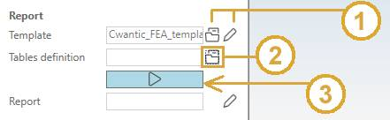
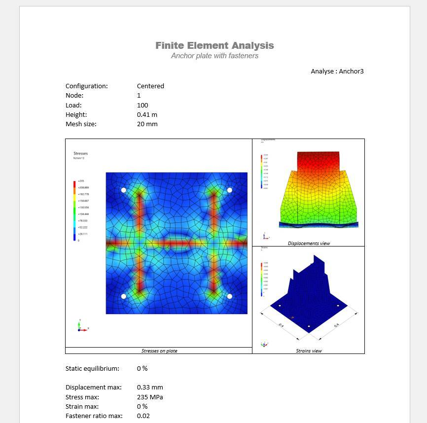

# Anchor Plate Analysis

MetaStructure proposes a detailed analysis of anchor plate and its fasteners.

Click [here](https://documentation.metapiping.com/Structure/Elements/Restraint.html#2-anchor-plate) for more information about the anchor plate definition.

## 1. Structure analysis

After structure analysis, the anchor plates of the structure can be examined.

* Select a load case or mode (1).
* Select the **anchor plate** button (2).
* Select either an anchor plate in the 3D space or in the results table (3).
* Click on the **Analysis** button (4).

The **selection mode** is automatically set to **Restraint** when clicking on **anchor plate** button.

If other analysis exists for the same **Restraint** and the same **Load**, a window will appear :

* Select **New analysis** to start a new analysis from scratch.
* Or select an existing analysis to reopen it :

Some properties and results are shown.

Click OK.

## 2. New analysis

If you choose to create a **New analysis**, you have to define a name to the analysis (that doesn't already exist) :

The **Finite Element Analysis Window** appears :

MetaStructure automatically transforms the actual plate, anchor positions, stiffeners and a part of the beam to surfacing elements (on neutral fiber).

These surfaces are grouping by types, thicknesses and materials :

The window is divided into 3 areas :

* A : Definition of the assembly, mesh, results and report
* B : Model 3D
* C : Groups of elements with same properties (type, thickness, material)

The first area contains 4 properties :

* A1 : The node of the anchor plate (restraint) and the current load
* A2 : The configuration
* A3 : The total height of the assembly. Click on **v** button to modify.
* A4 : The desired mesh size. Click on **v** button to **generate the meshing**.

> If the **anchor plate** has a non-zero value for the **Tolerance** property of its fasteners, 2 other configurations will be added in the list representing extreme positions of fasteners.

Click [here](https://documentation.metapiping.com/Structure/Elements/Restraint.html#22-fastener-definition) for more information about the fastener definition.

## 3. Meshing

Choose a **mesh size** and click on **v** button (1) :

After several seconds, the assembly is totally meshed (2).

All groups appears on the right (3). You can show/hide each group for a better visualization.

The **Code_Aster** button is now available for a complete calculation.

## 4. Finite element analysis

Click on the **Code_Aster** button to launch a detailed calculation (1) :

Colored results appears (2) with a corresponding legend.

A result panel appears where the type of results can be choose and some informations are shown (3).

You can show/hide each group for a better visualization (4).

Type of results :

| Property | Unit Metric | Unit USA | Remark |
| -------- | ---- | ---- | ---- |
| Groups | - | - | |
| Displacements | mm | in | Use **Factor** to amplify the deformation |
| Stresses | N/mm² | ksi | |
| Strains | % | % | |
| Compressions | N/mm² | ksi | Only on plate |
| Iso-displacements | mm | in | Use **Factor** to amplify the deformation |
| Iso-stresses | N/mm² | ksi | |
| Iso-Strains | % | % | |
| Iso-Compressions | N/mm² | ksi | Only on plate |

Example of the deformation of the plate (with factor = 128) :

Change for example the type to **Stresses** :

The **Static equilibrium** is also evaluated (value near 0 reaches the perfect equilibrium).

    Static Equilibrium refers to the physical state in which a system is at rest and the net force acting on it is null. It is a state in which all the forces acting on an object are balanced out and the object is not found to be in motion to the relative plane.

The **Fastener ratio max** indicates the max value of all ratios of all fasteners of the plate (must be < 1).

Click on the **Open** button to show a summary report of the **fasteners'** results :

Each fastener is deeply examined according to the current **standard**.

## 5. Report

A report can be generated based on a template and "*tables*" file.

* Select a template (**open** button) or edit template (**pencil** button) (1).
* Select a *tables* file (**open** button) (2).
* Click on the **Report** button to generate the report (3).

> The template is copy from the settings to the analysis' directory and can be locally modified before report generation (requires Microsoft Word).

The **select document window** (example for table) :

* Select the document (1)
* Click OK (2)

After generation, the report receive the name of the analysis. 

You can **edit** the final report by clicking on the **pencil** button (requires Microsoft Word) (1) :

## 6. Conclusion

The analysis is terminated.

You can keep this analysis on disk by closing the window and answer **Yes** to the question :

This analysis will be proposed on the window of §1 for the same anchor plate (node) and load.