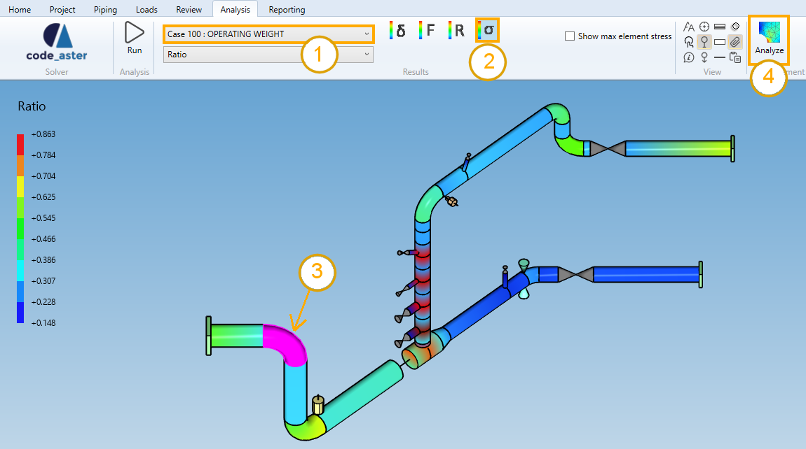
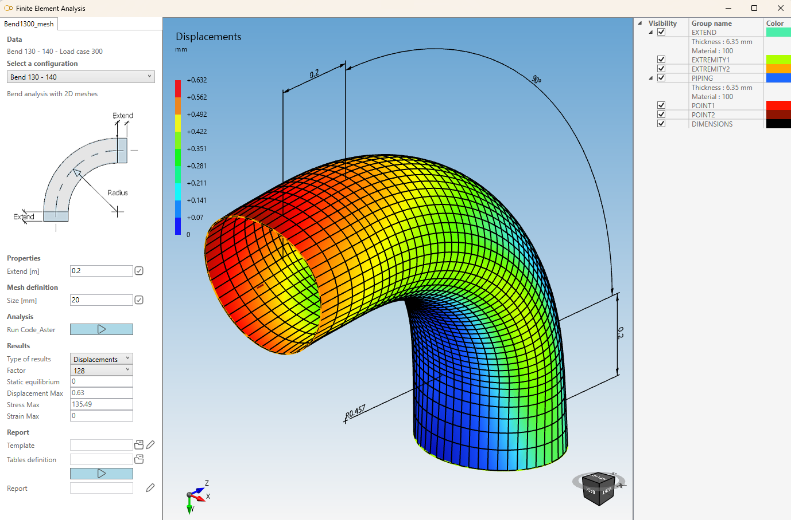

# Bend analysis

MetaPiping proposes a detailed analysis of bend.

After piping analysis, the bends can be examined.

* Select a load case or mode (1).
* Select the **stress** button (2).
* Select either a bend in the 3D space or in the results table (3).
* Click on the **Analysis** button (4).

The **selection mode** is automatically set to **Element** when clicking on **stress** button.

## 1. Template

You can then choose a template of **Finite element** :

* 3D bricks : second order 20-node hexahedrons for curved volumetric element
* 2D meshes : second order 8-node quadrangles for curved surface element

If other analysis exists for the same **Element**, the same **Load** and the same **Template**, a window will appear.

Example for a pipe analysis (same window for bends) :

* Select **New analysis** to start a new analysis from scratch.
* Or select an existing analysis to reopen it :

Some properties and results are shown.

Click OK.

## 2. New analysis

If you choose to create a **New analysis**, you have to define a name to the analysis (that doesn't already exist) :

The **Finite Element Analysis Window** appears (2D mesh template).

* Set *Extend* = 0.2 m and click on (1)
* Set *Size* = 20 mm and click on (2)
* Click on *Run Code_Aster* (3) to launch the analysis

Results : 

Click [here](https://documentation.metapiping.com/Analysis/FEA/Pipe.html#2-new-analysis) to have more information about this window.

A result panel appears where the type of results can be choose and some informations are shown (4).

Type of results :

| Property | Unit Metric | Unit USA | Remark |
| -------- | ---- | ---- | ---- |
| Groups | - | - | |
| Displacements | mm | in | Use **Factor** to amplify the deformation |
| Stresses | N/mm² | ksi | |
| Strains | % | % | |
| Iso-displacements | mm | in | Use **Factor** to amplify the deformation |
| Iso-stresses | N/mm² | ksi | |
| Iso-Strains | % | % | |

The **Static equilibrium** is also evaluated (value near 0 reaches the perfect equilibrium).

    Static Equilibrium refers to the physical state in which a system is at rest and the net force acting 
    on it is null. It is a state in which all the forces acting on an object are balanced out and the 
    object is not found to be in motion to the relative plane.

## 3. Report

Click [here](https://documentation.metapiping.com/Analysis/FEA/Reducer.html#5-report) to have more information about the report mechanism.

## 4. Brick template

If you select the **Brick** template, some features change : 

The mesh definition contains also the *thickness division* (= number of element in the thickness) and 4 groups that enable to hide part of the assembly (A, B, C and D).

In this example, you can see (2) a thickness division = 2 (1) and group D hidden to see the interior of the element.

## 5. Conclusion

The analysis is terminated.

You can keep this analysis on disk by closing the window and answer **Yes** to the question :

This analysis will be proposed on the window of §1 for the same element, load and template.