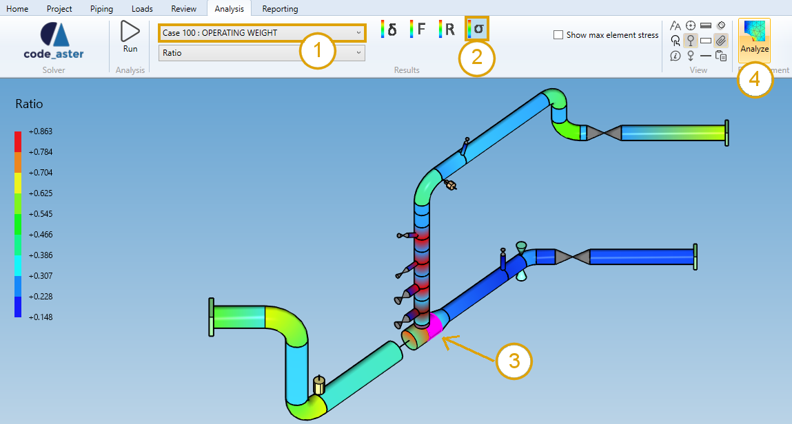
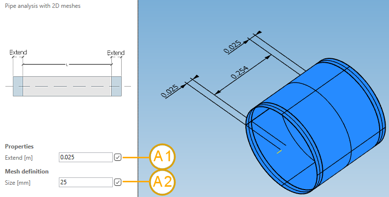
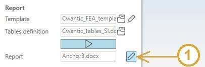
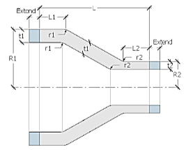

# Pipe analysis

MetaPiping proposes a detailed analysis of pipe.

After piping analysis, the pipes can be examined.



* Select a load case or mode (1).
* Select the **stress** button (2).
* Select either a pipe in the 3D space or in the results table (3).
* Click on the **Analysis** button (4).

The **selection mode** is automatically set to **Element** when clicking on **stress** button.

## 1. Template

You can then choose a template of **Finite element** :


* 3D bricks : second order 20-node hexahedrons for curved volumetric element
* 2D meshes : second order 8-node quadrangles for curved surface element

If other analysis exists for the same **Element**, the same **Load** and the same **Template**, a window will appear :


* Select **New analysis** to start a new analysis from scratch.
* Or select an existing analysis to reopen it :


Some properties and results are shown.

Click OK.

## 2. New analysis

If you choose to create a **New analysis**, you have to define a name to the analysis (that doesn't already exist) :


The **Finite Element Analysis Window** appears (2D mesh template) :


MetaPiping automatically transforms the actual pipe to surfacing elements (on neutral fiber).

The window is divided into 3 areas :

* A : Definition of the assembly, mesh, results and report
* B : Model 3D
* C : Groups of elements with same properties (type, thickness, material)

The first area contains 1 geometric property and 1 mesh property :



* A1 : The length of extend. Click on **v** button to modify.
* A2 : The desired mesh size. Click on **v** button to **generate the meshing**.

Set for example 0.05 m of extend and a mesh size of 20 mm.

## 3. Meshing

Choose a **mesh size** and click on **v** button (1) :


After several seconds, the assembly is totally meshed (2).

All groups appears on the right (3). You can show/hide each group for a better visualization.

The **Code_Aster** button is now available for a complete calculation.

## 4. Finite element analysis

Click on the **Code_Aster** button to launch a detailed calculation (1) :


Colored results appears (2) with a corresponding legend.

A result panel appears where the type of results can be choose and some informations are shown (3).

Type of results :

| Property | Unit Metric | Unit USA | Remark |
| -------- | ---- | ---- | ---- |
| Groups | - | - | |
| Displacements | mm | in | Use **Factor** to amplify the deformation |
| Stresses | N/mm² | ksi | |
| Strains | % | % | |
| Iso-displacements | mm | in | Use **Factor** to amplify the deformation |
| Iso-stresses | N/mm² | ksi | |
| Iso-Strains | % | % | |

The **Static equilibrium** is also evaluated (value near 0 reaches the perfect equilibrium).

    Static Equilibrium refers to the physical state in which a system is at rest and the net force acting 
    on it is null. It is a state in which all the forces acting on an object are balanced out and the 
    object is not found to be in motion to the relative plane.

## 5. Report

A report can be generated based on a template and "*tables*" file.


* Select a template (**open** button) or edit template (**pencil** button) (1).
* Select a *tables* file (**open** button) (2).
* Click on the **Report** button to generate the report (3).

> Use the default template Cwantic_FEA_Piping_template_SI

> The template is copy from the settings to the analysis' directory and can be locally modified before report generation (requires Microsoft Word).

The **select document window** (example for table) :


* Select the document (1)
* Click OK (2)

After generation, the report receive the name of the analysis. 

You can **edit** the final report by clicking on the **pencil** button (requires Microsoft Word) (1) :



Click [here](https://documentation.metapiping.com/Settings/Reporting.html) to have more information about the reporting mechanism.

### 5.1 Keywords

The keyword is useful to make a correspondence between the **template** and the **table** document but with specific decorators :

    $$keyword$$ for the template
    [keyword] for the table


| Keyword | Description | Remark |
| -------- | ---- | ---- |
| STUDY NAME | The name of the current study | No table |
| ANALYSIS NAME | The name of the current analysis | No table |
| PICTURE | Take a picture (§5.2) | No table |
| CONFIG PICTURE | The picture of the current config | No table |
| MESH RESULTS | The list of all mesh results | table [MESH RESULTS] |
| CONFIGURATION NAME | The name of the current configuration | No table |
| ELEMENT PROPERTIES | The element properties | table [ELEMENT PROPERTIES] |
| MESH SIZE | The meshing properties | table [MESH SIZE] |
| ELEMENTNAME | The name of the current element | No table |
| LOADCASE | The current load case | No table |
| STATIC EQUILIBRIUM | The static equilibrium value | No table |
| DISPLACEMENT MAX | The displacement max | No table |
| STRESS MAX | The stress max | No table |
| STRAIN MAX | The strain max | No table |
| FASTENER RATIO MAX | The max ratio on all fasteners | No table |

>CONFIG PICTURE for pipe =


>CONFIG PICTURE for bend =


>CONFIG PICTURE for concentric reducer =




### 5.2 Picture

It is possible to include pictures in the report with use of the keyword **PICTURE**.

When the software encounters this keyword, it simply makes a screenshot of the 3D engine.

It is possible to change the kind of visualization via a **JSON structure** just after the keyword separated by a semicolon character :

    $$PICTURE;{...}$$

JSON parameters :

| Parameter | Description | Default value |
| -------- | ---- | ---- |
| Groups | An array of visible group name | Empty list = all groups will be visible |
| View | Orientation of the camera | 35 (= FrontFaceTopLeft - see below) |
| ResultType | Result category | 0 (= Group - see below) |
| Factor | Amplification factor of the displacements | 1 |
| Dim | 1 = show dimensions | 1 |

View values :

        Front                   = 0
        Right                   = 1
        Rear                    = 2
        Left                    = 3
        Top                     = 4
        Bottom                  = 5
        Isometric               = 6
        Dimetric                = 7
        Trimetric               = 8
        FrontFaceBottom         = 9
        FrontFaceRight          = 10
        FrontFaceTop            = 11
        FrontFaceLeft           = 12
        RightFaceBottom         = 13
        RightFaceRight          = 14
        RightFaceTop            = 15
        RightFaceLeft           = 16
        BackFaceBottom          = 17
        BackFaceRight           = 18
        BackFaceTop             = 19
        BackFaceLeft            = 20
        LeftFaceBottom          = 21
        LeftFaceRight           = 22
        LeftFaceTop             = 23
        LeftFaceLeft            = 24
        BottomFaceBottom        = 25
        BottomFaceRight         = 26
        BottomFaceTop           = 27
        BottomFaceLeft          = 28
        TopFaceBottom           = 29
        TopFaceRight            = 30
        TopFaceTop              = 31
        TopFaceLeft             = 32
        FrontFaceBottomLeft     = 33
        FrontFaceBottomRight    = 34
        FrontFaceTopLeft        = 35
        FrontFaceTopRight       = 36
        BackFaceBottomLeft      = 37
        BackFaceBottomRight     = 38
        BackFaceTopLeft         = 39
        BackFaceTopRight        = 40

Result type values :

        Group = 0
        Displacement = 1
        Stress = 2
        Strain = 3
        Compression = 4
        IsoDisplacement = 5
        IsoStress = 6
        IsoStrain = 7
        IsoCompression = 8

Example :

```
    $$PICTURE;{“ResultType”:2,”View”:35,”Dim”:1}$$
```

>ResultType = 2 for a "Stress" view

>View = 35 for a FrontFaceTopLeft view

>Dim = 1 will show the dimensions

Result :


## 6. Brick template

If you select the **Brick** template, some features change : 


The mesh definition contains also the *thickness division* (= number of element in the thickness) and 4 groups that enable to hide part of the assembly (A, B, C and D).

In this example, you can see (2) a thickness division = 2 (1) and group B hidden to see the interior of the element.

## 7. Conclusion

The analysis is terminated.

You can keep this analysis on disk by closing the window and answer **Yes** to the question :


This analysis will be proposed on the window of §1 for the same element, load and template.