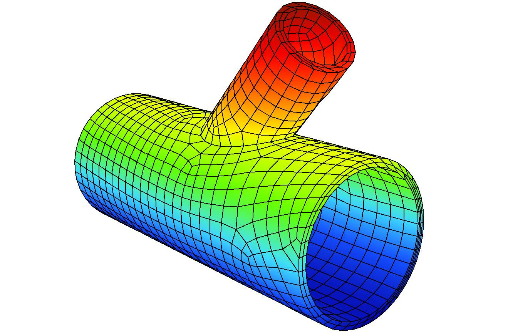
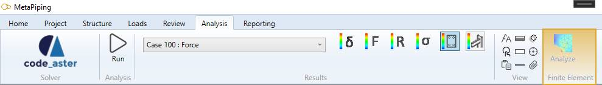

# Finite Element Analysis

**MetaPiping/MetaStructure** proposes detailed **finite element analysis** of part of piping system or structure.

The selected assembly is meshed with shell or brick element depending on the assembly type.

Loads are then applied on the resulting mesh and the boundary conditions are defined.

The solution is calculated with our native **Code_Aster** solver.

A diagnostic is shown depending on the assembly type.

A report can finally be generated.

## 1. Analysis

The **Finite Element Analysis** button is available at the end of the Analysis ribbon :

The button is only accessible for certain selected element.

The possible analysis are listed in the menu.