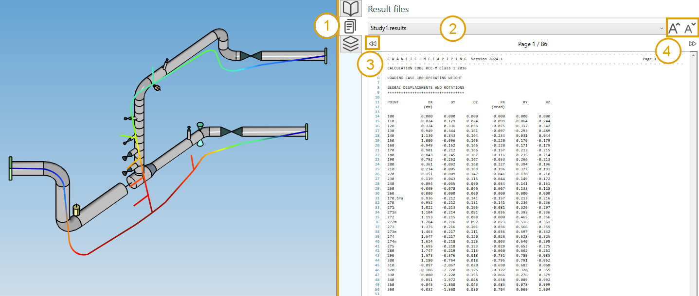

# Piping analysis

## 1. Data panel

After analysis, a right panel can be opened by clicking on the top button (1). It presents the selected results :

>Shortcut to open the data panel = F2.

## 2. Results

Click on the **RUN** button :

After a few seconds, the results of the analysis are shown. This panel will appear :

Select a case and the type of results :

- Displacements
- Forces and moments
- Reactions
- Stresses

### 2.1 Load cases

The combobox shows all calculated load cases :

The loadings can be defined [here](https://documentation.metapiping.com/Loads/Piping/).

The **Modes** are generated if the **Extract modes** is checked in the **Model options** screen :

Click [here](https://documentation.metapiping.com/Design/Specification/Options.html#3-modal-extraction) to have more information about the model options.

A special load case "Fatigue" is added at the bottom of the combobox for Class 1 piping codes (Code Aster solver only). It allows to visualize the results of the detailed fatigue analysis and also, for the RCC-MRx code, the progressive deformation and fatigue + creep interaction check.

A special load case "Creep" is added at the bottom of the combobox for RCC-MRx code if creep is not negligible (Code Aster solver only). It allows to visualize the results of the creep analysis : UA,C(pm), UA,C(pm + Φ⋅pb), ΔUA, WA,C,D(1.35pm) and WA,C,D(1.35(pm + Φ⋅pb)).

### 2.2 Displacements

1. Select the **Displacement** button
2. Open the right **Data panel**
3. Select a node
4. The results are highlighted

>Shortcut to open the data panel = F2.

The **Data panel** shows the global displacements for each node.

| Property | Description | Unit Metric | Unit USA |
| -------- | ----------- | ---- | ---- |
| Node name | Text or number | - | - |
| DX | X global displacement | mm | in |
| DY | Y global displacement  | mm | in |
| DZ | Z global displacement  | mm | in |
| RX | X global rotation | Rad | Rad |
| RY | Y global rotation  | Rad | Rad |
| RZ | Z global rotation  | Rad | Rad |
| D | global absolute displacement | mm | in |
| R | global absolute rotation | Rad | Rad |

>The **Selection mode** is automatically set to POINT.

You can amplify the displacement by changing the factor cursor.

**INTERACTIVITY** :

1. Click on a **Column header** to sort the results in ascending or descending order
2. Select a row
4. The node is highlighted

>TIP : you can copy the data by CTRL+C and paste in other software.

**ANIMATION**

The displacements can be animated : 

Start/Stop the animation by clicking the **play** button.

### 2.3 Forces and moments

1. Select the **Force** button
2. Click on a column of the **Data panel** to sort the data
3. Select a row
4. The corresponding element is highlighted

>Shortcut to open the data panel = F2.

The **Data panel** shows the forces and moments for the 2 extremities of each element.

| Property | Description | Unit Metric | Unit USA |
| -------- | ----------- | ---- | ---- |
| Element | Type | - | - |
| Node | Node name of the extremity | - | - |
| F1 | Force 1 | N | lb |
| F2 | Force 2 | N | lb |
| N | Normal force | N | lb |
| M1 | Moment 1 | N.m | lb.ft |
| M2 | Moment 2 | N.m | lb.ft |
| T | Torsion | N.m | lb.ft |
| !F! | Absolute force | N | lb |
| !M! | Absolute moment | N.m | lb.ft |

>The **Selection mode** is automatically set to ELEMENT.

**DIAGRAMS**

Select a diagram of force and moment just below the load case :

Possible diagrams :

* Nothing (default)
* F1  : forces in lateral direction 1
* F2  : forces in lateral direction 2
* N   : normal forces
* M1  : moment in lateral direction 1
* M2  : moment in lateral direction 2
* T   : tortion
* !F! : absolute forces
* !M! : absolute moments

You can increase and decrease the size of the diagram.

Selecting an element shows the extremity values.

>The diagram on bends is just a line joining the 2 values!

### 2.4 Reactions

1. Select the **Reaction** button
2. Select a row on the data panel
3. The corresponding restraint is highlighted

Or select directly a restraint to highlight the corresponding row.

>Shortcut to open the data panel = F2.

The **Data panel** shows the forces and moments (reactions) for each node.

| Property | Description | Unit Metric | Unit USA |
| -------- | ----------- | ---- | ---- |
| Node | Node name | - | - |
| FX | X component of the reaction force | N | lb |
| FY | Y component of the reaction force | N | lb |
| FZ | Z component of the reaction force | N | lb |
| MX | X component of the reaction moment | N.m | lb.ft |
| MY | Y component of the reaction moment | N.m | lb.ft |
| MZ | Z component of the reaction moment | N.m | lb.ft |
| !F! | Absolute reaction force | N | lb |
| !M! | Absolute reaction moment | N.m | lb.ft |

The **forces** are represented by a simple **arrow**.

The **moments** are represented by a double **arrow**.

>The **Selection mode** is automatically set to RESTRAINT.

### 2.5 Stresses

1. Select the **Stress** button
2. Select the result type
3. Click on a column of the **Data panel** to sort the desired data
4. Select a row
5. The corresponding element is highlighted

The results are **code dependent**. The third column shows the stress ratio, defined as the calculated stress divided by the allowable stress.

The stresses are shown at each extremity of the elements. The maximum stresses of both extremities may be displayed instead by checking "Show max element stress" :

>The **Selection mode** is automatically set to ELEMENT.

### Overstress

For result type = **Ratio** or **Ratio max**, check the **overstress** box to see the two color map with all element with ratio > 1 in red :

## 3. Result files

1. Click on the **File** button on the right controller :
2. Select a file in the list
3. Navigate through the pages of the document with the left and right button (or **PgDn** and **PgUp** shortcuts)
4. Increase or decrease the size of the font

>Tip: you can copy the content of the file

>Tip: If the analysis failed, a warning file will be available to know what happened.

