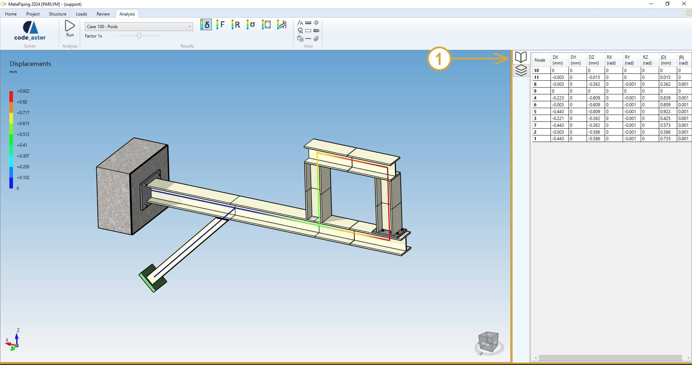
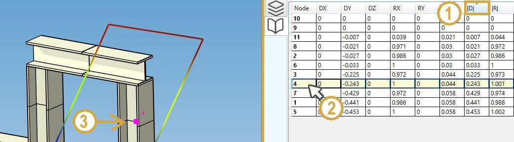
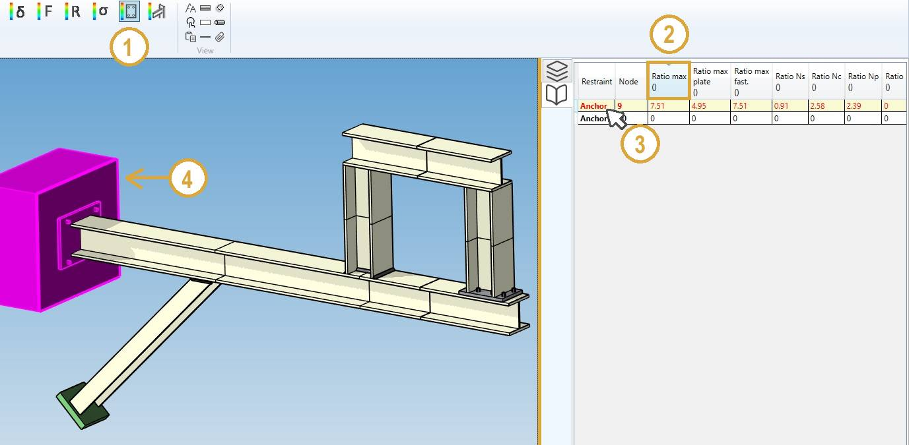
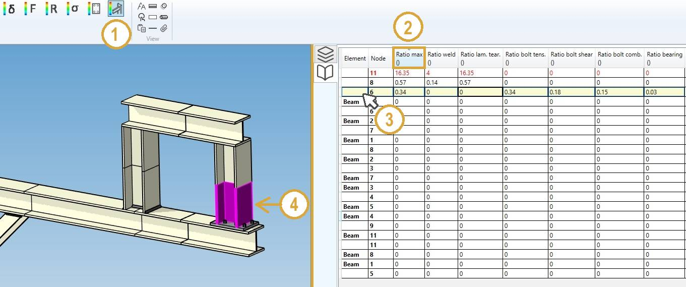

# Structure analysis

## 1. Data panel

After analysis, a right panel can be opened by clicking on the top button (1). It presents the selected results :

>Shortcut to open the data panel = F2.

## 2. Results

Click on the **RUN** button :

After a few seconds, the results of the analysis are shown. This panel will appear :

Select a case and the type of results :

- Displacements
- Forces and moments
- Reactions
- Stresses
- Anchor plates
- Joints

### 2.1 Load cases

The combobox shows all calculated load cases :

The loadings can be defined [here](https://documentation.metapiping.com/Loads/Structure/).

The **Modes** are generated if the **Extract modes** is checked in the **Model options** screen :

Click [here](https://documentation.metapiping.com/Structure/Specification/Options.html#3-modal-extraction) to have more information about the model options.

### 2.2 Displacements

1. Select the **Displacement** button
2. Open the right **Data panel**
3. Select a node
4. The results are highlighted

>Shortcut to open the data panel = F2.

The **Data panel** shows the global displacements for each node.

| Property | Description | Unit Metric | Unit USA |
| -------- | ----------- | ---- | ---- |
| Node name | Text or number | - | - |
| DX | X global displacement | mm | in |
| DY | Y global displacement  | mm | in |
| DZ | Z global displacement  | mm | in |
| RX | X global rotation | Rad | Rad |
| RY | Y global rotation  | Rad | Rad |
| RZ | Z global rotation  | Rad | Rad |
| D | global absolute displacement | mm | in |
| R | global absolute rotation | Rad | Rad |

>The **Selection mode** is automatically set to POINT.

You can amplify the displacement by changing the factor cursor.

**INTERACTIVITY** :

1. Click on a **Column header** to sort the results in ascending or descending order
2. Select a row
4. The node is highlighted

>TIP : you can copy the data by CTRL+C and paste in other software.

**ANIMATION**

The **MODES** and **DYNAMIC LOADS** can be animated : 

Start/Stop the animation by clicking the **play** button.

### 2.3 Forces and moments

1. Select the **Force** button
2. Click on a column of the **Data panel** to sort the data
3. Select a row
4. The corresponding element is highlighted

>Shortcut to open the data panel = F2.

The **Data panel** shows the forces and moments for the 2 extremities of each element.

| Property | Description | Unit Metric | Unit USA |
| -------- | ----------- | ---- | ---- |
| Element | Type | - | - |
| Node | Node name of the extremity | - | - |
| F1 | Force 1 | N | lb |
| F2 | Force 2 | N | lb |
| N | Normal force | N | lb |
| M1 | Moment 1 | N.m | lb.ft |
| M2 | Moment 2 | N.m | lb.ft |
| T | Torsion | N.m | lb.ft |
| !F! | Absolute force | N | lb |
| !M! | Absolute moment | N.m | lb.ft |

>The **Selection mode** is automatically set to ELEMENT.

**DIAGRAMS**

Select a diagram of force and moment just below the load case :

Possible diagrams :

* Nothing (default)
* F1  : forces in lateral direction 1
* F2  : forces in lateral direction 2
* N   : normal forces
* M1  : moment in lateral direction 1
* M2  : moment in lateral direction 2
* T   : tortion
* !F! : absolute forces
* !M! : absolute moments

You can increase and decrease the size of the diagram.

Selecting an element shows the extremity values.

### 2.4 Reactions

1. Select the **Reaction** button
2. Select a row on the data panel
3. The corresponding restraint is highlighted

Or select directly a restraint to highlight the corresponding row.

>Shortcut to open the data panel = F2.

The **Data panel** shows the forces and moments (reactions) for each node.

| Property | Description | Unit Metric | Unit USA |
| -------- | ----------- | ---- | ---- |
| Node | Node name | - | - |
| FX | X component of the reaction force | N | lb |
| FY | Y component of the reaction force | N | lb |
| FZ | Z component of the reaction force | N | lb |
| MX | X component of the reaction moment | N.m | lb.ft |
| MY | Y component of the reaction moment | N.m | lb.ft |
| MZ | Z component of the reaction moment | N.m | lb.ft |
| !F! | Absolute reaction force | N | lb |
| !M! | Absolute reaction moment | N.m | lb.ft |

The **forces** are represented by a simple **arrow**.

The **moments** are represented by a double **arrow**.

>The **Selection mode** is automatically set to RESTRAINT.

### 2.5 Stresses

1. Select the **Stress** button
2. Select the result type
3. Click on a column of the **Data panel** to sort the desired data
4. Select a row
5. The corresponding element is highlighted

The results are **code dependent**. The third column shows the stress ratio, defined as the calculated stress divided by the allowable stress.

The stresses are shown at each extremity of the elements. The maximum stresses of both extremities may be displayed instead by checking "Show max element stress" :

>The **Selection mode** is automatically set to ELEMENT.

### Overstress

For result type = **Ratio max**, check the **overstress** box to see the two color map with all element with ratio > 1 in red :

### 2.6 Anchor plates

1. Select the **Anchor plate** button
2. Click on a column of the **Data panel** to sort the desired data
3. Select a row
4. The corresponding anchor is highlighted

Or select directly an anchor to highlight the corresponding row.

The results are **code dependent**. The plates are verified according to the structure code (RCC-M, ASME, etc.) and the fasteners according to the anchor code (only EN-1992-4 in the current software version).

> Plates are only checked for regular configurations with 2 or 4 fasteners in the current version of MetaStructure.

 The ratios output in **Data panel** are the calculated values (stress or force) divided by the allowable ones :

| Property | Description |
| -------- | ----------- |
| Restraint | Type of restraint |
| Node | Node name |
| Ratio max | Envelope of plate stress ratio and fastener ratios |
| Ratio max plate | Plate stress ratio |
| Ratio max fast. | Maximum ratio for the fasteners |
| Ratio Ns | Ratio of steel failure in tension |
| Ratio Nc | Ratio of concrete cone failure |
| Ratio Np | Ratio of pull-out failure |
| Ratio Npc | Ratio of combined pull-out and concrete failure (bonded fasteners) |
| Ratio Nsp | Ratio of failure by splitting |
| Ratio Ncb | Ratio of failure in tension by blow-out at the edge of the slab (cast-in fasteners only) |
| Ratio Vs | Ratio of steel failure in shear |
| Ratio NVs | Ratio of steel failure in combined tension and shear |
| Ratio Vcp | Ratio of concrete failure by pry-out effect |
| Ratio Vc | Ratio of failure in shear at the edge of the slab |
| Ratio NcMax | Max concrete ratio in tension |
| Ratio VcMax | Max concrete ratio in shear |
| Ratio NVc | Ratio of concrete failure in combined tension and shear |
| Error | Error number |

The error numbers are listed below :

| Error number | Description |
| -------- | ----------- |
| 0 | No error |
| -1 | Non regular arrangement, no check is carried out |
| 2 | Insufficient concrete thickness |
| 3 | Insufficient edge distance |
| 4 | Insufficient anchor spacing |
| 5 | Insufficient edge distance for selected spacing |
| 6 | Insufficient edge distance c1 in the case of mounting with lever arm |
| 7 | Insufficient edge distance c1 in case t ≥ 0.25 hef |
| 9 | Spacing must be > 4 dnom for slab edge failure |

>The **Selection mode** is automatically set to RESTRAINT.

### 2.7 Bolted and welded joints

1. Select the **Joint** button
2. Click on a column of the **Data panel** to sort the desired data
3. Select a row
4. The corresponding beam is highlighted

Or select directly a beam to highlight the corresponding row.

The results are **code dependent**. The ratios output in **Data panel** are the calculated values (stress or force) divided by the allowable ones :

| Property | Description |
| -------- | ----------- |
| Element | Type of element |
| Node | Node of the element where the joint is located |
| Ratio max | Max ratio of the welds or the bolts |
| Ratio weld | Ratio of the welds (0 if bolted joint) |
| Ratio lam. tear. | Ratio for lamellar tearing on the base metal (0 if bolted joint) |
| Ratio bolt tens. | Ratio of the bolts in tension |
| Ratio bolt shear. | Ratio of the bolts in shear |
| Ratio bolt comb. | Ratio of the bolts in combined tension and shear |
| Ratio bearing | Ratio of the bearing stress |

>The **Selection mode** is automatically set to ELEMENT.

## 3. Result files

1. Click on the **File** button on the right controller :
2. Select a file in the list
3. Navigate through the pages of the document with the left and right button (or **PgDn** and **PgUp** shortcuts)
4. Increase or decrease the size of the font

>Tip: you can copy the content of the file

>Tip: If the analysis failed, a warning file will be available to know what happen.