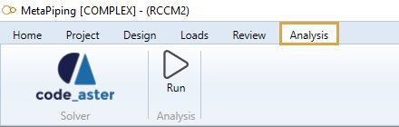
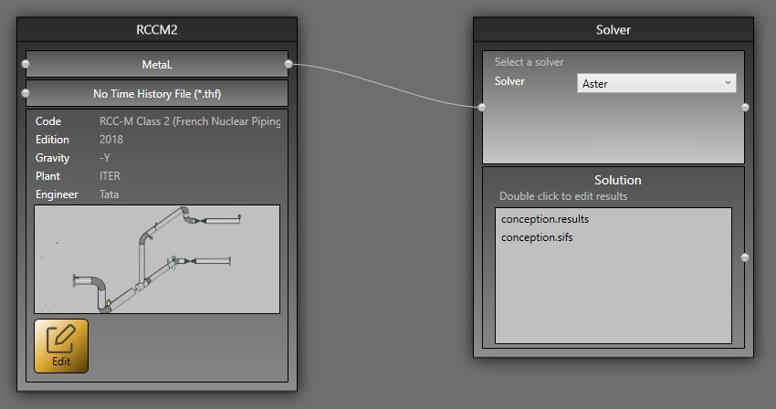

# Analysis

After designing the whole model, set the loading and review the data, click on the **ANALYSIS** button to launch a complete verification of the piping system.

## 1. Ribbon menu

### 1.1 Solver

**Code Aster** is the main SOLVER of MetaPiping and MetaStructure. The selection of the solver is done in the **Study** screen :

Click [here](https://documentation.metapiping.com/Explorer/Study.html) to have more information about studies.

For **Editpipe** users, it is also possible to connect to PIPESTRESS solver.

Click [here](https://documentation.metapiping.com/Settings/General.html#5-pipestress) to have more information about PIPESTRESS settings.

