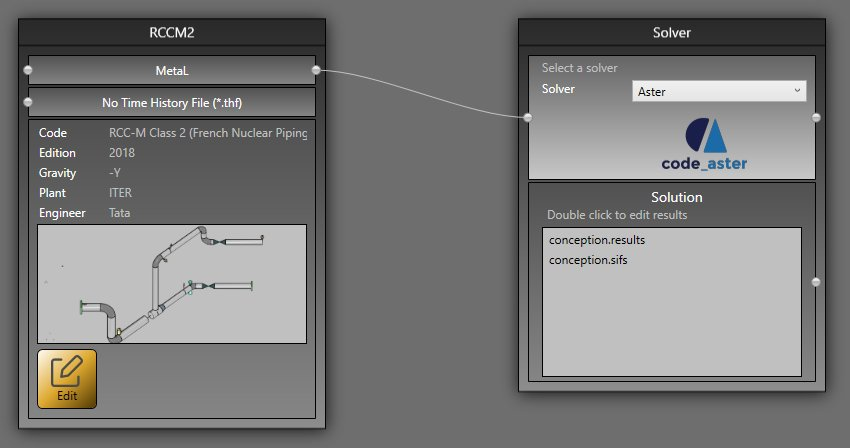
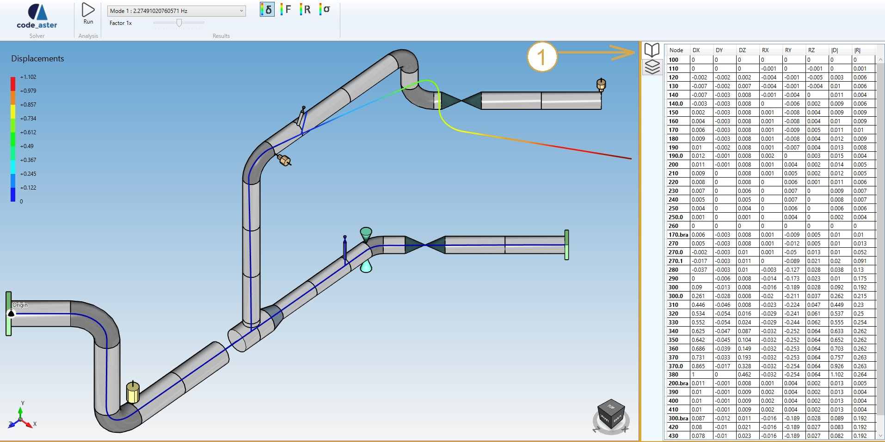
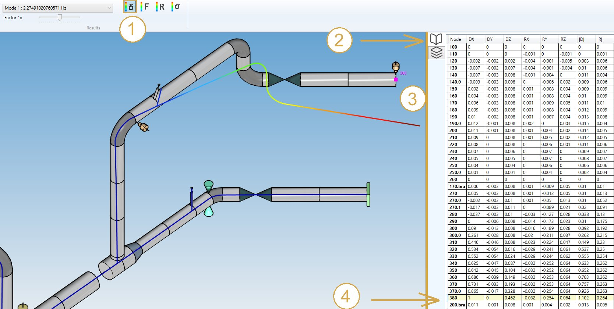
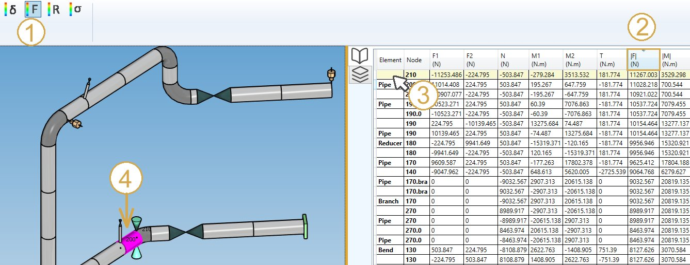

# Analysis

After designing the whole model, set the loading and review the data, click on the **ANALYSIS** button to launch a complete verification of the piping system.

## 1. Ribbon menu

### 1.1 Solver

**Code Aster** is the main SOLVER of MetaPiping. The selection of the solver is done on the **Study** screen :

Click [here](https://documentation.metapiping.com/Explorer/Study.html) to have more information about studies.

### 1.2 PIPESTRESS solver

For the users of EditPipe, it is also possible to connect the PIPESTRESS solver.

Click [here](https://documentation.metapiping.com/Settings/General.html#5-pipestress) to have more information about PIPESTRESS settings.

Click [here](https://documentation.metapiping.com/Analysis/Solver.html#3-major-differences) to see the differences between all proposed solvers.

## 2. Data panel

A right panel can be opened by clicking on the top button (1). It presents the selected results :

>Shortcut = F2

## 3. Results

Click on the **RUN** button :

After several seconds, the results of the analysis are shown. This panel will appear :

Select a case and the type of results :

- Displacements
- Forces and moments
- Reactions
- Stresses

### 3.1 Load cases

The combobox shows all calculated load cases :

The loading can be defined [here](https://documentation.metapiping.com/Loads/index.html).

The **Modes** are generared if the **Extract modes** is checked in the **Model options** screen :

Click [here](https://documentation.metapiping.com/Design/Specification/Options.html) to have more information about the model options.

### 3.2 Displacements

1. Select the **Displacement** button
2. Open the right **Data panel**
3. Select a node
4. The results are highlighted

>Shortcut to open the data panel = F2.

The **Data panel** shows the global displacements for each node.

| Property | Description | Unit Metric | Unit USA |
| -------- | ----------- | ---- | ---- |
| Node name | Text or number | - | - |
| DX | X global displacement | m | ft |
| DY | Y global displacement  | m | ft |
| DZ | Z global displacement  | m | ft |
| RX | X global rotation | Rad | Rad |
| RY | Y global rotation  | Rad | Rad |
| RZ | Z global rotation  | Rad | Rad |
| D | global absolute displacement | m | ft |
| R | global absolute rotation | Rad | Rad |

>The **Selection mode** is automatically set to POINT.

You can amplify the displacement by changing the factor cursor.

**INTERACTIVITY** :

1. Click on a **Column header** to sort the results in ascending or descending order
2. Select a row
4. The node is  highlighted

>TIP : you can copy the data by CTRL+C and paste on other softwares.

### 3.3 Forces and moments

1. Select the **Force** button
2. Click on a colum of the **Data panel** to sort the data
3. Select a row
4. The corresponding element is highlighted

>Shortcut to open the data panel = F2.

The **Data panel** shows the forces and moments for the 2 extremities of each element.

| Property | Description | Unit Metric | Unit USA |
| -------- | ----------- | ---- | ---- |
| Element | Type | - | - |
| Node | Node name of the extremity | - | - |
| F1 | Force 1 | N | lb |
| F2 | Force 2 | N | lb |
| N | Normal force | N | lb |
| M1 | Moment 1 | N.m | lb.ft |
| M2 | Moment 2 | N.m | lb.ft |
| T | Torsion | N.m | lb.ft |
| F | Absolute force | N | lb |
| M | Absolute moment | N.m | lb.ft |

>The **Selection mode** is automatically set to ELEMENT.

### 3.4 Reactions

1. Select the **Reaction** button
2. Select a row on the data panel
3. The corresponding restraint is highlighted

Or select directly a restraint to highlight the corresponding row.

>Shortcut to open the data panel = F2.

The **Data panel** shows the forces and moments (reactions) for each node.

| Property | Description | Unit Metric | Unit USA |
| -------- | ----------- | ---- | ---- |
| Node | Node name | - | - |
| FX | X component of the reaction force | N | lb |
| FY | Y component of the reaction force | N | lb |
| FZ | Z component of the reaction force | N | lb |
| MX | X component of the reaction moment | N.m | lb.ft |
| MY | Y component of the reaction moment | N.m | lb.ft |
| MZ | Z component of the reaction moment | N.m | lb.ft |
| F | Absolute reaction force | N | lb |
| M | Absolute reaction moment | N.m | lb.ft |

>The **Selection mode** is automatically set to RESTRAINT.

### 3.5 Stresses

1. Select the **Stress** button
2. Select the result type
3. Click on a colum of the **Data panel** to sort the desired data
4. Select a row
5. The corresponding element is highlighted

The type of results are **code dependent**

    Documentation will come soon…

You can also visualize the max stress :

>The **Selection mode** is automatically set to ELEMENT.