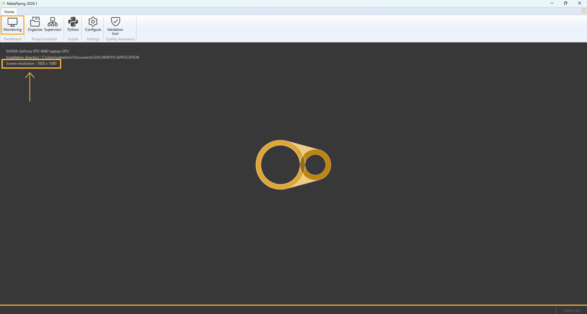

# System requirements

In order to exploit the full power of the software, we recommend the following configuration :

- **Windows** : 8.1 or upper (64bits)
- **Processor** : Intel® Core I5 or upper
- **Memory** : 8 Gb or more
- **Hard disk** : 1 Gb of free space or more
- **Graphic card** : NVIDIA GeForce® GTX series or upper, AMD Radeon® RX series or upper
- **Screen resolution** : Full HD (1920x1080) or more
- **Mouse** : 3 buttons (scroll wheel button)

# Graphic scale

The visual **scale** of the screen must be such that all the icons on the top ribbon are visible:

# Rights requirements

The setup tool will install the software on **Program Files** and the data on **ProgramData**.

This last directory **must** have the **Read** and **Write** rights for the user.

\( S_{\text{occ}} = \sqrt{\left(|S_{a,\text{occ}}| + S_{b,\text{occ}}\right)^2 + \left(2 S_{t,\text{occ}}\right)^2} \tag{Eq.~11} \)

\[ 
S_{\text{occ}} = \sqrt{\left(|S_{a,\text{occ}}| + S_{b,\text{occ}}\right)^2 + \left(2 S_{t,\text{occ}}\right)^2} \tag{Eq.~11} 
\]

$$ S_b = \sqrt{\left(\frac{I_i \, M_i}{Z}\right)^2 + \left(\frac{I_o \, M_o}{Z}\right)^2} \tag{Eq.~4} $$

$ S_b = \sqrt{\left(\frac{I_i \, M_i}{Z}\right)^2 + \left(\frac{I_o \, M_o}{Z}\right)^2} \tag{Eq.~4} $
