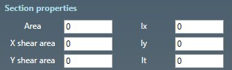
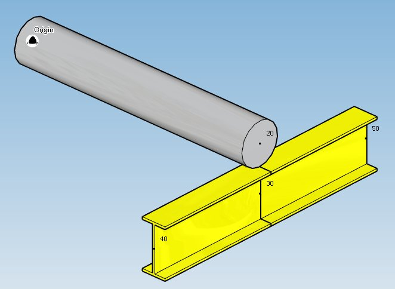

# Create beams

When you click on the **Add beam** button without selection, the left panel shows a message :

    Select 1 node

The **selection mode** is automatically set to **POINT**. You can so directly select a node.

## 1. Create a beam

- Select a **node**.
- Click the **Add beam** button.

**BEAM TYPE** :

- *Non standard*
- *I*
- *Channel*
- *Rectangular*
- *Tee*
- *Equal angle*
- *Unequal angle*
- *Round*
- *Plate*

>The length must be defined by the **orientation tool**.

Common property :

| Property | Unit Metric | Unit USA |
| -------- | ---- | ---- |
| Young modulus | kN/mm² | 10^6.psi |
| Moments released | - | - |
| Distributed linear mass density | kg/m | lb/ft |
| End point mass density | kg/m | lb/ft |
| Distributed volumetric mass density | kg/m³ | lb/ft³ |

Based on **type**, you have to define different section properties.

**SECTION PROPERTIES** :

- Non standard :

| Property | Unit Metric | Unit USA |
| -------- | ---- | ---- |
| Cross sectional area | mm² | in² |
| Shear area along X' axis| mm² | in² |
| Shear area along Y' axis| mm² | in² |
| Moment of inertia about X' axis : Ix | mm^4 | in^4 |
| Moment of inertia about Y' axis : Iy | mm^4 | in^4 |
| Torsional inertia : It  | mm^4 | in^4 |

    To know the UNIT of a property, just move the mouse over the property name. 

- All other types :

| Property | Unit Metric | Unit USA |
| -------- | ---- | ---- |
| Height | mm | in |
| Web thickness | mm | in |
| Flange width | mm | in |
| Flange thickness | mm | in |

**X-AXIS DIRECTION** :

You can define the **X-axis** vector by defining Xx, Xy, Xz in global coordinates.

**Label** :

You can define a label to this element. The labels are shown with the node names view button.

---

You can then define the second point of the beam thanks to the **Orientation tool**.

Click [here](https://documentation.metapiping.com/Design/Elements/Orientation.html) for more information about the orientation tool.

Create 2 **I beams** after creation of node 30 :

## 2. Modify/Remove a beam

Change the **Selection mode** to ELEMENT and select a beam :

Click [here](https://documentation.metapiping.com/Design/Selection.html) for more information about the selection tool.

You can change the type and the appropriate properties of the selected beam (except the length).

Click on the **Modify** button to change the selected beam with these new properties.

You can **undo** this command.

Click on the **Remove** button to delete the selected beam.

You can **undo** this command.

Example of modification, change **I** type to **Channel** type :

And by changing the **X-axis direction** :

## 3. Insert a beam on an intermediate node

Click on the **Add beam** button and select an **intermediate node** between 2 beams.

Fill the properties (see §1) and select the **insertion mode** :

- Shift forward
- Shift backwards
- Reduce the next element
- Reduce the previous element
- Symmetrically reduce the neighboring elements

{: .warning }
>ATTENTION, if the length is null, no mode will be proposed (empty list)

{: .warning }
>Based on the length of the beam and the lengths of the neighboring elements, some mode could be hidden.

Select for example "Shift forward" and click the **Insert** button :

You can **undo** this command.