# Create bellows

When you click on the **Add bellow** button without selection, the left panel shows a message :

    Select 1 node

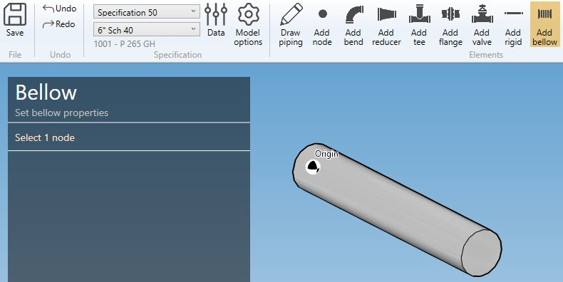

The **selection mode** is automatically set to **POINT**. You can so directly select a node.

## 1. Create a bellow

- Select the current **section/material** in the specification box.
- Select a **node**.
- Click the **Add bellow** button.

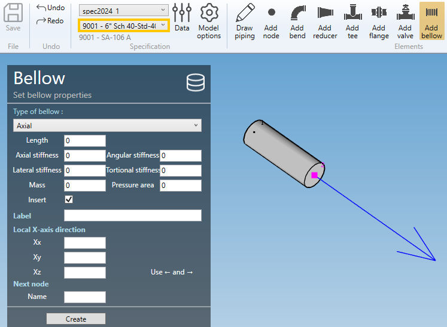

**BELLOW PROPERTIES** :

- Axial : *Axial and lateral displacements and rotations are permitted*
- Lateral in a single plane : *Lateral displacements are only permitted in the plane defined by the local axes Z’ and X’. No axial displacements nor rotations are permitted*
- Lateral in all planes : *Lateral displacements are permitted in all directions perpendicular to the element axis Z’. No axial displacements nor rotations are permitted*
- Angular in a single plane : *Rotations are only permitted about the local axis Y’. The movements are thus restricted to the plane defined by the local axes Z’ and X’*
- Angular in all planes : *Rotations are permitted about all axes perpendicular to Z’*

>The length must be defined by the **orientation tool**.

Based on **type**, you have to define several properties :

- Axial :

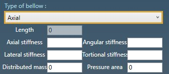

| Property | Unit Metric | Unit USA |
| -------- | ---- | ---- |
| Length | m | ft |
| Axial stiffness| kN/mm | kips/in |
| Lateral stiffness | kN/mm | kips/in |
| Angular stiffness | kN.m/rad | kips.ft/rad |
| Torsional stiffness | kN.m/rad | kips.ft/rad |
| Distributed mass | ton | kips |
| Pressure area | mm² | in² |

    If Torsional stiffness is zero or blank, the joint is modeled as rigid in torsion and the user should verify that the moments about the element axis Z’ are acceptable.

    One half of the mass will be concentrated at each end of the bellow.

- Lateral in a single plane

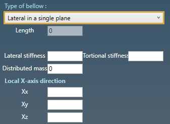

| Property | Unit Metric | Unit USA |
| -------- | ---- | ---- |
| Length | m | ft |
| Lateral stiffness | kN/mm | kips/in |
| Torsional stiffness | kN.m/rad | kips.ft/rad |
| Distributed mass | ton | kips |

    If Torsional stiffness is zero or blank, the joint is modeled as rigid in torsion and the user should verify that the moments about the element axis Z’ are acceptable.

    One half of the mass will be concentrated at each end of the bellow.

You can define the **X-axis** vector by defining Xx, Xy, Xz in global coordinates.

- Lateral in all planes

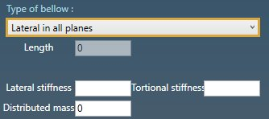

| Property | Unit Metric | Unit USA |
| -------- | ---- | ---- |
| Length | m | ft |
| Lateral stiffness | kN/mm | kips/in |
| Torsional stiffness | kN.m/rad | kips.ft/rad |
| Distributed mass | ton | kips |

    If Torsional stiffness is zero or blank, the joint is modeled as rigid in torsion and the user should verify that the moments about the element axis Z’ are acceptable.

    One half of the mass will be concentrated at each end of the bellow.

- Angular in a single plane

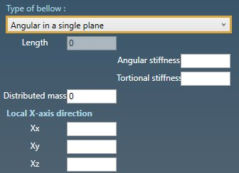

| Property | Unit Metric | Unit USA |
| -------- | ---- | ---- |
| Length | m | ft |
| Angular stiffness | kN.m/rad | kips.ft/rad |
| Torsional stiffness | kN.m/rad | kips.ft/rad |
| Distributed mass | ton | kips |

    If Torsional stiffness is zero or blank, the joint is modeled as rigid in torsion and the user should verify that the moments about the element axis Z’ are acceptable.

    One half of the mass will be concentrated at each end of the bellow.

- Angular in all planes

| Property | Unit Metric | Unit USA |
| -------- | ---- | ---- |
| Length | m | ft |
| Angular stiffness | kN.m/rad | kips.ft/rad |
| Torsional stiffness | kN.m/rad | kips.ft/rad |
| Distributed mass | ton | kips |

    If Torsional stiffness is zero or blank, the joint is modeled as rigid in torsion and the user should verify that the moments about the element axis Z’ are acceptable.

    One half of the mass will be concentrated at each end of the bellow.

**DATABASE** :

To save time, you can also directly select a bellow from **database** :

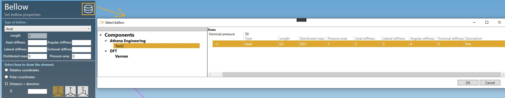

Click on the **Database** button, select a **Library** and a **Bellow**. The **OK** button will appear.

The tables will be filled automatically.

Click [here](https://documentation.metapiping.com/Settings/Databases/Components.html) for more information about creation of library of components.

---

You can then define the second point of the bellow thanks to the **Orientation tool**.

Click [here](https://documentation.metapiping.com/Design/Elements/Orientation.html) for more information about the orientation tool.

Create the bellow :

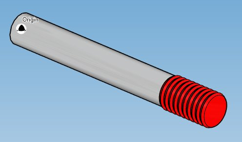

## 2. Modify/Remove a bellow

Change the **Selection mode** to ELEMENT and select a bellow :

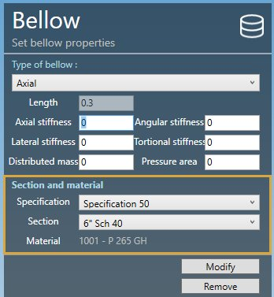

Click [here](https://documentation.metapiping.com/Design/Selection.html) for more information about the selection tool.

You can change the type and the appropriate properties of the selected bellow (except the length).

**SECTION AND MATERIAL** :

You can change the **specification** and **section/material** of the bellow.

Click on the **Modify** button to change the selected bellow with these new properties.

You can **undo** this command.

Click on the **Remove** button to delete the selected bellow.

You can **undo** this command.

## 3. Insert a bellow on an intermediate node

Click on the **Add bellow** button and select an **intermediate node** between 2 elements.

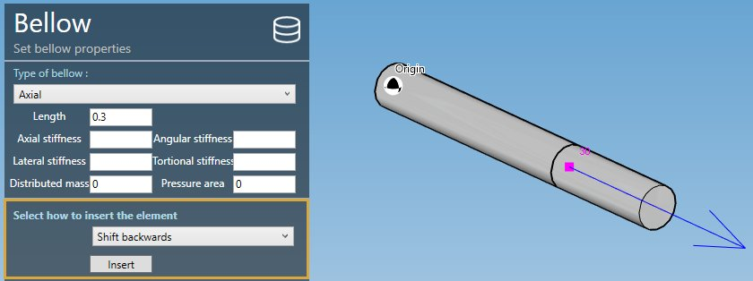

Fill the properties (see §1) and select the **insertion mode** :

- Shift forward
- Shift backwards
- Reduce the next element
- Reduce the previous element
- Symmetrically reduce the neighboring elements

{: .warning }
>ATTENTION, if the length is null, no mode will be proposed (empty list)

{: .warning }
>Based on the length of the bellow and the lengths of the neighboring elements, some mode could be hidden.

Select for example "Shift backwards" and click the **Insert** button :

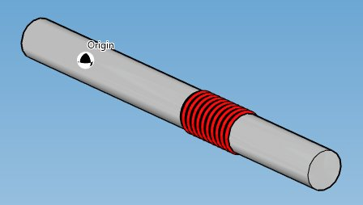

You can **undo** this command.