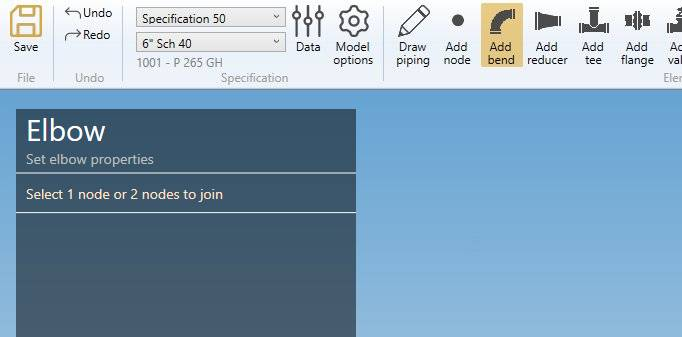
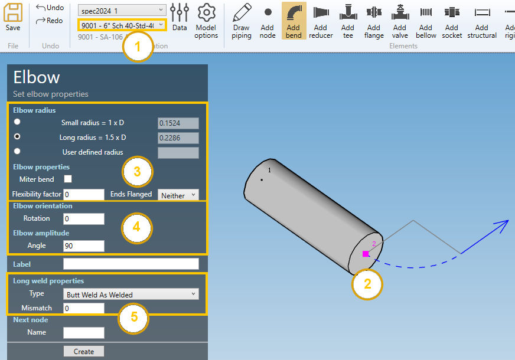
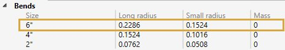
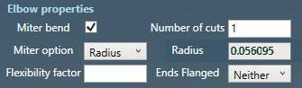
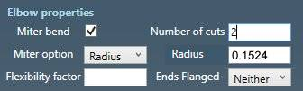
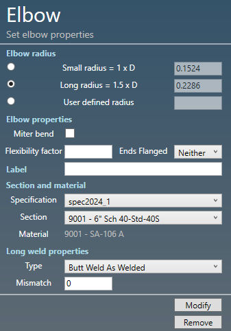

# Create bends

When you click on the **Add bend** button without selection, the left panel shows a message :

    Select a node

The **selection mode** is automatically set to **POINT**. You can so directly select a node.

## 1. Create first bend

Select an isolated node and click to the **Add bend** button :

MetaPiping ask you to define the **start direction** with 2 angles :

- Azimuth = Horizontal angle in °
- Elevation = Vertical angle in °

The default direction is the global **X axis**.

But with the default **Amplitude** of 90°, the elbow will have a final direction of the global **Y axis**.

The properties are explained in §2.

Click on the **Create** button to add a bend.

You can **Undo** this command.

## 2. Create a bend from another element

1. Select the current **section/material** in the specification box.
2. Select a **node**.
3. Click the **Add bend** button

### 2.1 Elbow properties (3)

In this example, the values correspond to **current specification** preset.

**RADIUS** :

MetaPiping set the **Long radius** by default but you can change it (Small radius or user defined radius)

| Property | Unit Metric | Unit USA |
| -------- |  ---- | ---- |
| Radius |  m | ft |

    To know the UNIT of the value, just let the mouse over the cell. 

**MITER** :

You can define a miter bend by checking the checkbox and define the number of cuts and if it is based on the radius or on a spacing.

| Property | Unit Metric | Unit USA |
| -------- |  ---- | ---- |
| Spacing |  m | ft |

Here are some examples.

Radius & cuts = 1 :

Radius & cuts = 2 :

Radius & cuts = 3 :

Spacing & cuts = 3, MetaPiping calculates the default spacing for an identical result :

Spacing = 0.6 :

{: .warning }
>ATTENTION, in this case, the node extremity of the previous pipe is moved to respect the bend construction

**FLEXIBILITY FACTOR** :

User can define the flexibility factor of the bend.

This flexibility factor will be used for all load cases.

Default = 0 or blanck = default special k Factor in the code.

**ENDS FLANGED** :

You can choose between :

- Neither end flanged
- One end flanged
- Both ends flanged

### 2.2 Elbow orientation (4)

Here are some examples of **Rotation** and **Amplitude** values :

Rotation and Angle are in °.

### 2.3 Long weld properties (5)

For the type, you can choose between :

- None
- Butt weld flush
- Butt weld as welded

Based on this property, define the **Long weld mismatch** [mm or in].

In this example, the default values correspond to **current specification** preset :

## 3. Modify/Remove a bend

Change the **Selection mode** to ELEMENT and select a bend :

Click [here](https://documentation.metapiping.com/Design/Selection.html) for more information about the selection tool.

You can modify the radius of the bend. The lengths of the adjacent pipes will be adapted.

You can also modify all bend properties.

**SECTION AND MATERIAL** :

You can change the **specification** and **section/material** of the bend.

**LONG WELD** :

You can change the **Long weld properties** :

For the type, you can choose between :

- None
- Butt weld flush
- Butt weld as welded

Based on this property, define the **Long weld mismatch** [mm or in].

In this example, the default values correspond to **current specification** preset :

Click on the **Modify** button to change the selected bend with these new properties.

You can **undo** this command.

Click on the **Remove** button to delete the selected bend.

You can **undo** this command.