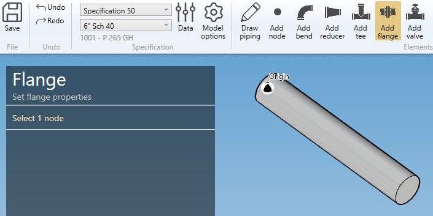
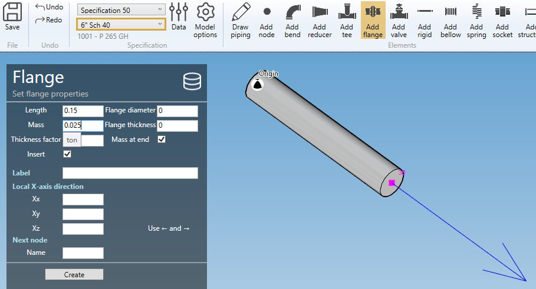
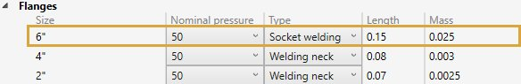
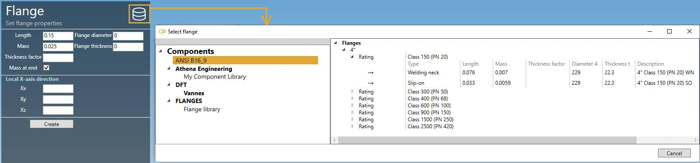
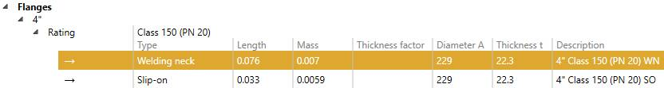
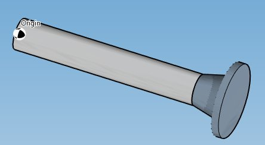
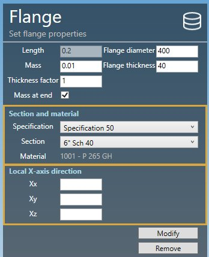
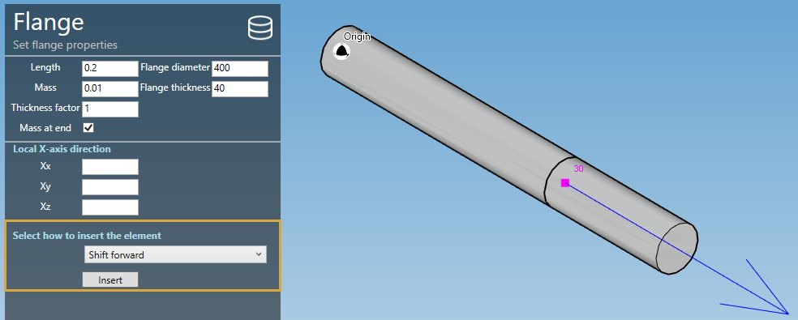
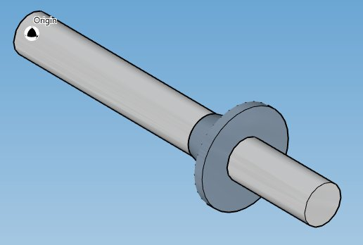

# Create flanges

When you click on the **Add flange** button without selection, the left panel shows a message :

    Select 1 node

The **selection mode** is automatically set to **POINT**. You can so directly select a node.

## 1. Create a flange

- Select the current **section/material** in the specification box.
- Select a **node**.
- Click the **Add flange** button.

**FLANGE PROPERTIES** :

Define the properties of the new flange :

| Property | Unit Metric | Unit USA |
| -------- | ---- | ---- |
| Length | m | ft |
| Mass | ton | kips |
| Thickness factor | - | - |
| Diameter of the flange| mm | in |
| Thickness of the flange | mm | in |
| Mass at end | - | - |

    The wall thickness is increased by the thickness factor by equally increasing the outer diameter and decreasing the inner diameter, keeping the mean diameter the same as that of connected pipe. The thickness value is reduced if the wall thickness is too great. Default = 3.

The Length and Mass come from the **current specification** :

To save time, you can also directly select a flange from **database** :

Click on the **Database** button, select a **Library** and a **Flange**. The **OK** button will appear.

The **Nominal pressure** and the **Type** is just informative.

The tables will be filled automatically :

Click [here](https://documentation.metapiping.com/Settings/Databases/Components.html) for more information about creation of library of components.

**X-AXIS DIRECTION** :

You can define the **X-axis** vector by defining Xx, Xy, Xz in global coordinates.

---

Click on the **Create** button to create the flange.

You can **undo** this command.

## 2. Modify/Remove a flange

Change the **Selection mode** to ELEMENT and select a flange :

Click [here](https://documentation.metapiping.com/Design/Selection.html) for more information about the selection tool.

You can change the properties of the selected flange (except the length).

**SECTION AND MATERIAL** :

You can change the **specification** and **section/material** of the flange.

**X-AXIS DIRECTION** :

You can change the **X-axis** vector by defining Xx, Xy, Xz in global coordinates.

Click on the **Modify** button to change the selected flange with these new properties.

You can **undo** this command.

Click on the **Remove** button to delete the selected flange.

You can **undo** this command.

## 3. Insert a flange on an intermediate node

Click on the **Add flange** button and select an **intermediate node** between 2 elements.

Fill the properties (see §1) and select the **insertion mode** :

- Shift forward
- Shift backwards
- Reduce the next element
- Reduce the previous element
- Symmetrically reduce the neighboring elements

{: .warning }
>ATTENTION, if the length is null, no mode will be proposed (empty list)

{: .warning }
>Based on the length of the flange and the lengths of the neighboring elements, some mode could be hidden.

Select for example "Symmetrically reduce the neighboring elements" and click the **Insert** button :

You can **undo** this command.