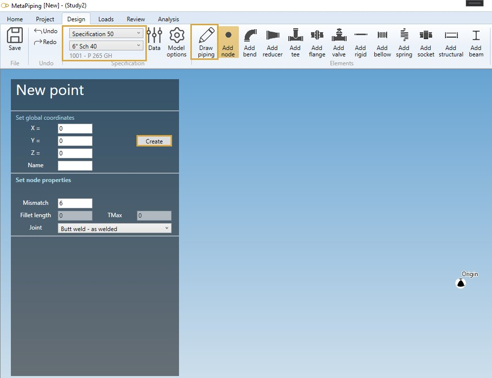
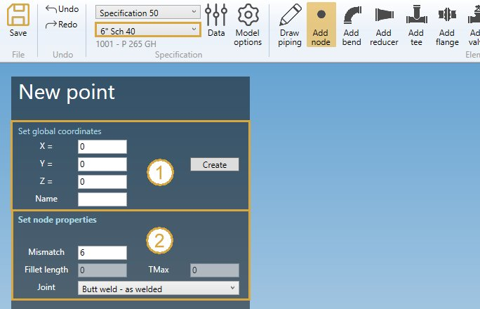
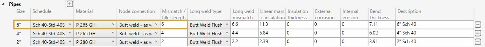
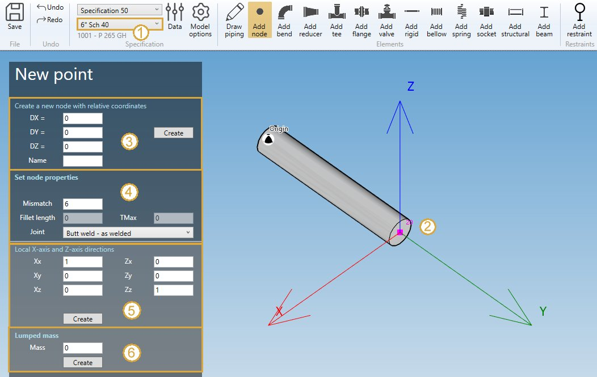
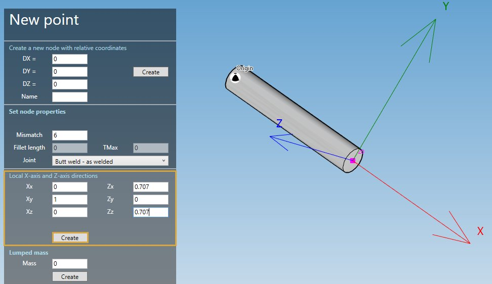
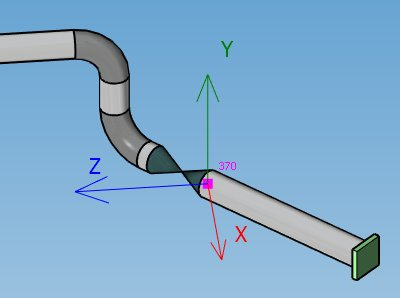
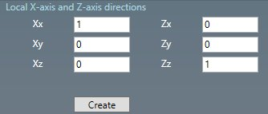
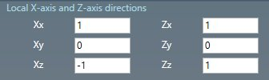
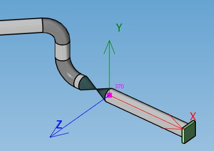
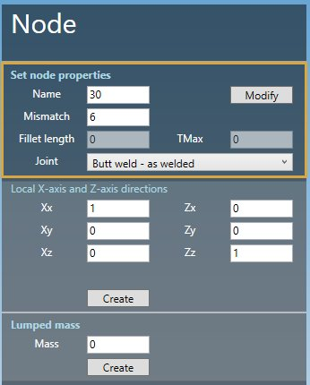

# Create nodes

There are 3 possibilities of creation :

- Creation of the **FIRST** node
- Creation of a **GLOBAL** node
- Creation of a **RELATIVE** node

## 1. First node

The first node panel is called when a first **element** needs a starting point. Example for a pipe :

Set the **GLOBAL** X, Y, Z coordinates and a name.

See **Global node** just below :
## 2. Global node

If the selection is **EMPTY**, click on the **Add node** button to create a new global node :

{: .warning }
>ATTENTION, the current specification is important (Ex : 6" Sch 40) for the default node connection.

Fill the **GLOBAL** X, Y, Z coordinates and a name (1).

| Property | Description | Unit Metric | Unit USA |
| -------- | ----------- | ---- | ---- |
| X | X global coordinate | m | ft |
| Y | Y global coordinate  | m | ft |
| Z | Z global coordinate  | m | ft |
| Name | Text or number | - | - |

    To know the UNIT of the value, just let the mouse over the cell. 

If **Name** is blank, the new node will receive an automatic name based on the **Node settings**.

Click [here](https://documentation.metapiping.com/Settings/General.html) for more information about node naming.

All new node follow the **current specification** node connection properties (2) :

| Property | Description | Unit Metric | Unit USA |
| -------- | ----------- | ---- | ---- |
| Mismatch | Mismatch for welded joints | mm | in |
| Fillet length | Length of fillet weld Cx | mm | in |
| TMax | for Class 1 transition within 1:3 slope envelope | mm | in |

The **Joint** can be :

- None
- Butt weld - flush
- Butt weld - as welded
- Fillet weld
- Full fillet weld
- Threaded
- Brazed

In this example, the values correspond to **current specification** preset :

Click the **Create** button to create the first node of the model.

## 3. Relative node

If a node is selected, you can create a new node relative to it in **Global directions** :

1. Select the current **section/material** in the specification box.
2. Select a **node**.
3. Define the DX, DY, DZ, name of the new node.
4. Define the node properties

Click [here](https://documentation.metapiping.com/Design/Selection.html) for more information about the selection tool.

| Property | Description | Unit Metric | Unit USA |
| -------- | ----------- | ---- | ---- |
| DX | Relative distance from the selected node in X global direction | m | ft |
| DY | Relative distance from the selected node in Y global direction  | m | ft |
| DZ | Relative distance from the selected node in Z global direction  | m | ft |
| Name | Text or number | - | - |

If **Name** is blank, the new node will receive an automatic name based on the **Node settings**.

Click [here](https://documentation.metapiping.com/Settings/General.html) for more information about node naming.

All new node follow the **current specification** node connection properties (2) :

| Property | Description | Unit Metric | Unit USA |
| -------- | ----------- | ---- | ---- |
| Mismatch | Mismatch for welded joints | mm | in |
| Fillet length | Length of fillet weld Cx | mm | in |
| TMax | for Class 1 transition within 1:3 slope envelope | mm | in |

The **Joint** can be :

- None
- Butt weld - flush
- Butt weld - as welded
- Fillet weld
- Full fillet weld
- Threaded
- Brazed

## 4. Creation of a local coordinate system

You can define a new **local coordinate system** on selected node (5) :

Just define the new **X** axis vector (Xx, Xy, Xz) in global coordinates and the new **Z** axis vector (Zx, Zy, Zz).
The **Y** axis will be automatically defined by the right-hand rule.

Example :

Click on the **Create** button to add a new local coordinate system to the model.

You can later modify or remove this object by selecting this node and click on **Modify/Remove** buttons.

You can **Undo** this command.

Another example with an off-axis piping :

The default global axis are :

To define the **Local X-axis** tangent to the pipe, change the vectors like this :

## 5. Creation of a lumped mass

You can define a **lumped mass** on selected node (6) :

| Property | Unit Metric | Unit USA |
| -------- | ---- | ---- |
| Mass | ton | kips |

Click on the **Create** button to add a new lumped mass to the node.

You can later modify or remove this object by selecting this node and click on **Modify/Remove** buttons.

You can **Undo** this command.

---
## 6. Modify a node

Change the **Selection mode** to POINT and select a node :

Click [here](https://documentation.metapiping.com/Design/Selection.html) for more information about the selection tool.

You can change the node properties.

Click on the **Modify** button to change the selected node.

You can **Undo** this command.