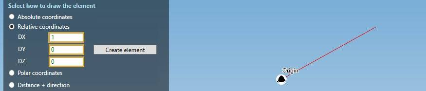
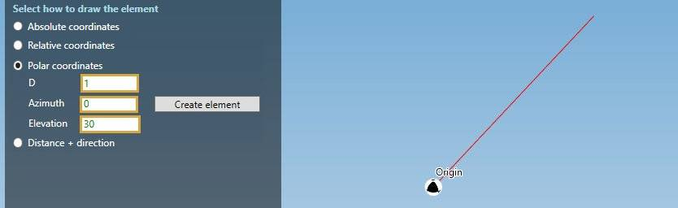
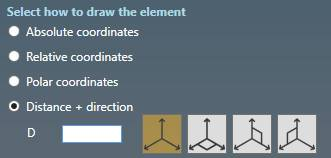
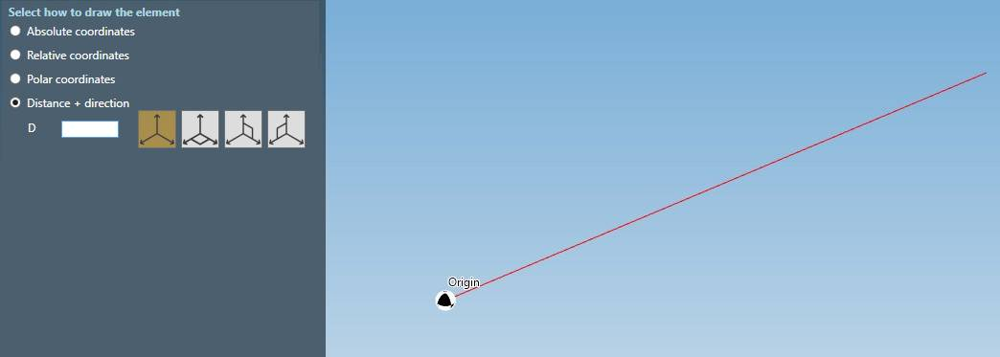

# Orientation

This tool is common to all element.

The goal is to help user to set the second extremity point, based on the first selected one.

---

## 1. Relative coordinates

This mode is usefull when you want to draw an element with the second point **relative** to the first one in the **global axis** directions :

| Property | Unit Metric | Unit USA |
| -------- | ---- | ---- |
| DX | m | ft |
| DY | m | ft |
| DZ | m | ft |

    To know the UNIT of the value, just let the mouse over the cell. 

*TIP : a preview of the element length will be shown when entering values :*

Click the **Create element** button to create the element.

You can **Undo** this command.

---

## 2. Polar coordinates

This mode is usefull when you want to draw an element with the second point relative to the first one by a **distance** and **2 angles** :

| Property | Description Unit | Metric | Unit USA |
| -------- | ---- | ---- | -- |
| D | Distance | m | ft |
| Azimuth | Horizontal angle | ° | ° |
| Elevation | Vertical angle | ° | ° |

    To know the UNIT of the value, just let the mouse over the cell. 

*TIP : a preview of the element length will be shown when entering values.*

Click the **Create element** button to create the element.

You can **Undo** this command.

---

## 3. Distance + direction

This mode is usefull when you want to draw an element with a **standard direction** (+X, -X, +Y, -Y, +Z, -Z) and a **distance** from the first point :

| Property | Unit Metric | Unit USA |
| -------- | ---- | ---- |
| Distance | m | ft |

Move the mouse in the desired direction. The line will take the same color as the **global axis**. Red for **X**, green for **Y** and blue for **Z**.

Write the distance on the **keyboard** (m or ft) :

The value will automatically be entered in the corresponding cell (D).

Click on **Enter** to execute the creation.

{: .warning }
> ATTENTION, do not write the value in the cell directly !

You can **Undo** this command.

### 3.1 Horizontal plane

Click on the second button to display a **horizontal graduated wheel** :

Bring mouse closer to an angle to be magnetized (Ex : at 315 °).

Now that the direction is established, as in §3, write the distance on the **keyboard** :

And valid :

The second point will be at "Distance" from the first point in the direction of the selected angle.

### 3.1 Vertical plane

Click on the third button to display a **vertical graduated wheel** :

Bring mouse closer to an angle to be magnetized (Ex : at 15 °).

Now the direction is established, as in §3., write the distance on the **keyboard** :

And valid :

The second point will be at "Distance" from the first point in the direction of the selected angle.

You can **Undo** this command.

### 3.2 Special cases

* Tangent direction (in MAGENTA) :

---

* Snap to an existing node (for branch connection - in YELLOW) :

*TIP : The distance is automatically filled in the cell. Press ENTER to create the element :*

>The point (GREEN) becomes a REFERENCE point

You can **Undo** this command.

---

* Indication of similar coordinate with a REFERENCE point :

1. Snap to a point (become the new REFERENCE POINT in GREEN)
2. Move mouse verticaly from the first point and wait that the **dashed lines** appear.
3. The blue line indicates that the **Z** coordinate is similar to the coordinate of the REFERENCE point. Same for the **dashed lines**.
4. The distance is automatically filled in the cell.
5. Press ENTER to create the element :

You can **Undo** this command.
