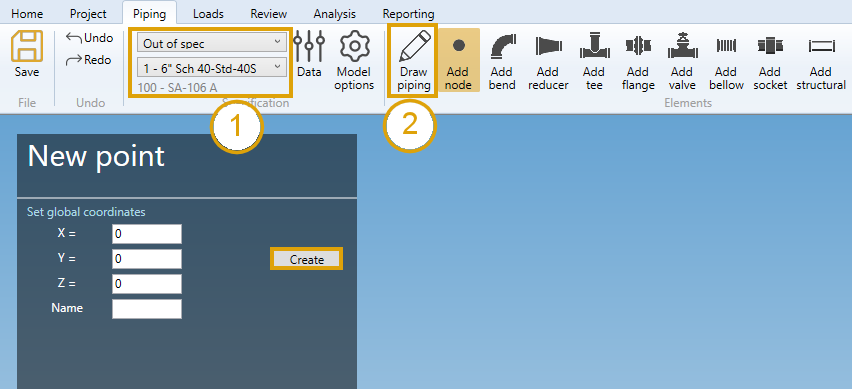
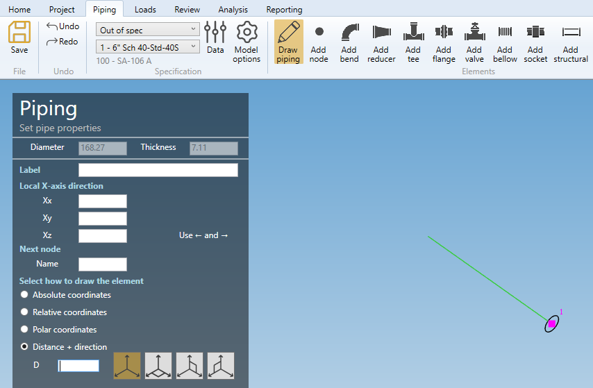
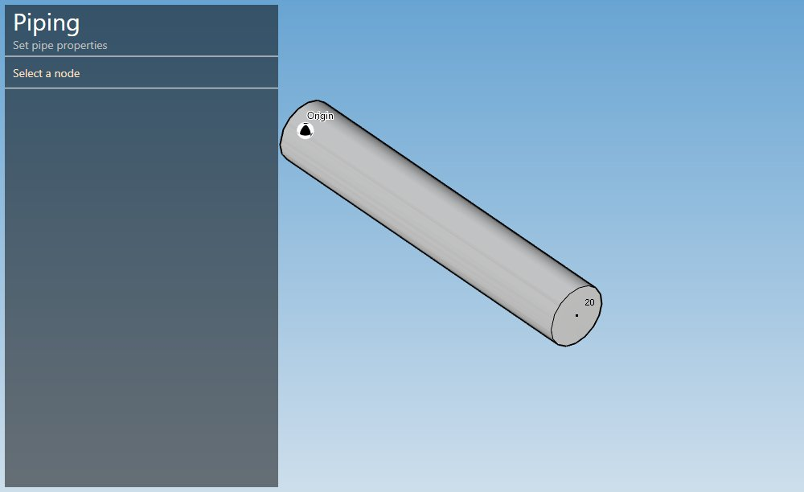
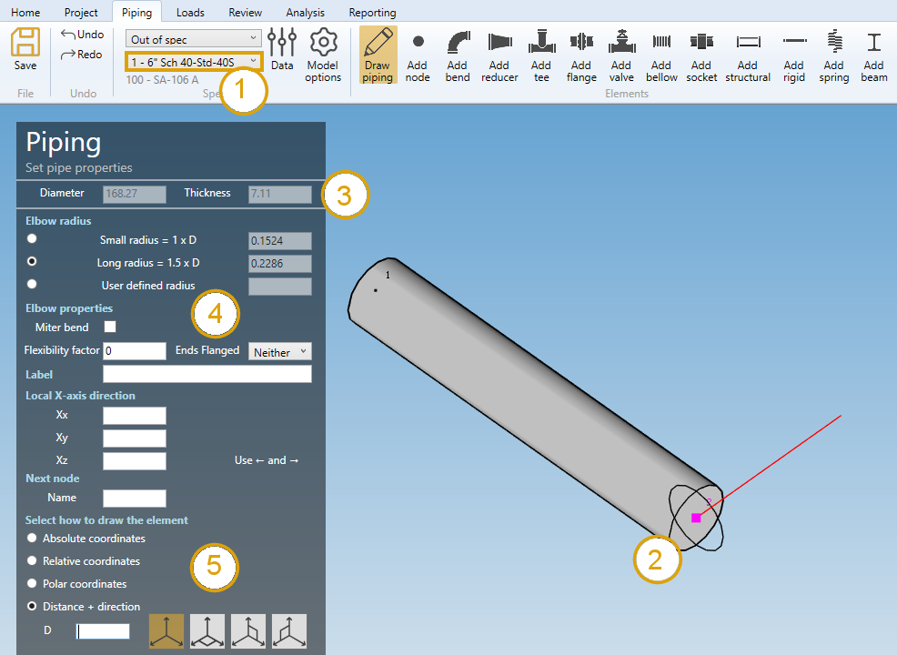
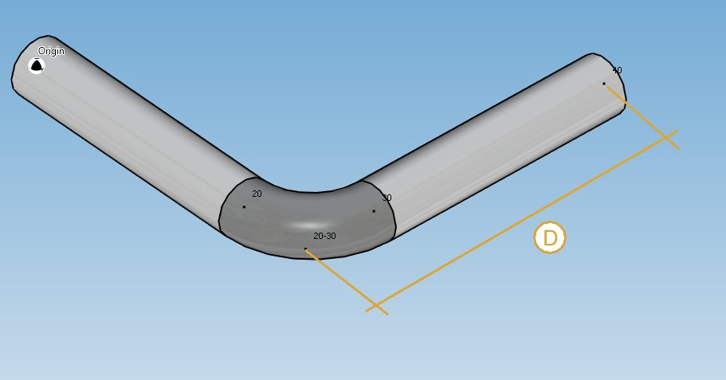
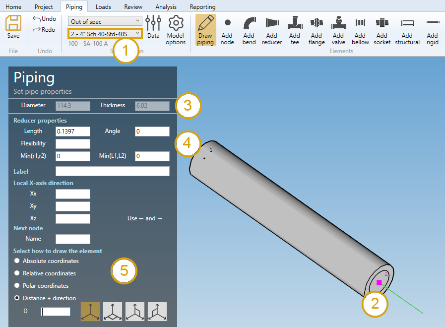
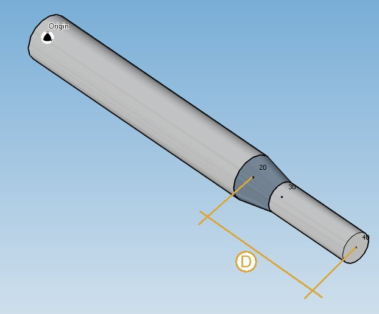
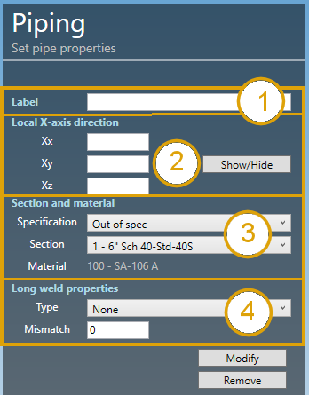
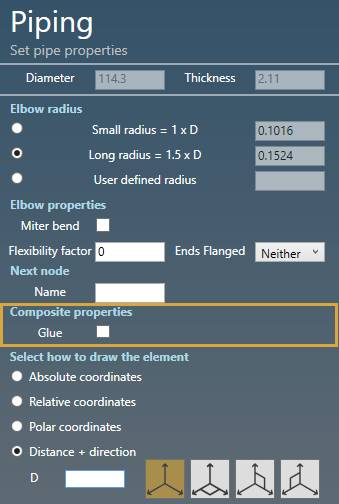

# Create pipes

## 1. New project

Select a **specification** (default = Out of spec) and a current **section**.

Click on the **Draw piping** button.

As we start the modeling, we need to create a **First node** :

Click [here](https://documentation.metapiping.com/Design/Elements/Node.html) for more information about the **First node** creation.

### 1.2. Draw the first pipe

After the first node has been created, you can draw your first pipe :

The Diameter and Thickness properties come from the **current specification**.

    To know the UNIT of the value, just let the mouse over the cell. 

The only thing you have to do is to select how to draw the pipe.

Click [here](https://documentation.metapiping.com/Design/Elements/Orientation.html) for more information about the orientation tool.

## 2. Draw piping

When you click on the **Draw piping** button without selection, the left panel shows a message :

    Select a node

The **selection mode** is automatically set to **POINT**. You can so directly select a node :

1. Select the current **section/material** in the specification box.
2. Select a **node**.
3. The current diameter and thickness is shown on top of the left panel.

Click [here](https://documentation.metapiping.com/Design/Selection.html) for more information about the selection tool.

MetaPiping checks the section of the element on the selected node.

### 2.1 Same section

If the section of the element on the selected node is the same as the **current section** (1), the left panel shows **ELBOW PROPERTIES** (4).

Click [here](https://documentation.metapiping.com/Design/Elements/Bend.html) for more information about the elbow properties.

You can then define the second point of the pipe thanks to the **Orientation tool** (5).

Click [here](https://documentation.metapiping.com/Design/Elements/Orientation.html) for more information about the orientation tool.

Based on the elbow properties and the second point definition (distance **D** in **X** direction for example), the pipe is created with a bend :

The distance **D** start from old point 20 to point 40. An elbow is then inserted from new point 20 - point 20-30 to point 30.

The previous pipe is reduced from old point 20 (actually point 20-30) to new point 20.

You can **undo** this command.

### 2.2 Different section

If the section of the element on the selected node is different from the **current section** (1), the left panel shows **REDUCER PROPERTIES** (4).

{: .warning }
>ATTENTION, you are supposed to draw the pipe tangent from the previous one.

Click [here](https://documentation.metapiping.com/Design/Elements/Reducer.html) for more information about the reducer properties.

You can then define the second point of the pipe thanks to the **Orientation tool** (5).

Click [here](https://documentation.metapiping.com/Design/Elements/Orientation.html) for more information about the orientation tool.

Based on the reducer properties and the second point definition (distance **D** in **TANGENT** direction for example), the pipe is created with a reducer :

The previous pipe is NOT affected.

You can **undo** this command.

>Remark : you can also draw a pipe from one node to another node. Just by clicking on the target node.

## 3. Modify/Remove a pipe

Change the **Selection mode** to ELEMENT and select a pipe :

Click [here](https://documentation.metapiping.com/Design/Selection.html) for more information about the selection tool.

**LABEL** (1) :

You can define a label to this element. The labels are shown with the label view button.

**X-AXIS DIRECTION** (2) :

You can change the **X-axis** vector by defining Xx, Xy, Xz in global coordinates.

**SECTION AND MATERIAL** (3) :

You can change the **specification** and **section/material** of the pipe.

**LONG WELD** (4) :

You can change the **Long weld properties** :

For the type, you can choose between :

- None
- Butt weld flush
- Butt weld as welded

Based on this property, define the **Long weld mismatch** [mm or in].

Click on the **Modify** button to change the selected pipe with these new properties.

You can **undo** this command.

Click on the **Remove** button to delete the selected pipe.

You can **undo** this command.

**COMPOSITE PIPE** :

If the material of the pipe is **Composite**, a special property **Glue** appears :

This property indicates that the pipe is a connectivity element.
