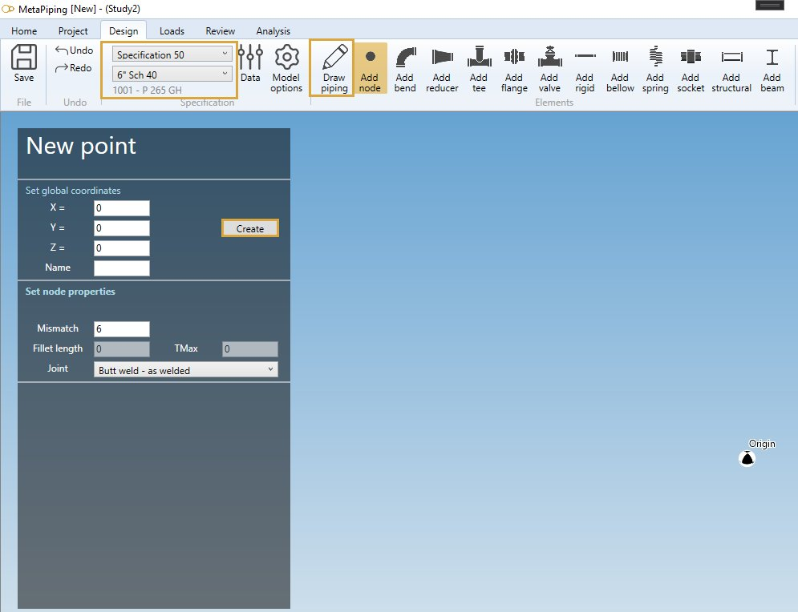
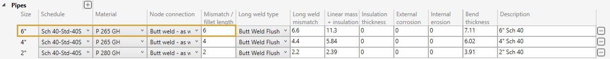

# Create pipes

## 1. New project

Select a **specification** (default = Out of spec) and a current **section**.

Click on the **Draw piping** button.

As we start the modelisation, we need to create a **First point** :

    To know the UNIT of the value, just let the mouse over the cell. 

| Property | Description | Unit Metric | Unit USA |
| -------- | ----------- | ---- | ---- |
| X | X global coordinate | m | ft |
| Y | Y global coordinate  | m | ft |
| Z | Z global coordinate  | m | ft |
| Name | Text or number | - | - |

If **Name** is blanck, the new node will receive an automatic name based on the **Node settings**.

Click [here](https://documentation.metapiping.com/Settings/General.html) for more information about node naming.

### 1.1. Node properties

All new node follow the **current specification** node connection properties :

| Property | Description | Unit Metric | Unit USA |
| -------- | ----------- | ---- | ---- |
| Mismatch | Mismatch for welded joints | mm | in |
| Fillet length | Length of fillet weld Cx | mm | in |
| TMax | for Class 1 transition within 1:3 slope envelope | mm | in |

The **Joint** can be :

- None
- Butt weld - flush
- Butt weld - as welded
- Fillet weld
- Full fillet weld
- Threaded
- Brazed

In this example, the values correspond to **current specification** preset :

Click the **Create** button to create the first node of the model.

### 1.2. Draw first pipe

After the first node has been created, you can draw your first pipe :

The Diameter and Thickness properties come from the **current specification**.

    To know the UNIT of the value, just let the mouse over the cell. 

The only thing you have to do is to select how to draw the pipe.

Click [here](https://documentation.metapiping.com/Design/Elements/Orientation.html) for more information about the orientation tool.

## 2. Draw piping

Documentation will come soon...

