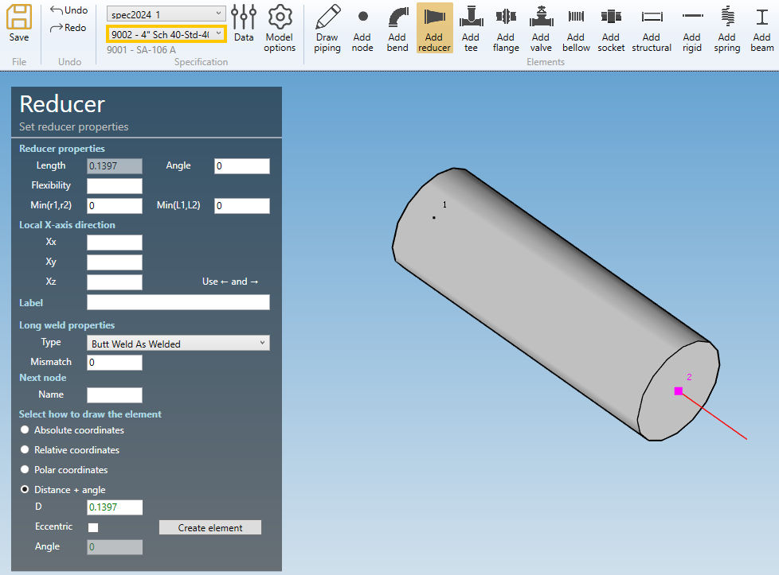
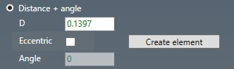
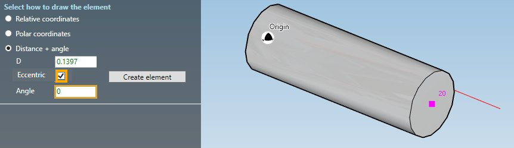
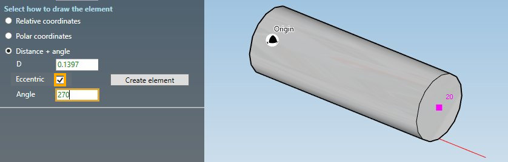

# Create reducers

When you click on the **Add reducer** button without selection, the left panel shows a message :

    Select 1 extremity node

The **selection mode** is automatically set to **POINT**. You can so directly select a node.

{: .warning }
>ATTENTION, you cannot start a reducer from an isolated node, only from the extremity of an element. If you have to start your piping line by a reducer, first create a small pipe in opposite direction, create a reducer from an extremity, then remove the pipe.

## 1. Create a reducer from another element

- Select the current **section/material** in the specification box (1).
- Select a **node** (2).
- Click the **Add reducer** button

If the section of the element on node has the same section than the **current specification** (1), the left panel shows a message :

    The section is the same. No need of reduction

If the section of the element on node is different from the **current specification** (Ex : 4" Sch 40), you can define a new reducer :

**REDUCER PROPERTIES** :

Define the properties of the new reducer :

| Property | Unit Metric | Unit USA | Remark |
| -------- |  ---- | ---- | -- |
| Length |  m | ft |  |
| Angle | ° | ° |  |
| Flexibility | - | - |  |
| Min(r1,r2)  | mm | in | Minimum radius r1,r2 : B31J, Class 1 and Classes 2 & 3 Revision A94 for C2 of equations X and Z |
| Min(L1,L2)  | m | ft | Minimum tangent L1, L2 : for B31J and Class 1 only |

The Length and Angle come from the **current specification** :

You can change the **flexibility factor** of the reducer. If blank, default value = 1.

**X-AXIS DIRECTION** :

You can change the **X-axis** vector by defining Xx, Xy, Xz in global coordinates.

Use the left and right keyboard arrows to turn the **X-axis** vector 90°/-90°around the tangent direction.

**LABEL** :

You can define a label to this element. The labels are shown with the node names view button.

**LONG WELD** :

You can change the **Long weld properties** :

For the type, you can choose between :

- None
- Butt weld flush
- Butt weld as welded

Based on this property, define the **Long weld mismatch** [mm or in].

In this example, the default values correspond to the first section preset.

**NEXT NODE** :

You can set the next extremity node name of the element. If blank, the software will define it automatically. The software will also check that the name doesn't already exist.

---

You can then define the second point of the reducer thanks to the **Orientation tool**.

Click [here](https://documentation.metapiping.com/Design/Elements/Orientation.html) for more information about the orientation tool.

By default, the **Distance + angle** tool is activated with the default **length** and in **concentric** mode :

| Property | Unit Metric | Unit USA |
| -------- |  ---- | ---- |
| D |  m | ft |
| Angle | ° | ° |

A red line shows a preview of the second point of the reducer :

{: .warning }
>ATTENTION, you can change the length of the reducer but it will no more be standard

You can click on the **Create element** to create a concentric reducer :

You can **undo** this command.

**ECCENTRIC REDUCER** :

Check the **Eccentric** checkbox and define at which side of the pipe you want to be tangent (thanks to the **Angle** property) :

A red line shows a preview of the tangent side and length of the reducer.

You can click on the **Create element** to create a right aligned eccentric reducer :

You can **undo** this command.

Another example with **Angle = 270 °** :

You can click on the **Create element** to create a bottom aligned eccentric reducer :

You can **undo** this command.

## 2. Modify/Remove a reducer

Change the **Selection mode** to ELEMENT and select a reducer :

Click [here](https://documentation.metapiping.com/Design/Selection.html) for more information about the selection tool.

**REDUCER PROPERTIES** :

You can change the properties of the selected reducer (except the length) :

| Property | Unit Metric | Unit USA | Remark |
| -------- |  ---- | ---- | -- |
| Length |  m | ft |  |
| Angle | ° | ° |  |
| Flexibility | - | - |  |
| Min(r1,r2)  | mm | in | Minimum radius r1,r2 : B31J, Class 1 and Classes 2 & 3 Revision A94 for C2 of equations X and Z |
| Min(L1,L2)  | m | ft | Minimum tangent L1, L2 : for B31J, Class 1 only |

You can change the **flexibility factor** of the reducer. If blank, default value = 1.

**X-AXIS DIRECTION** :

You can change the **X-axis** vector by defining Xx, Xy, Xz in global coordinates.

**LABEL** :

You can change the label of the element.

**SECTION AND MATERIAL** :

You can change the **specification** and **section/material** of the two extremities of the reducer.

**LONG WELD** :

You can change the **Long weld properties** :

For the type, you can choose between :

- None
- Butt weld flush
- Butt weld as welded

Based on this property, define the **Long weld mismatch** [mm or in].

In this example, the default values correspond to the first section preset.

Click on the **Modify** button to change the selected reducer with these new properties.

You can **undo** this command.

Click on the **Remove** button to delete the selected reducer.

You can **undo** this command.