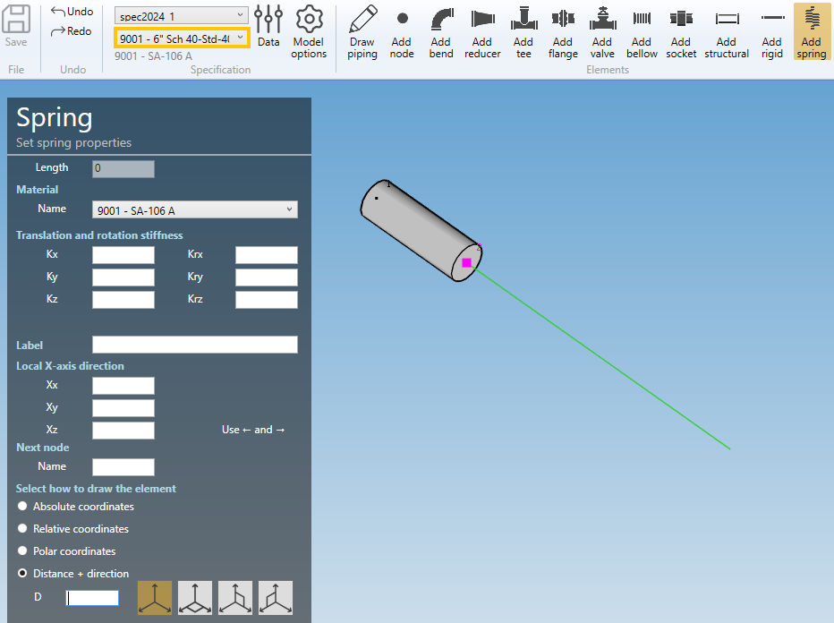

# Create springs

When you click on the **Add spring** button without selection, the left panel shows a message :

    Select 1 node

The **selection mode** is automatically set to **POINT**. You can so directly select a node.

## 1. Create a spring

- Select the current **section/material** in the specification box.
- Select a **node**.
- Click the **Add spring** button.

**SPRING PROPERTIES** :

| Property | Description | Unit Metric | Unit USA |
| -------- | --- | ---- | ---- |
| Length | - | m | ft |
| Kx | Translation stiffness in X direction | kN/mm | kips/in |
| Kx | Translation stiffness in Y direction | kN/mm | kips/in |
| Kx | Translation stiffness in Z direction | kN/mm | kips/in |
| Krx | Rotation stiffness in X direction | kN.m/rad | kips.ft/rad |
| Kry | Rotation stiffness in Y direction | kN.m/rad | kips.ft/rad |
| Krz | Rotation stiffness in Z direction | kN.m/rad | kips.ft/rad |

>The length must be defined by the **orientation tool**.

**MATERIAL** :

Select the material of the spring.

Click [here](https://documentation.metapiping.com/Design/Specification/Data.html#11-material-definition) for more information about the materials definition.

**X-AXIS DIRECTION** :

You can define the **X-axis** vector by defining Xx, Xy, Xz in global coordinates.

**Label** :

You can define a label to this element. The labels are shown with the node names view button.

---

You can then define the second point of the spring thanks to the **Orientation tool**.

Click [here](https://documentation.metapiping.com/Design/Elements/Orientation.html) for more information about the orientation tool.

Create the spring (represented by a black line) :

## 2. Modify/Remove a spring

Change the **Selection mode** to ELEMENT and select a spring by dragging a selection rectangle :

Click [here](https://documentation.metapiping.com/Design/Selection.html) for more information about the selection tool.

You can change the properties of the selected spring (except the length) :

Click on the **Modify** button to change the selected spring with these new properties.

You can **undo** this command.

Click on the **Remove** button to delete the selected spring.

You can **undo** this command.

## 3. Insert a spring on an intermediate node

Click on the **Add spring** button and select an **intermediate node** between 2 elements.

Fill the properties (see §1) and select the **insertion mode** :

- Shift forward
- Shift backwards
- Reduce the next element
- Reduce the previous element
- Symmetrically reduce the neighboring elements

{: .warning }
>ATTENTION, if the length is null, no mode will be proposed (empty list)

{: .warning }
>Based on the length of the spring and the lengths of the neighboring elements, some mode could be hidden.

Select for example "Reduce the next element" and click the **Insert** button :

You can **undo** this command.