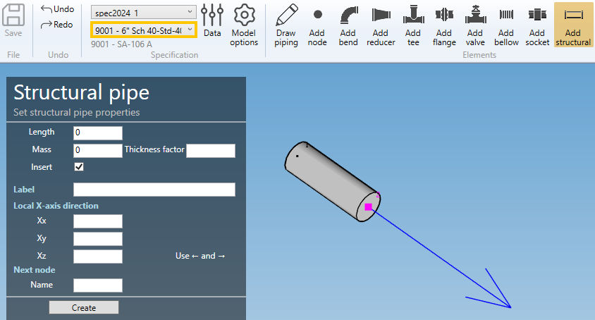

# Create structurals

    A structural is an element which is modeled as a straight pipe but which does not contain any fluid and is not counted as part of a tee connection.

When you click on the **Add structural** button without selection, the left panel shows a message :

    Select 1 node

The **selection mode** is automatically set to **POINT**. You can so directly select a node.

## 1. Create a structural

- Select the current **section/material** in the specification box.
- Select a **node**.
- Click the **Add structural** button.

**STRUCTURAL PROPERTIES** :

| Property | Unit Metric | Unit USA |
| -------- | ---- | ---- |
| Length | m | ft |
| Mass | ton | kips |
| Thickness factor | - | - |

>The length must be defined by the **orientation tool**.

**X-AXIS DIRECTION** :

You can define the **X-axis** vector by defining Xx, Xy, Xz in global coordinates.

---

You can then define the second point of the structural thanks to the **Orientation tool**.

Click [here](https://documentation.metapiping.com/Design/Elements/Orientation.html) for more information about the orientation tool.

Create the structural :

## 2. Modify/Remove a structural

Change the **Selection mode** to ELEMENT and select a structural :

You can change the properties of the selected structural (except the length).

**SECTION AND MATERIAL** :

You can change the **specification** and **section/material** of the structural.

Click on the **Modify** button to change the selected structural with these new properties.

You can **undo** this command.

Click on the **Remove** button to delete the selected structural.

You can **undo** this command.

## 3. Insert a structural on an intermediate node

Click on the **Add structural** button and select an **intermediate node** between 2 elements.

Fill the properties (see §1) and select the **insertion mode** :

- Shift forward
- Shift backwards
- Reduce the next element
- Reduce the previous element
- Symmetrically reduce the neighboring elements

{: .warning }
>ATTENTION, if the length is null, no mode will be proposed (empty list)

{: .warning }
>Based on the length of the structural and the lengths of the neighboring elements, some mode could be hidden.

Select for example "Reduce the previous element" and click the **Insert** button :

You can **undo** this command.
