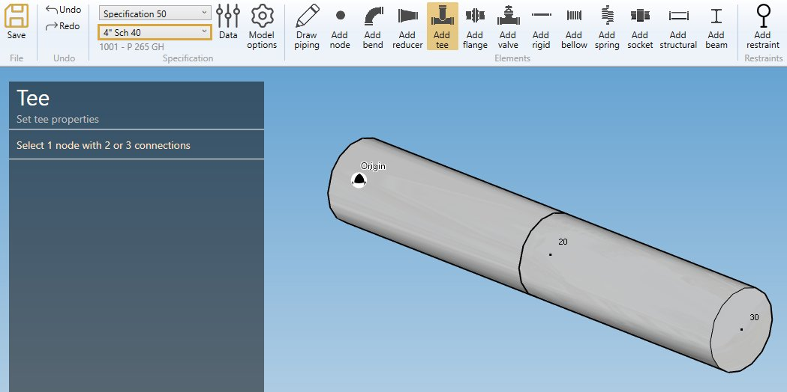
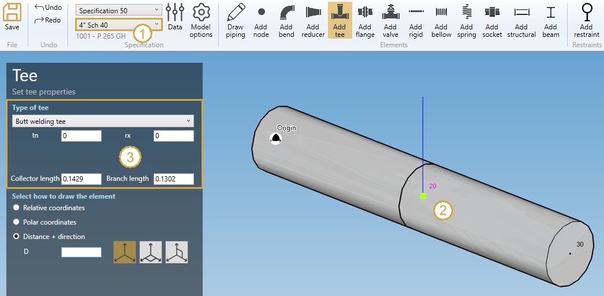
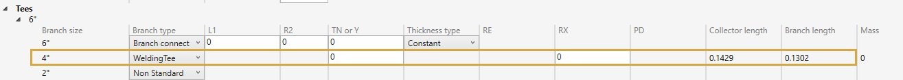
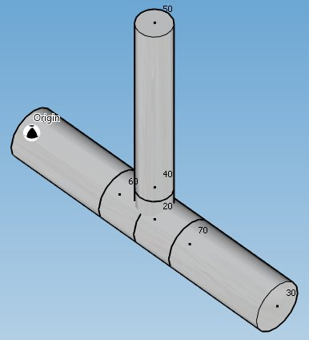
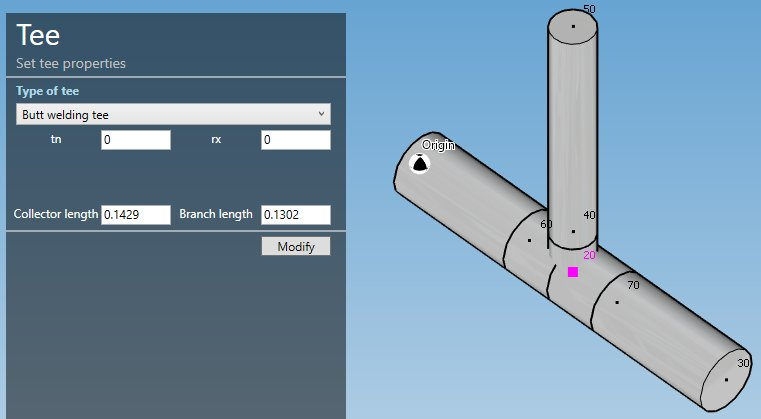

# Create tees

When you click on the **Add tee** button without selection, the left panel shows a message :

    Select 1 node with 2 or 3 connections

The **selection mode** is automatically set to **POINT**. You can so directly select a node.

## 1. Create a tee from an intermediate node

- Select the current **section/material** in the specification box (1).
- Select a **node** (2).
- Click the **Add tee** button

>The left panel is the same if you click on the **Draw piping** button

**TEE PROPERTIES** :

Type of tee :

- Branch connection
- WeldingTee
- Non Standard
- Fabricated
- Sweepolet flush weld
- Sweepolet as welded
- Weldolet
- Extruded weldingTee
- Welded-in contour insert
- Branch welded-on fitting
- Lateral connection
- Partial penetration branch connection

Based on the type, some other properties must be filled :

| Property | Description | Unit Metric | Unit USA |
| -------- | ---- | ---- | -- |
| L1 | Branch length | m | ft |
| R2 | Branch-to-run fillet radius | mm | in |
| TN | Branch connections and piping lateral connections CONSTANT thickness | mm | in |
| Y | Branch connections and piping lateral connections VARIABLE thickness | mm | in |
| Thickness type | Variable or constant | - | - |
| RE | Pad or saddle outer radius for reinforced fabricated tees  | mm | in |
| RX | Transition radius | mm | in |
| PD | Pad thickness for reinforced fabricated tees | mm | in |
| Collector length | Half length of the collector of welding tees | m | ft |
| Branch length | Branch length of welding tees | m | ft |

>MetaPiping automatically shows the necessary properties for each type.

The Type and properties come from the **current specification** :

You can change all values before creating the tee.

**ORIENTATION** :

You can then define the second point of the tee thanks to the **Orientation tool**.

Click [here](https://documentation.metapiping.com/Design/Elements/Orientation.html) for more information about the orientation tool.

After creation of the tee, you can **undo** the command.

*Example of welding tee*

## 2. Modify a tee

Change the **Selection mode** to TEE and select a node intersecting 3 or more pipes :

Click [here](https://documentation.metapiping.com/Design/Selection.html) for more information about the selection tool.

You can change the type of tee and the corresponding properties.

Click on the **Modify** button to modify the selected tee.

You can **undo** this command.