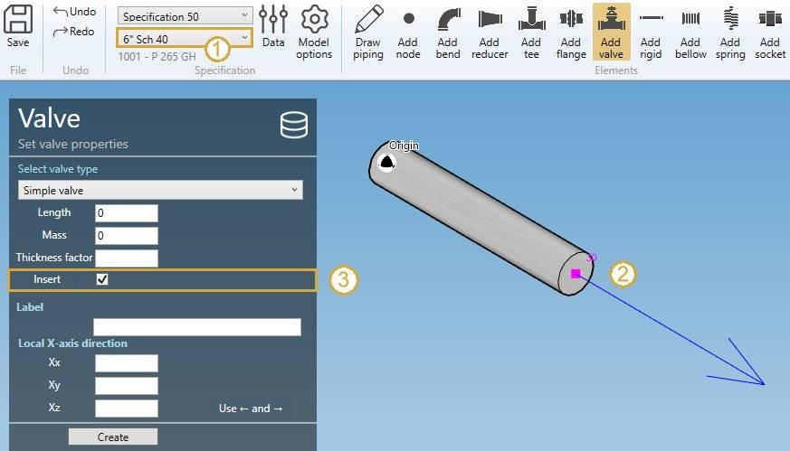
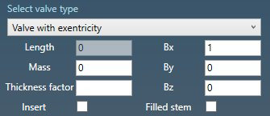
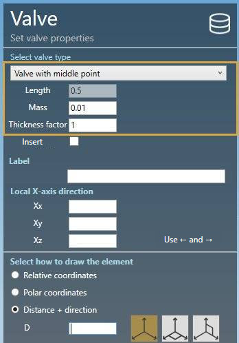
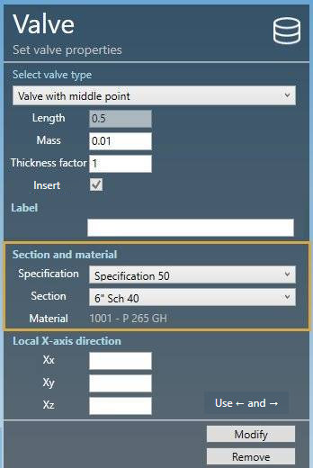

# Create valves

When you click on the **Add valve** button without selection, the left panel shows a message :

    Select 1 node

The **selection mode** is automatically set to **POINT**. You can so directly select a node.

## 1. Create a valve

- Select the current **section/material** in the specification box.
- Select a **node**.
- Click the **Add valve** button.

By default, the orientation of the valve is defined to **Tangent** (3) represented by a blue arrow.

You can decide to use the **orientation tool** by unchecking the option :

**VALVE PROPERTIES** (1) :

You have the choice between 3 types of valve :

- Simple valve
- Valve with middle point
- Valve with excentricity

| Property | Unit Metric | Unit USA |
| -------- | ---- | ---- |
| Length | m | ft |
| Mass | ton | kips |
| Thickness factor | - | - |

>The length must be defined by the **orientation tool**.

The valve with excentricity has 4 more options :

| Property | Unit Metric | Unit USA |
| -------- | ---- | ---- |
| Bx | m | ft |
| By | m | ft |
| Bz | m | ft |
| Filled stem | - | - |

The vector B (Bx, By, Bz) represents the excentricity in **global coordinates**.

**DATABASE** (2) :

To save time, you can also directly select a valve from **database** :

Click on the **Database** button, select a **Library** and a **Valve**. The **OK** button will appear.

The **Nominal pressure**, the **Type** and the **Connection** are just informative.

The tables will be filled automatically :

Click [here](https://documentation.metapiping.com/Settings/Databases/Components.html) for more information about creation of library of components.

**X-AXIS DIRECTION** (3) :

You can define the **X-axis** vector by defining Xx, Xy, Xz in global coordinates.

---

You can then define the second point of the valve thanks to the **Orientation tool**.

Click [here](https://documentation.metapiping.com/Design/Elements/Orientation.html) for more information about the orientation tool.

Create the valve :

## 2. Modify/Remove a valve

Change the **Selection mode** to ELEMENT and select a valve :

Click [here](https://documentation.metapiping.com/Design/Selection.html) for more information about the selection tool.

You can change the properties of the selected valve (except the length).

**SECTION AND MATERIAL** :

You can change the **specification** and **section/material** of the valve.

**X-AXIS DIRECTION** :

You can change the **X-axis** vector by defining Xx, Xy, Xz in global coordinates.

Click on the **Modify** button to change the selected valve with these new properties.

You can **undo** this command.

Click on the **Remove** button to delete the selected valve.

You can **undo** this command.

## 3. Insert a valve on an intermediate node

Click on the **Add valve** button and select an **intermediate node** between 2 elements.

Fill the properties (see §1) and select the **insertion mode** :

- Shift forward
- Shift backwards
- Reduce the next element
- Reduce the previous element
- Symmetrically reduce the neighboring elements

{: .warning }
>ATTENTION, if the length is null, no mode will be proposed (empty list)

{: .warning }
>Based on the length of the valve and the lengths of the neighboring elements, some mode could be hidden.

Select for example "Reduce the previous element" and click the **Insert** button :

You can **undo** this command.