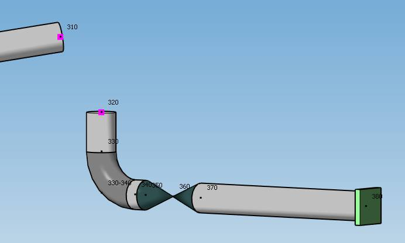
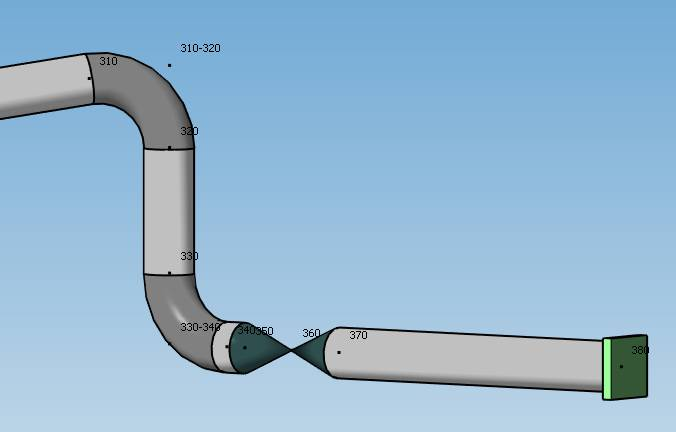
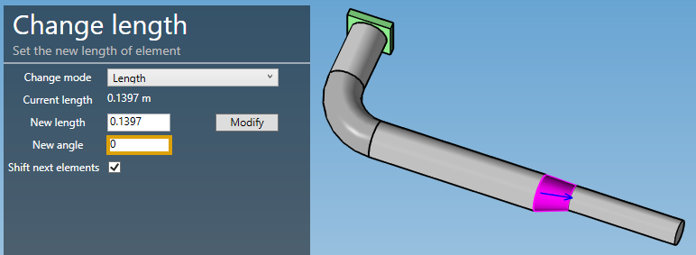
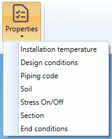
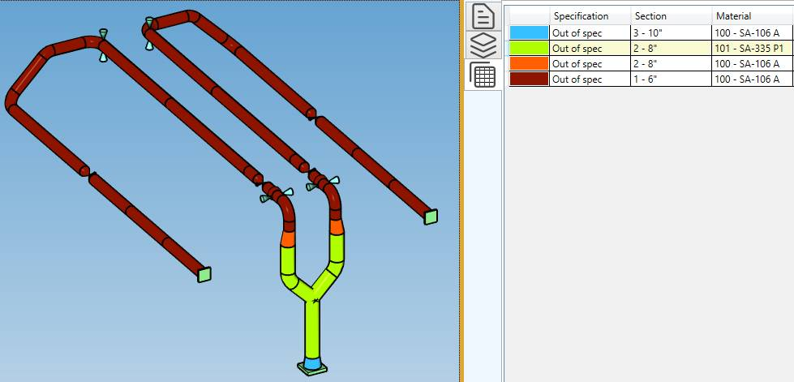
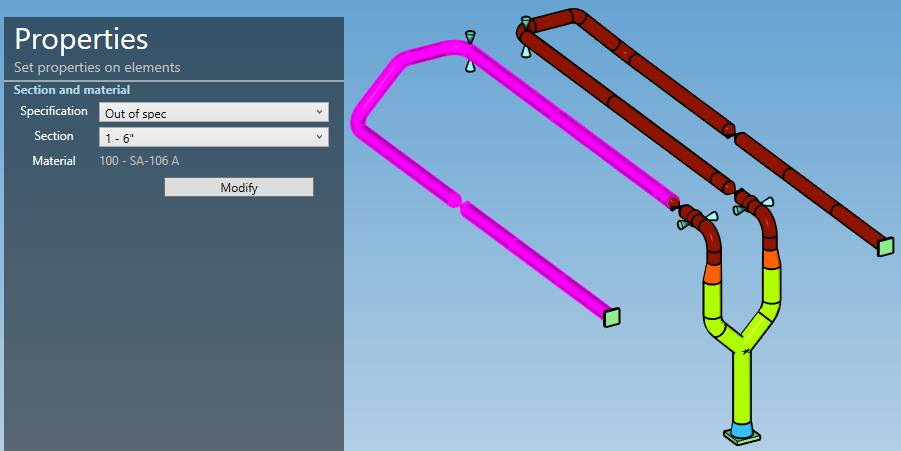
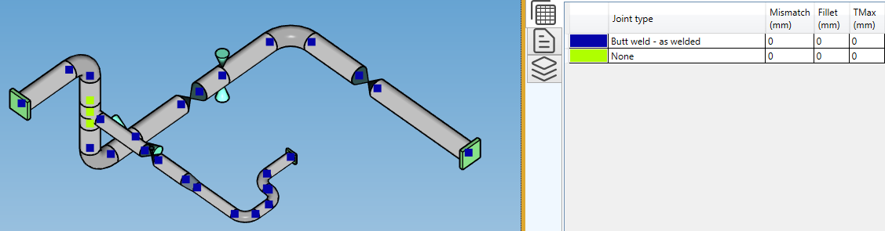
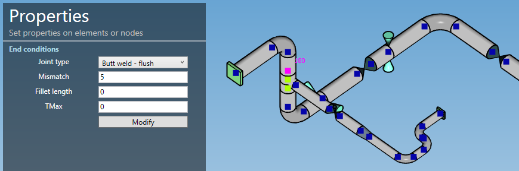

# Modification

## 1. Selection

Click on **Select** button to open the selection window :

- Click on **Point** to select nodes (or F10)
- Click on **Element** to select piping elements (pipe, bend, reducer, valve, etc.) (or F11)
- Click on **Restraint** to select restraints (or F12)
- Click on **Tee** to select nodes where a tee has been assigned
- Press **ESC** on keyboard to hide the selection window

You can now select objects of corresponding type.

    The selection is done by pressing the left mouse button above the desired object

You can also select a node by entering the node name and click to the **Point** button.

You can also select an element by entering the two node names separate by "-" and click to the **Element** button.

You can also select a valve by entering its label and click to the **Element** button.

You can also select a restraint by entering the node name or its label and click to the **Restraint** button.

Click [here](https://documentation.metapiping.com/Design/Selection.html) to have more information about the selection.

## 2. Remove nodes, elements and restraints

Select **nodes**, **elements** or **restraints** and click on the **Remove elements** button to delete these elements.

You can **Undo** this command.

>The nodes must be isolated (not an extremity or part of an element)!

## 3. Cut element

It is possible to cut **pipe**, **bend** and **beam** and in several parts.

Select for example one pipe and click to the **Cut element** button :

Cut mode can be :
* Cut into 2 parts
* Cut into N parts

The current length of the pipe is shown on top.

By default, a distance from the first node of the pipe is calculated, which is the half length of the selected pipe (middle point).

You can choose from which node to start and the distance.

| Property | Unit Metric | Unit USA |
| -------- | ---- | ---- |
| Length | m | ft |
| Distance | m | ft |

If the pipe has a bend before, next or both, you can check the cell *Use intersection point* to calculate the distance between these points instead of the extremities of the pipe.

Click on **Cut** to execute the command.

    To know the UNIT of the value, just let the mouse over the cell. 

You can **Undo** this command.

The second possibility is to cut in N parts with preview :

The tool is available only for pipes, beams and bends. For bends, length and distance are replaced by angles :

## 4. Merge elements

Select a **Node** between 2 similar colinear pipes or 2 succesive bends with same center and radius, and click on the **Merge** button.

The 2 pipes/bends must have the same **Material** and the same **Section**.

The 2 pipes/bends will be replaced by one pipe/bend.

{: .warning }
>Attention, the force, restraint, lumped mass or local coordinates defined on the node will be destroyed.

You can **Undo** this command.

## 5. Node SIF

MetaPiping lets you define **Stress Intensification Factors** and **Stress Indices** on nodes.

Each **piping code** has its own factors.

| Code | SIFS | 
| -------- | ----------- | 
| ASME and RCC-M Class 1 | B1, C1, K1, B2, C2, K2, C3, C3', K3 |
| ASME Class 2 | i, B1, B2, B2', C2 |
| B31.1 up to ed. 2018| i |
| B31.1 ed. 2020 (B31J) | ii, io, it, ia, Ii, Io, It, Ia |
| EN 13480 | io, ii |
| RCC-M Class 2 | i |
| RCC-MRx | B1, C1, K1, B2, C2, K2, C3, K3, D1, D21, D22, D23 |

These factors are unitless.

Select a node and click on the **Node SIF** button.

- You can change one (or more) factor(s) at the extremity of the first element connected to the node, e.g. in RCC-M Class 2 code :

- You can change one (or more) factor(s) at the **extremity** of the second element connected to the node :

- You can change one (or more) factor(s) of all elements :

Click on **Create** button to apply the SIFs to the model.

You can later modify or remove the SIFs by selecting the node and clicking on **Modify/Remove** buttons.

You can **Undo** this command.

## 6. Body SIF

MetaPiping lets you define **Stress Intensification Factors** and **Stress Indices** on elements.

Select an element and click on the **Body SIF** button :

Click on **Create** button to apply the SIFs to the model.

You can later modify or remove the SIFs by selecting the element and clicking on **Modify/Remove** buttons.

You can **Undo** this command.

## 7. Move nodes

MetaPiping lets you move nodes.

Select the nodes one by one (with CTRL) or by a selection rectangle :

Set the offset to apply to the nodes :

| Property | Unit Metric | Unit USA |
| -------- | ---- | ---- |
| DX | m | ft |
| DY | m | ft |
| DZ | m | ft |

Validate the command by clicking on the **Move** button :

You can **Undo** this command.

{: .warning }
>ATTENTION, sometimes this modification can create unwanted results, essentially due to bend definition no more compatible. You have to remove elements and rebuild the connection.

Remove bend :

Select the 2 nodes :

Click on the *Add bend* button, set the section and the radius, click on the *Create* button :

This will extend the 2 adjacent elements and place a bend with the desired radius.

## 8. Change length/direction

MetaPiping lets you change length of any element (no bend).

Change mode :

* Change length
* Change direction

You can select only one element.

### 8.1 Change length

Select an element and set the new length :

| Property | Unit Metric | Unit USA |
| -------- | ---- | ---- |
| Length | m | ft |

The **Shift** option offsets all following elements.

If **Shift** option is unchecked, MetaPiping will try to change the length of the selected element and modify the length of the next element. 

>A new length of 0 will remove the element if possible (the element must not be the attached element of a restraint)

You can **Undo** this command.

For eccentric reducer, the change length tool let you change the angle of alignement:

Don't forget to shift the next elements to not destroy the pipeline continuity.

### 8.2 Change direction

Select an element and set the new length vector (DX, DY, DZ) :

| Property | Unit Metric | Unit USA |
| -------- | ---- | ---- |
| DX | m | ft |
| DY | m | ft |
| DZ | m | ft |

{: .warning }
>ATTENTION, the vector (DX, DY, DZ) is calculated from intersection point to intersection point. On the last picture, the arrow starts from the intersection point on the bend and ends at the last point of the pipe.

Let's try this change of direction :

The **Shift** option offsets all following elements.

{: .warning }
>ATTENTION, sometime this modification can create unwanted results, essentially due to bend definition no more compatible. You have to remove elements and rebuild the connection. See §7 that show an example of how to rebuild a bend.

You can **Undo** this command.

## 9. Properties

### 9.1 Installation temperature

MetaPiping lets you define installation temperature of elements when different from default one :

Select multiple elements, uncheck **Use default** cell and set the new temperature.

| Property | Unit Metric | Unit USA |
| -------- | ---- | ---- |
| Temperature | °C | °F |

Click on Modify to validate.

You can see the elements with this property by a colored map and the legend in the right tab.

You can **Undo** this command.

### 9.2 Design conditions

MetaPiping lets you define the design conditions of elements in the case of different from default one :

Select multiple elements, uncheck **Use default** cell and set the temperature and pressure.

| Property | Unit Metric | Unit USA |
| -------- | ---- | ---- |
| Temperature | °C | °F |
| Pressure | N/mm² | psi |

Click on Modify to validate.

You can see the elements with this property by a colored map and the legend in the right tab.

You can **Undo** this command.

### 9.3 Piping code

MetaPiping lets you define the piping code of elements when different from default one :

Select multiple elements, uncheck **Use default** cell and set the new code and edition.

Click on Modify to validate.

You can see the elements with this property by a colored map and the legend in the right tab.

You can **Undo** this command.

### 9.4 Soil

In **Buried piping**, soils must be defined for all elements.

    The soil is modeled as a Winkler foundation. Discrete springs are placed at regular intervals ∆L along the piping in the transverse and axial directions. The springs can be either elastic or elastic-plastic.

Select multiple elements and choose **New soil** :

Give it a name and fill the soil properties :

| Property | Description | Unit Metric | Unit USA |
| -------- | ---- | ---- | ---- |
| LK | Influence length | m | in |
| LF | Slippage length | m | in |
| NK | Number of transverse springs along the influence length | - | - |
| NF | Number of axial springs along the slippage length | - | - |
| KH | Horizontal modulus of subgrade reaction | N/mm² | ksi |
| KU | Vertical upwards modulus of subgrade reaction | N/mm² | ksi |
| KD | Vertical downwards modulus of subgrade reaction | N/mm² | ksi |
| FF | Maximum unit friction force at the pipe/soil interface | kN/m | kips/ft |
| GH | Pipe displacement at maximum horizontal resistance | mm | in |
| GU | Pipe displacement at maximum upwards resistance | mm | in |
| GD | Pipe displacement at maximum downwards resistance | mm | in |
| GF | Axial pipe displacement at maximum friction force | mm | in |
| DM | Maximum pipe length | m | ft |
| DB | Maximum bend length | m | ft |

Click on Modify to validate.

You can see the elements with this property by a colored map and the legend in the right tab.

You can **Undo** this command.

### 9.5 Stress On/Off

MetaPiping lets you deactivate the stress report of a portion of the piping system.

Select multiple elements and click on the **Deactivated stress** button :

Click on the **Modify** button to deactivate the stress reporting of these elements.

You can later modify this property by selecting the elements and activating or deactivating the checkbox.

You can see the elements with this property by a colored map and the legend in the right tab.

You can **Undo** this command.

### 9.6 Section

As in review, the **Section** property shows all sections used in the model with a colored map :

MetaPiping let you change the section of multiple elements in one operation.

Select multiple elements, a specification and a section, and click on the **Modify** button :

You can **Undo** this command.

>If the sections are different between several selected elements, **Variable** will appear. You have to specify the wanted new section to be able to modify.

### 9.7 End conditions

The **End conditions** property shows all type of joint between elements with a colored map :

MetaPiping let you change the joint of multiple nodes in one operation.

Select multiple nodes, change the properties, and click on the **Modify** button :

You can **Undo** this command.

>If the types are different between several selected nodes, **Variable** will appear. You have to specify the wanted new type to be able to modify.