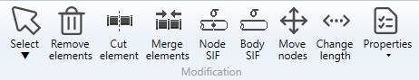
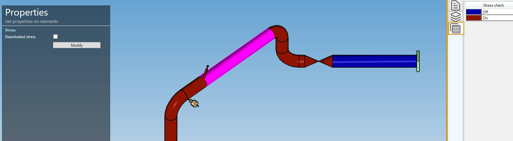

# Modification

## 1. Selection

Click on **Select** button to open the selection window :

- Click on **Point** to select nodes
- Click on **Element** to select piping element (pipe, bend, reducer, valve...)
- Click on **Restraint** to select restraints
- Click **Tee** to select nodes where a tee has been assigned
- Press **ESC** on keyboard to hide the selection window

You can now select objects of appropriate type.

    The selection is done by pressing the left mouse button above the desired object

Click [here](https://documentation.metapiping.com/Design/Selection.html) to have more information about the selection.

## 2. Remove elements

Select elements and click the **Remove elements** button to delete these elements.

You can **Undo** this command.

## 3. Cut element

It is possible to cut **pipe** in two parts.

Select one pipe and click to the **Cut element** button :

The length of the pipe is shown on the right.

By default, a distance from the first node of the pipe is calculated, this is the half length of the selected pipe (middle point).

You can change the value. Click on **Cut** to execute the command.

    To know the UNIT of the value, just let the mouse over the cell. 

You can **Undo** this command.

## 4. Merge elements

Select a **Node** between 2 similar colinear pipes and click the **Merge** button.

The 2 pipes must have the same **Material** and the same **Section**.

The 2 pipes will be replaced by one pipe.

{: .warning }
>Attention, the force, restraint, lumped mass or local coordinates defined on the node will be destroyed.

You can **Undo** this command.

## 5. Node SIF

MetaPiping let you define **Stress Intensification Factors** on nodes.

Each **piping code** has its own factors.

| Code | SIFS | 
| -------- | ----------- | 
| ASME Class 1 | B1, C1, K1, B2, C2, K2, C3, CP, K3 |
| ASME Class 2 | i, B1, B2, B2', C2 |
| B31.1 | i |
| B31.1 B31.J | ii, io, it, ia, Ii, Io, It, Ia |
| EN 13480 | io, ii |
| RCCM Class 2 | i |

A factor is unitless.

Select a node and click to the **Node SIF** button.

- You can change one factor (or more) of the extremity of the first element of the node (in RCCM Class 2 code) :

- You can change one (or more) factor of the **extremity** of the second element of the node :

- You can change one (or more) factor of all elements :

Click on **Create** button to add SIF informations on the model.

You can later modify or remove SIF factors by selecting the node and click on **Modify/Remove** buttons.

You can **Undo** this command.

## 6. Body SIF

MetaPiping let you define **Stress Intensification Factors** on elements.

Select an element and click to the **Body SIF** button :

Click on **Create** button to add SIF informations on the model.

You can later modify or remove SIF factors by selecting the element and click on **Modify/Remove** buttons.

You can **Undo** this command.

## 7. Stress On/Off

MetaPiping let you deactivate the stress report of a portion of the piping system.

Select multiple elements and click to the **Stress On/Off** button :

Click on the checkbox and the **Modify** button to deactivate the stress reporting of these elements.

You can later modify this property by selecting the elements and activate or deactivate the value.

You can **Undo** this command.