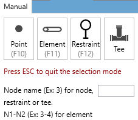
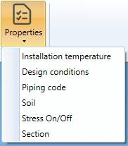

# Modification

## 1. Selection

Click on **Select** button to open the selection window :

- Click on **Point** to select nodes
- Click on **Element** to select piping elements (pipe, bend, reducer, valve, etc.)
- Click on **Restraint** to select restraints
- Click **Tee** to select nodes where a tee has been assigned
- Press **ESC** on keyboard to hide the selection window

You can now select objects of appropriate type.

    The selection is done by pressing the left mouse button above the desired object

Click [here](https://documentation.metapiping.com/Design/Selection.html) to have more information about the selection.

## 2. Remove elements

Select elements and click the **Remove elements** button to delete these elements.

You can **Undo** this command.

## 3. Cut element

It is possible to cut **pipe** in several parts.

Select one pipe and click to the **Cut element** button :

Cut mode can be :
* Cut into 2 parts
* Cut into N parts

The current length of the pipe is shown on top.

By default, a distance from the first node of the pipe is calculated, which is the half length of the selected pipe (middle point).

You can choose from which node to start and the distance.

| Property | Unit Metric | Unit USA |
| -------- | ---- | ---- |
| Length | m | ft |
| Distance | m | ft |

Click on **Cut** to execute the command.

    To know the UNIT of the value, just let the mouse over the cell. 

You can **Undo** this command.

The second possibility is to cut in N parts with preview :

The tool is available only for pipes, beams and bends. For bends, length and distance are replaced by angles :

## 4. Merge elements

Select a **Node** between 2 similar colinear pipes and click the **Merge** button.

The 2 pipes must have the same **Material** and the same **Section**.

The 2 pipes will be replaced by one pipe.

{: .warning }
>Attention, the force, restraint, lumped mass or local coordinates defined on the node will be destroyed.

You can **Undo** this command.

## 5. Node SIF

MetaPiping lets you define **Stress Intensification Factors** and **Stress Indices** on nodes.

Each **piping code** has its own factors.

| Code | SIFS | 
| -------- | ----------- | 
| ASME Class 1 | B1, C1, K1, B2, C2, K2, C3, C3', K3 |
| ASME Class 2 | i, B1, B2, B2', C2 |
| B31.1 | i |
| B31.1 B31.J | ii, io, it, ia, Ii, Io, It, Ia |
| EN 13480 | io, ii |
| RCCM Class 2 | i |

These factors are unitless.

Select a node and click on the **Node SIF** button.

- You can change one (or more) factor(s) at the extremity of the first element connected to the node, e.g. in RCC-M Class 2 code :

- You can change one (or more) factor(s) at the **extremity** of the second element connected to the node :

- You can change one (or more) factor(s) of all elements :

Click on **Create** button to apply the SIFs to the model.

You can later modify or remove the SIFs by selecting the node and clicking on **Modify/Remove** buttons.

You can **Undo** this command.

## 6. Body SIF

MetaPiping lets you define **Stress Intensification Factors** and **Stress Indices** on elements.

Select an element and click on the **Body SIF** button :

Click on **Create** button to apply the SIFs to the model.

You can later modify or remove the SIFs by selecting the element and clicking on **Modify/Remove** buttons.

You can **Undo** this command.

## 7. Move nodes

MetaPiping lets you move nodes.

Select the nodes one by one (with CTRL) or by a selection rectangle :

Set the offset to apply to the nodes :

| Property | Unit Metric | Unit USA |
| -------- | ---- | ---- |
| DX | m | ft |
| DY | m | ft |
| DZ | m | ft |

Valid the command by clicking the **Move** button :

You can **Undo** this command.

{: .warning }
>ATTENTION, sometime this modification can create unwanted results, essentially due to bend definition no more compatible. You have to remove elements and rebuild the connection.

Remove bend :

Draw a pipe between the 2 nodes (a bend will automatically appear) :

Select the node and add a bend to finalize the connection :

## 8. Change length/direction

MetaPiping lets you change length of any element (no bend).

Change mode :

* Change length
* Change direction

You can select only one element.

### 8.1 Change length

Select an element and set the new length :

| Property | Unit Metric | Unit USA |
| -------- | ---- | ---- |
| Length | m | ft |

The **Shift** option offset all next elements.

If **Shift** option is unchecked, MetaPiping will try to change the length of the selected element and modify the length of the next element. 

You can **Undo** this command.

### 8.2 Change direction

Select an element and set the new direction (DX, DY, DZ) :

| Property | Unit Metric | Unit USA |
| -------- | ---- | ---- |
| DX | m | ft |
| DY | m | ft |
| DZ | m | ft |

{: .warning }
>ATTENTION, the direction (DX, DY, DZ) are calculated from intersection point to intersection point. On the last picture, the arrow start from the intersection point on the bend and end at the last point of the pipe.

Let's try this change of direction :

The **Shift** option offset all next elements.

{: .warning }
>ATTENTION, sometime this modification can create unwanted results, essentially due to bend definition no more compatible. You have to remove elements and rebuild the connection.

You can **Undo** this command.

## 9. Properties

### 9.1 Installation temperature

MetaPiping lets you define installation temperature of elements in the case of different from default one :

Select multiple elements, uncheck **Use default** cell and set the new temperature.

| Property | Unit Metric | Unit USA |
| -------- | ---- | ---- |
| Temperature | °C | °F |

Click to Modify to validate.

You can see the elements with this property by a colored map and the legend in the right tab.

You can **Undo** this command.

### 9.2 Design conditions

MetaPiping lets you define the design conditions of elements in the case of different from default one :

Select multiple elements, uncheck **Use default** cell and set the temperature and pressure.

| Property | Unit Metric | Unit USA |
| -------- | ---- | ---- |
| Temperature | °C | °F |
| Pressure | N/mm² | lb/in² |

Click to Modify to validate.

You can see the elements with this property by a colored map and the legend in the right tab.

You can **Undo** this command.

### 9.3 Piping code

MetaPiping lets you define the piping code of elements in the case of different from default one :

Select multiple elements, uncheck **Use default** cell and set the new code and edition.

Click to Modify to validate.

You can see the elements with this property by a colored map and the legend in the right tab.

You can **Undo** this command.

### 9.4 Soil

In **Buried piping**, soils must be defined for all elements.

    The soil is modeled as a Winkler foundation. Discrete springs are placed at regular intervals ∆L along the piping in the transverse and axial directions. The springs can be either elastic or elastic-plastic.

Select multiple elements and choose **New soil** :

Give it a name and fill the soil properties :

| Property | Description | Unit Metric | Unit USA |
| -------- | ---- | ---- | ---- |
| LK | Influence Length | m | in |
| LF | Slippage Length | m | in |
| NK | Number of Transverse Springs along the Influence Length | - | - |
| NF | Number of Axial Springs along the Slippage Length | - | - |
| KH | Horizontal Modulus of Subgrade Reaction | N/mm² | ksi |
| KU | Vertical Upwards Modulus of Subgrade Reaction | N/mm² | ksi |
| KD | Vertical Downwards Modulus of Subgrade Reaction | N/mm² | ksi |
| FF | Maximum Unit Friction Force at the Pipe/Soil Interface | kN/m | kips/ft |
| GH | Pipe Displacement at Maximum Horizontal Resistance | mm | in |
| GU | Pipe Displacement at Maximum Upwards Resistance | mm | in |
| GD | Pipe Displacement at Maximum Downwards Resistance | mm | in |
| GF | Axial Pipe Displacement at Maximum Friction Force | mm | in |
| DM | Maximum pipe Length | m | ft |
| DB | Maximum bend Length | m | ft |

Click to Modify to validate.

You can see the elements with this property by a colored map and the legend in the right tab.

You can **Undo** this command.

### 9.5 Stress On/Off

MetaPiping lets you deactivate the stress report of a portion of the piping system.

Select multiple elements and click on the **Deactivated stress** button :

Click on the **Modify** button to deactivate the stress reporting of these elements.

You can later modify this property by selecting the elements and activating or deactivating the checkbox.

You can see the elements with this property by a colored map and the legend in the right tab.

You can **Undo** this command.