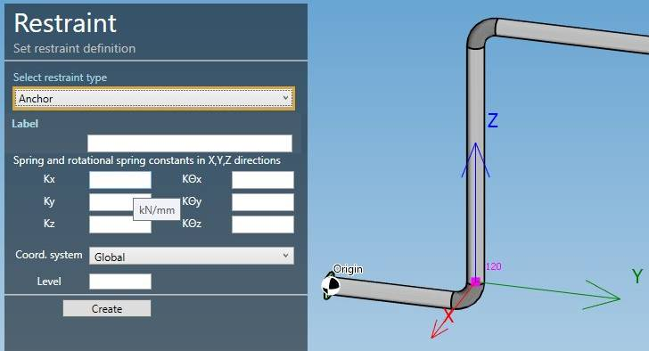
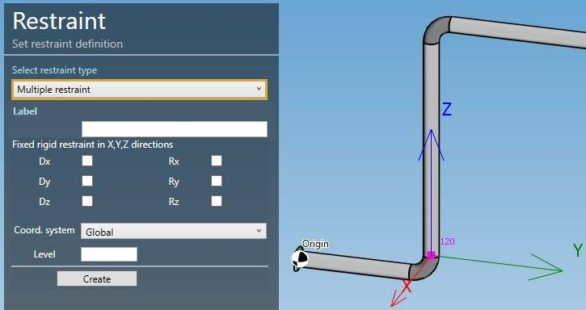
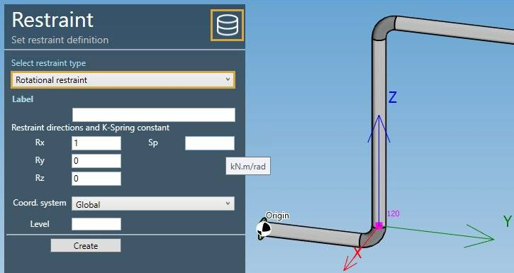
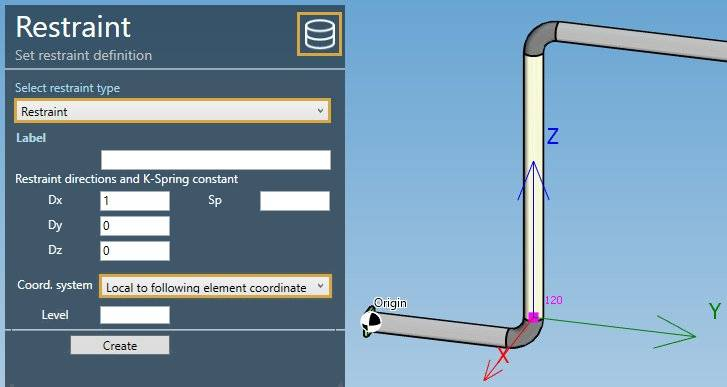
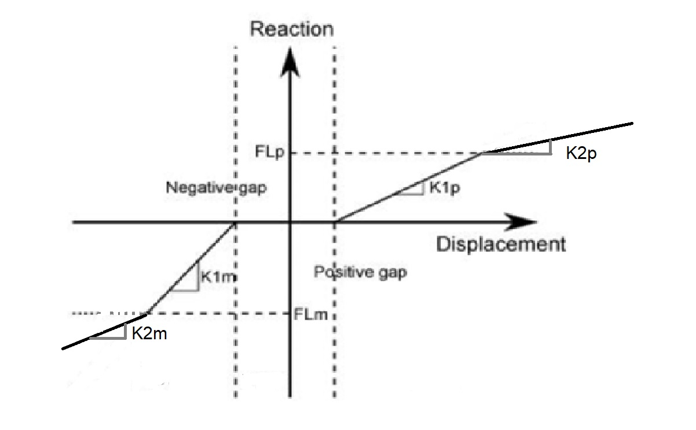

# Restraints

MetaPiping lets you create several types of restraints on nodes :

- Anchors
- Multiple restraints
- Rotational restraints
- Translational restraints
- Snubbers
- Variable spring hangers
- Constant spring hangers

## 1. Database

You can create **Catalogs** of restraints in the database :

Click [here](https://documentation.metapiping.com/Settings/Databases/Supports.html) to have more information about the support catalog creation.

## 2. Anchors

Select a **Node** and click on **Add restraint** button :

Select the type **Anchor** :

| Property | Description | Unit Metric | Unit USA |
| -------- | ----------- | ---- | ---- |
| Kx | Spring Constant acting in X direction | kN/mm | Kips/in |
| Ky | Spring Constant acting in Y direction | kN/mm | Kips/in |
| Kz | Spring Constant acting in Z direction | kN/mm | Kips/in |
| KΘx | Rotational Spring Constant acting in X direction | kN.m/rad | Kips.ft/rad |
| KΘy | Rotational Spring Constant acting in Y direction | kN.m/rad | Kips.ft/rad |
| KΘz | Rotational Spring Constant acting in Z direction | kN.m/rad | Kips.ft/rad |  

    To know the UNIT of the value, just move the mouse over the cell. 

You can change the coordinate system that defines the directions X,Y,Z :

- Global (default)
- Local to preceding element
- Local to following element

The **Level** is used to identify the spectrum applied to this anchor for multilevel floor response spectrum analysis.

You can later modify or remove this anchor by selecting it and clicking on **Modify/Remove** buttons.

You can **Undo** this command.

## 3. Multiple restraints

Select a **Node** and click on **Add restraint** button :

Select the type **Multiple restraint** :

| Property | Description | 
| -------- | ----------- | 
| Dx | Checked if there is a fixed rigid restraint acting in X direction |
| Dy | Checked if there is a fixed rigid restraint acting in Y direction |
| Dz | Checked if there is a fixed rigid restraint acting in Z direction |
| Rx | Checked if there is a fixed rigid rotational restraint about X axis |
| Ry | Checked if there is a fixed rigid rotational restraint about Y axis |
| Rz | Checked if there is a fixed rigid rotational restraint about Z axis |

You can change the coordinate system that defines the directions X,Y,Z :

- Global (default)
- Local to preceding element
- Local to following element

The **Level** is used to identify the spectrum applied to this restraint for multilevel floor response spectrum analysis.

You can later modify or remove this restraint by selecting it and clicking on **Modify/Remove** buttons.

You can **Undo** this command.

## 4. Rotational restraints

Select a **Node** and click on **Add restraint** button :

Select the type **Rotational restraint** :

| Property | Description | Unit Metric | Unit USA |
| -------- | ----------- | ---- | ---- |
| Rx | X direction of the restraint | - | - |
| Ry | Y direction of the restraint  | - | - |
| Rz | Z direction of the restraint  | - | - |
| Sp | Rotational Spring Constant | kN.m/rad | Kips.ft/rad |

>if Sp is blanck = rigid, which is modeled by using a value of 1.13 x 10^9 kN.m/rad or 8.33 x 10^8 Kips.ft/rad.
 
    To know the UNIT of the value, just move the mouse over the cell. 

The **Database** button on upper right corner gives an access to the libraries :

Select a library on the left treeview, then select a row that represents a predefined restraint. Some values are just informative. Click **OK**. The properties are copied to the restraint screen.

You can change the coordinate system that defines the directions X,Y,Z :

- Global (default)
- Local to preceding element
- Local to following element

The **Level** is used to identify the spectrum applied to this restraint for multilevel floor response spectrum analysis.

You can later modify or remove this restraint by selecting it and clicking on **Modify/Remove** buttons.

You can **Undo** this command.

## 5. Translational restraints

Select a **Node** and click on **Add restraint** button :

Select the type **Restraint** :

| Property | Description | Unit Metric | Unit USA |
| -------- | ----------- | ---- | ---- |
| Dx | X direction of the restraint | - | - |
| Dy | Y direction of the restraint  | - | - |
| Dz | Z direction of the restraint  | - | - |
| Sp | Translational Spring Constant | kN/mm | Kips/in |

>if Sp is blanck = rigid, which is modeled by using a value of 8.75 x 10^5
 N/mm or 5 x 10^6 lb/in.

    To know the UNIT of the value, just move the mouse over the cell. 

The **Database** button on upper right corner gives an access to the libraries.

You can change the coordinate system that defines the directions X,Y,Z :

- Global (default)
- Local to preceding element
- Local to following element (**in yellow in the picture**)

The **Level** is used to identify the spectrum applied to this restraint for multilevel floor response spectrum analysis.

You can later modify or remove this restraint by selecting it and clicking on **Modify/Remove** buttons.

You can **Undo** this command.

## 6. Snubbers

Select a **Node** and click on **Add restraint** button :

Select the type **Snubber** :

| Property | Description | Unit Metric | Unit USA |
| -------- | ----------- | ---- | ---- |
| Dx | X direction of the restraint | - | - |
| Dy | Y direction of the restraint  | - | - |
| Dz | Z direction of the restraint  | - | - |
| Sp | Translational Spring Constant | kN/mm | Kips/in |

>if Sp is blanck = rigid, which is modeled by using a value of 2.625 x 10^5
 N/mm or 1.5 x 10^6 lb/in.

    To know the UNIT of the value, just move the mouse over the cell. 

The **Database** button on upper right corner gives an access to the libraries.

You can change the coordinate system that defines the directions X,Y,Z :

- Global (default)
- Local to preceding element (**in yellow in the picture**)
- Local to following element

The **Level** is used to identify the spectrum applied to this restraint for multilevel floor response spectrum analysis.

You can later modify or remove this restraint by selecting it and clicking on **Modify/Remove** buttons.

You can **Undo** this command.

## 7. Variable spring hangers

Select a **Node** and click on **Add restraint** button :

Select the type **Variable support spring hanger** :

| Property | Description | Unit Metric | Unit USA |
| -------- | ----------- | ---- | ---- |
| Dx | X direction of the restraint | - | - |
| Dy | Y direction of the restraint  | - | - |
| Dz | Z direction of the restraint  | - | - |
| Sp | Spring Constant | kN/mm | Kips/in |
| Force | Pre-compression/pre-tension force | kN | Kips |

>if Sp is blanck = rigid, which is modeled by using a value of 8.75 x 10^5
 N/mm or 5 x 10^6 lb/in.

    To know the UNIT of the value, just move the mouse over the cell. 

The **Database** button on upper right corner gives an access to the libraries.

You can change the coordinate system that defines the directions X,Y,Z :

- Global (default)
- Local to preceding element
- Local to following element

The **Level** is used to identify the spectrum applied to this restraint for multilevel floor response spectrum analysis.

You can later modify or remove this rstraint by selecting it and clicking on **Modify/Remove** buttons.

You can **Undo** this command.

## 8. Constant spring hangers

Select a **Node** and click on **Add restraint** button :

Select the type **Constant support hanger** :

| Property | Description | Unit Metric | Unit USA |
| -------- | ----------- | ---- | ---- |
| Dx | X direction of the restraint | - | - |
| Dy | Y direction of the restraint  | - | - |
| Dz | Z direction of the restraint  | - | - |
| Force | Pre-compression/pre-tension force | kN | Kips |

    To know the UNIT of the value, just move the mouse over the cell. 

The **Database** button on upper right corner gives an access to the libraries.

You can change the coordinate system that defines the directions X,Y,Z :

- Global (default)
- Local to preceding element
- Local to following element

The **Level** is used to identify the spectrum applied to this restraint for multilevel floor response spectrum analysis.

You can later modify or remove this restraint by selecting it and clicking on **Modify/Remove** buttons.

You can **Undo** this command.

## 9. Non-linear restraint

Select a **Node** and click on **Add restraint** button :

Select the type **Non-linear restraint** :

| Property | Description | Unit Metric | Unit USA |
| -------- | ----------- | ---- | ---- |
| Dx | X direction of the restraint | - | - |
| Dy | Y direction of the restraint  | - | - |
| Dz | Z direction of the restraint  | - | - |
| Sp | Translational Spring Constant | kN/mm | Kips/in |

>if Sp is blanck = rigid, which is modeled by using a value of 8.75 x 10^5
 N/mm or 5 x 10^6 lb/in.

    To know the UNIT of the value, just move the mouse over the cell. 

| Property | Description | Unit Metric | Unit USA |
| -------- | ----------- | ---- | ---- |
| Negative gap | Must be ≤ 0 | mm | in |
| K1m | Spring Constant | kN/mm | Kips/in |
| K2m | Spring Constant | kN/mm | Kips/in |
| Positive gap | Must be >= 0 | mm | in |
| K1p | Spring Constant | kN/mm | Kips/in |
| K2p | Spring Constant | kN/mm | Kips/in |
| FLm | Negative Dynamic Limit Load (<= 0, default = infinite) | kN | Kips |
| FLp | Positive Dynamic Limit Load (>= 0, default = infinite) | kN | Kips |
| Coef. of friction | Coulomb coefficient of friction between the pipe and the support (>0) | - | - |

For **gapped restraint**, set Sp = 0 (modal analysis) and K2m = K2p = 0

You can change the coordinate system that defines the directions X,Y,Z :

- Global (default)
- Local to preceding element
- Local to following element

The **Level** is used to identify the spectrum applied to this restraint for multilevel floor response spectrum analysis.

You can later modify or remove this restraint by selecting it and clicking on **Modify/Remove** buttons.

You can **Undo** this command.

Example :

