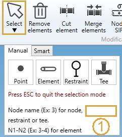

# Selection

MetaPiping lets you select one or multiple objects of the same type.

Click on the **Select** button to open the **Selection tool** :

## 1. Manual selection

**POINT** :

Click on the **Point** button to select **Nodes** or **element extremities**.

The node is highlighted and its **Name** appears in magenta.

**ELEMENT** :

Click on the **Element** button to select an **element**.

The element is highlighted in magenta.

**RESTRAINT** :

Click on the **Restraint** button to select a **restraint**.

The restraint is highlighted in magenta.

**TEE** :

Click on the **Tee** button to select a **tee**.

The node containing the tee is highlighted and its **Name** appears in magenta.

**CLEAR SELECTION** :

Clicking in the 3D view where no objects are present without **CTRL key** pressed will clear the selection.
  
**CANCEL SELECTION** :

Just press **ESC** on keyboard to hide the **selection tool**.

## 2. Smart selection

*Not yet implemented*

## 3. Selection type

**MOUSE CLICK** :

To select **ONE** object, just make a click with the **left mouse button** :

**RECTANGLE SELECTION** :

For **Element** and **Restraint**, it is possible to make a rectangular selection :

1. Press the **left mouse button**
2. Move the mouse without releasing the left mouse button
3. Release the left mouse button

Every object that intersects the **rectangle** will be selected (in magenta).

**MULTIPLE SELECTION** :

You can make multiple selection by pressing the **CTRL** key on keyboard.

**MULTIPLE SELECTION BY CONNECTION** :

You can make continuous selection by pressing the **SHIFT** key on keyboard and 2 distant **elements**.

1. Select a first element :

2. Press **SHIFT**

3. Select a second element :

Every object between the 2 elements will be selected (in magenta).