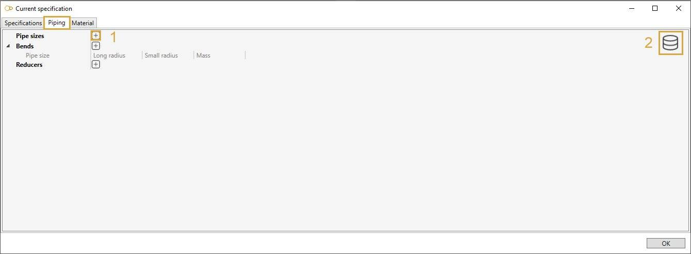

# Data

The **Data** window lets you create all materials and all piping sections of the model.

It also lets you select one or more predefined **specifications**.
## 1. New project

When starting a new model, the **Data** window opens :

### 1.1 Material definition

Let's define a new material.

Click on the **+** button and enter the description of the new material (Ex : My material).

A new name has been created for this material (Ex : 100).

Click on the **-** button (next to Name) to remove it.

Define the description, type, max temperature, density and Poisson's ratio.

Click on the **+** button (next to Properties) to add a new row of properties for a **given temperature** or click on the **-** button (end of row) to remove one.

| Property | Description | Unit Metric | Unit USA |
| -------- | ----------- | ---- | ---- |
| Max. temperature | Max Temperature | °C | °F |
| Density | Density | kg/m³ | lb/ft³ |
| Poisson | Poisson's ratio | - | - |
| EH | Modulus of Elasticity | kN/mm² | 10^6.psi |
| EX | Thermal Expansion | 10^-6.mm/mm/°C | 10^-6.in/in/°F |
| SH | Non-Class 1 Allowable Stress | N/mm² | ksi |
| SY | Yield Stress | N/mm² | ksi |
| SU | Ultimate Tensile Stress | N/mm² | ksi |
| SM | Class 1 Allowable Stress | N/mm² | ksi |
| CR | Creep Stress | N/mm² | ksi |
| GH | Shear Modulus (composite only)| kN/mm² | 10^6.psi |
| E2 | Circumferential Modulus of Elasticity (composite only) | kN/mm² | 10^6.psi |
| CO | Thermal Conductivity (Class 1)| kJ/hr/m/°C | btu/hr/ft/°F |
| DI | Thermal Diffusivity (Class 1) | mm²/s | ft²/hr |

See [Units](https://documentation.metapiping.com/Design/units.html) for more information.

{: .warning }
>ATTENTION, temperatures must be entered in ascending order!

>Properties of High Density Polyethylene materials (HDPE) also depend on load duration. The properties are built-in for 5 different specifications :
>- ISO  : EN 15494:2015 with coefficient = 1.25
>- ASTM : ASTM with factor = 0.63
>- ASME : ASTM with factor = 0.5 (= values given in Appendix XXVI)
>- EDF1 : guide EDF D305914006648 [E]
>- EDF2 : guide EDF D305921021240 [A]
>
>The user has to enter the density, Poisson's ratio' and thermal expansion coefficient, which are supposed to be constant.

>Properties of RCC-MRx materials are built-in for 5 different specifications :
>- A3.18AS : X10CrMoVNb9-1 RM 242-2 & 243-1 (P91)
>- A3.1S : X2CrNiMo17-12-2(N) (316L(N))
>- A3.3S : X2CrNiMo17-12-2, X2CrNiMo17-12-3 and X2CrNiMo18-14-3 (316L)
>- A3.4S : X2CrNi18-9 & X2CrNi19-11 (304L)
>- A3.8S : X4CrNiMo16-05-01

To save time, you can also directly select a material from **database** :

Click on the **Database** button, select a **Library** and a **Material**. The tables will be filled in automatically :

>Only libraries with **Target** = Piping will be shown !

Click [here](https://documentation.metapiping.com/Settings/Databases/Materials.html) for more information about creation of library of materials.

>In Class 1, materials can define a **Fatigue curve** :

User can define the number of cycles for every stress step.

Add a curve point by clicking on the **+** button and remove one by clicking on the **-** button.

The stresses must be entered in ascending order!

### 1.2 Piping definition

To add new pipe sizes, click on **+** button (1) and give it a name (Ex : 4").

Each size exists in different schedules. click on **+** button to add schedules :

| Property | Unit Metric | Unit USA | 
| -------- | ---- | ---- | 
| Schedule | - | - | 
| Outside diameter | mm | in |
| Thickness | mm | in | 
| Linear mass | kg/m | lb/ft | 

    To know the UNIT of a property, just let the mouse over the property name. 
    For example : mm for the Outside diameter

{: .warning }
>ATTENTION, the name of the pipe size is very important (Ex : 4"). It will be used as a **reference** for all other piping elements.

{: .warning }
>ATTENTION, the sizes must be defined in an **ascending** order.

To add **bend** properties for each pipe size, click on **+** button and select a pipe size :

Standard radius and mass can be entered :

| Property | Unit Metric | Unit USA | 
| -------- | ---- | ---- | 
| Long radius | m | ft | 
| Small radius | m | ft |
| Mass | ton | kips | 

{: .warning }
>ATTENTION, for a better readability, we recommend to enter the sizes in **ascending** order. 

To add **reducer** properties for each pipe size, click on **+** button and select a pipe size :

Click on **+** button (next to Mass) to add all possible reduction from the current size to a **smaller** one.

Length and mass can be entered :

| Property | Unit Metric | Unit USA | 
| -------- | ---- | ---- | 
| Length | m | ft | 
| Mass | ton | kips | 

{: .warning }
>ATTENTION, for a better readability, we recommend to enter the sizes in **ascending** order. 

---

To save time, you can also directly select a pipe size from **database** (2) :

Select a **Library**, a **Pipe size** and a **Schedule**. The tables will be filled automatically :

Click [here](https://documentation.metapiping.com/Settings/Databases/Piping.html) for more information about creation of library of piping elements.

---

Finally, you can define the **sections** of the model by defining pairs of Piping size/Material + special properties of the project.

Click to **+** button and select pipe sizes (Ex : 4") :

For each size, define the **schedule** and the **material**. A **pipe** knows now its section and its material.

Select then the **node connections** of the pipe, which depend on the material :

**Steel**
- None
- Butt weld - flush
- Butt weld - as welded
- Fillet weld
- Full fillet weld
- Threaded
- Brazed

**Composite**
- None
- Bell and spigot adhesive bonded
- Bell and spigot adhesive bonded with laminated fiberglass overlay
- Bell and spigot gasket with laminated fiberglass overlay
- Butt and strap

**HDPE**
- None
- Concentric fabricated reducer
- Thrust collar
- Electrofusion coupling

You may define the **mismatch** for butt-weld as welded connections, and the **fillet length**  for fillet weld connections [mm or in].

Select then the **Long weld type** of the pipe between :
- None
- Butt weld flush (steel only)
- Butt weld as welded (steel only)

Based on this property, define the **Long weld mismatch** [mm or in].

Other properties :

| Property | Unit Metric | Unit USA | Default |
| -------- | ---- | ---- | -- |
| Linear mass + insulation | kg/m | lb/ft | Linear mass of the pipe |
| Insulation thickness | mm |in | 0 |
| External corrosion | mm | in | 0 |
| Internal erosion | mm | in | 0 |
| Bend thickness | mm | in | Thickness of the pipe |

### 1.3 Spec driven mode

Another way to define **Materials** and **Piping elements** is to use a predefined **Specification**.

The goal of a specification is to supervise the engineer's work by predefining all piping elements, sections, materials, bend radius, reducer lengths, tees...

Click on **+** button and select a specification :

Click [here](https://documentation.metapiping.com/Settings/Specifications.html) for more information about creation of specification.

Now, you can use these 2 dropdown lists to select the current **section** :

