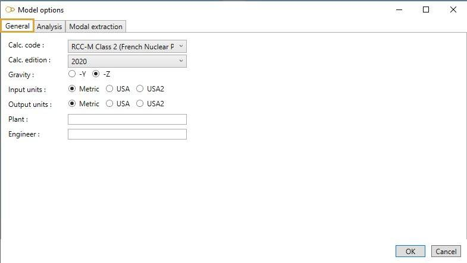
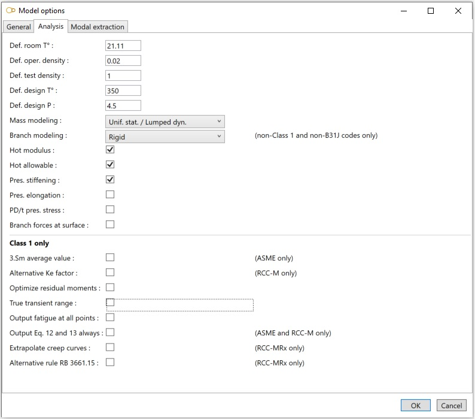
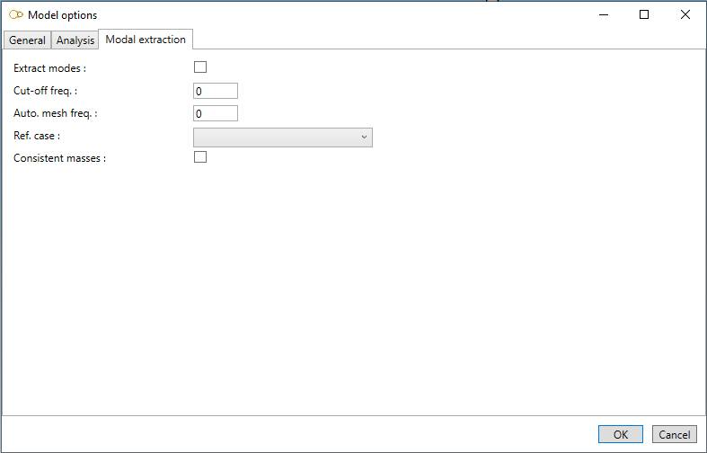

# Model options

## 1. General

This tab lets you define the **calculation code** and its **Edition**, direction of **gravity**, input and output **Units**, **Plant** name and **Engineer** name.

{: .warning }
> ATTENTION, when starting a new project, be sure to select a specification that will be compatible with the Units, Code and Edition of the project and do not change these three properties during design.

## 2. Analysis

- **Def. room T°** : default room temperature (used to calculate thermal expansion)
- **Def. oper. density** and **Def. test density** : default operating and test density. These values can be superseded in **Data** for some cross sections or in the load case definition
- **Def. design T°** and **Def. design P** : default design temperature and pressure. For non-Class 1 piping codes, the allowable stress Sh is evaluated at the design temperature if the **Hot allowable** option is not checked
- **Mass modeling** :
    - Lumped stat. and dyn. : lumped mass for static analysis, lumped mass for dynamic analysis
    - Unif. stat. / Lumped dyn. : uniform mass for static analysis, lumped mass for dynamic analysis
    - Lumped stat. / Lumped dyn. + rot. : lumped mass for static analysis, lumped mass and rotational inertia for dynamic analysis
    - Unif. stat. / Lumped dyn. + rot. : uniform mass for static analysis, lumped mass and rotational inertia for dynamic analysis
- **Branch modeling** (non-Class 1 and non-B31J codes only):
    - Rigid : the imaginary element connecting the centerline with the surface of the run pipe is rigid
    - Pipe : the imaginary element connecting the centerline with the surface of the run pipe is a pipe with the same cross section as the branch pipe 
    - Class 1 : the imaginary element connecting the centerline with the surface of the run pipe is modeled as in Class 1 codes (either rigid or rigid + element of negligible length with local flexibility)
    - B31J : the imaginary element connecting the centerline with the surface of the run pipe is modeled as in B31J standard
- **Hot modulus** : for most non-Class 1 piping codes, the Young modulus Ec at room temperature is used by default for all load cases. If **Hot modulus** is checked, the Young modulus Eh at the operating temperature is used instead. For Class 1 piping codes, the Young modulus Eh at the operating temperature is always used
- **Hot allowable** : for non-Class 1 piping codes, the allowable stress at design temperature is used by default for all load cases. If **Hot allowable** is checked, the allowable at the operating temperature is used instead
- **Pres. stiffening** : check this option to take into account the pressure stiffening effect on elbows and miter bends (if permitted by the piping code) 
- **Pres. elongation** : if PIPESTRESS solver is used and this option is checked, the elongation due to internal pressure (also called "Bourdon effect") will be taken into account for all thermal expansion and test weight cases. If Code_Aster solver is used, this option has no effect, the option **Include Bourdon effect** in every load case definition is used instead
- **PD/t pres. stress** : the pressure stress is calculated with the formula Pd^2/(D0^2 - d^2) by default. The simpler formula PD/t is used if this option is checked 
- **Branch forces at surface** : check this option to use the forces and moments at run surface instead of intersection point for tees (if permitted by the piping code)

***Class 1 only***

- **3.Sm average value** : check this option to use the average value of 3Sm between two load sets instead of the minimum value (ASME only)
- **Alternative Ke factor** : if checked, the penalty factor Ke.therm is used for austenitic stainless steels and Ni-Cr-Fe alloys (RCC-M only)
- **Optimize residual moments** : contact CWANTIC for further explanations and theoretical background
- **True transient range** : by default, the range of the thermal gradient stress for a load set pair (LS1, LS2) is calculated assuming that the sign of the thermal stress is positive for heat-up transients and negative for cool-down transients. If this option is checked, the true range of the thermal gradient stress is calculated
- **Output fatigue at all points** : by default, the detailed results of the fatigue analysis are only output at points where the code limits are exceeded. If this option is checked, the detailed results are output at all points
- **Output Eq. 12 and 13 always** : by default, equations 12 and 13 are only output when equation 10 fails. If this option is checked, equations 12 and 13 are output in all cases (ASME and RCC-M only)
- **Extrapolate creep curves** : check this option to allow extrapolation of the creep curves from Appendix A3.52 and A3.53 (RCC-MRx only)
- **Alternative rule RB 3661.15** : rule RB 3661.14 is used by default when the efficiency diagram is provided in Appendix A3.481. Check this option to use rule RB 3661.15 in all cases (RCC-MRx only)

## 3. Modal extraction

- **Extract modes** : check this option to extract the mode shapes
- **Cut-off freq.** : only the mode shapes below to the cut-off frequency are extracted 
- **Auto. mesh freq.** : if different from 0, additional mass points will be generated to ensure that the mode shapes up to this frequency are accurate. This frequency should be equal or larger than the cut-off frequency
- **Ref. case** : if the **Hot modulus** option is checked, the Young modulus Eh used for the modal extraction is evaluated at the temperature of the reference case
- **Consistent masses** : if checked, a consistent mass matrix is used