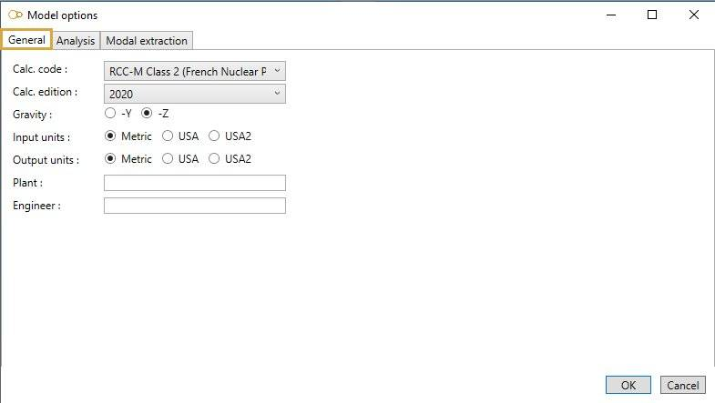
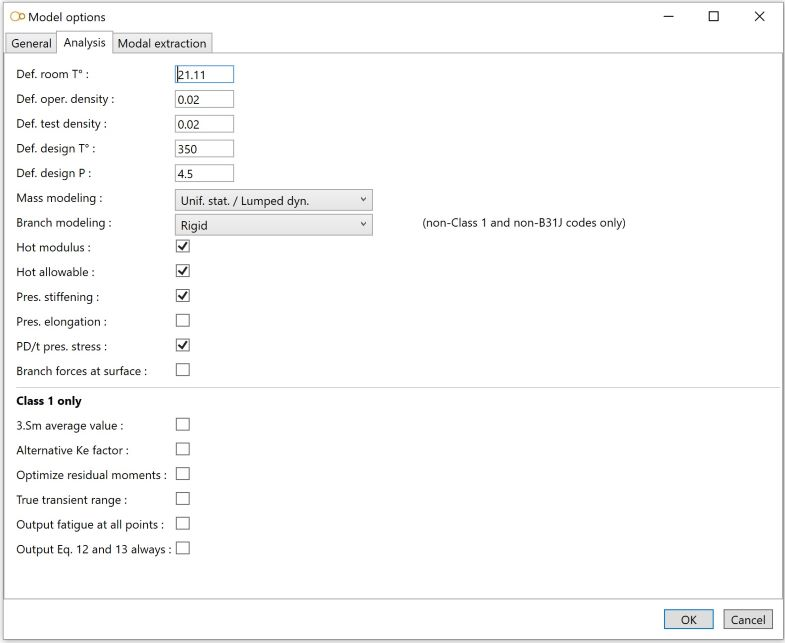

# Model options

## 1. General

This tab let you define the **calculation code** and its **Edition**, the direction of the **gravity**, the input and output **Units**, the **Plant** name and the **Engineer** name.

{: .warning }
> ATTENTION, when starting a new project, be sure to select a specification that will be compatible with the Units, Code and Edition of the project and do not change these 3 properties during design.

## 2. Analysis

Documentation will come soon...

## 3. Modal extraction

Documentation will come soon...