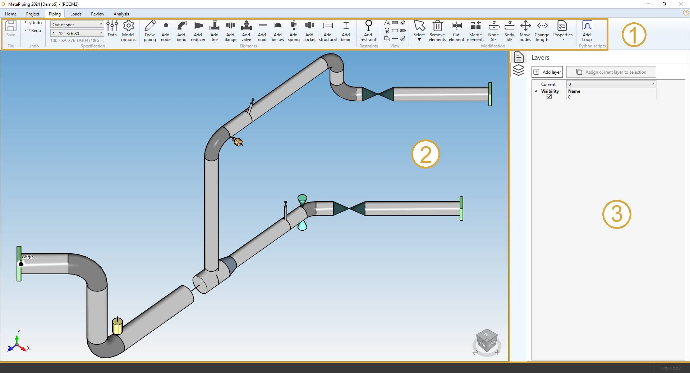

# Design

After selecting a study and pressing the **Edit** button, new tabs appear in the ribbon menu on top of the application :

- Design
- Load - click [here](https://documentation.metapiping.com/Loads/index.html) to have more information about loading
- Review - click [here](https://documentation.metapiping.com/Review/index.html) to have more information about review tools
- Analysis - click [here](https://documentation.metapiping.com/Analysis/index.html) to have more information about analysis

The **Design** screen consists of a ribbon menu (1), a 3D visualization engine (2) and a data panel on the right (3).

## 1. Ribbon menu

### 1.1 File

During the design of the model, every command is automatically saved in a temporary file (conception.~metaL).

You can decide to save the last modifications or cancel it and return to the study screen.

A floppy disk on the left side of the ribbon indicates the sate of the file on disk :

 means that everything has been saved.

 means that something has changed and the MetaL need to be saved.

{: .warning }
>If the application crashes, MetaPiping will prompt to reopen the last modifications

### 1.2 Undo/Redo

Every command in MetaPiping is stored in a **command list**.

You can *navigate* through this list by pressing the **Undo/Redo** buttons.

### 1.3 Specification

This group of controls let you define the current **Section/Material** for the next elements. 

You have an access to a window that defines the piping sections and materials for the current model.

You have an access to the model options (code, edition, calculation options...).

Click [here](https://documentation.metapiping.com/Design/Specification/index.html) to have more information about the **Data** button and the **Model options** button.
### 1.4 Elements

Click [here](https://documentation.metapiping.com/Design/Elements/index.html) to have more information about all possible piping element.

---

### 1.5 Restraints

Click [here](https://documentation.metapiping.com/Design/Restraints.html) to have more information about restraints.

### 1.6 View options

### 1.7 Modification tools

### 1.8 Python scripts

## 2. 3D Visualization

## 3. Data panel

### 3.1 PIPESTRESS editor

### 3.2 Layers

