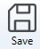
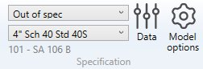
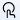
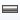
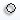
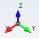
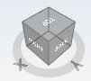
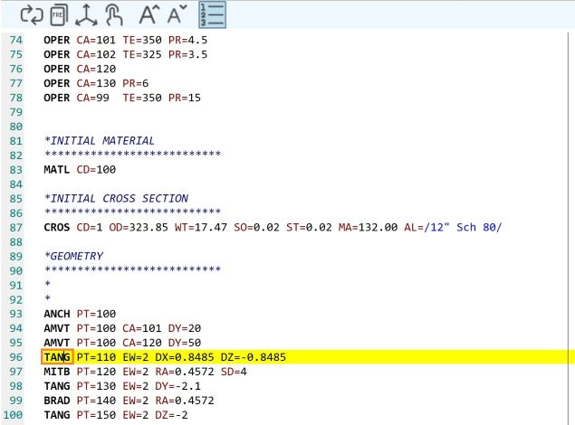
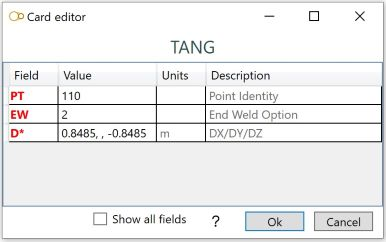

# Design

After selecting a study and pressing the **Edit** button, new tabs appear in the ribbon menu on top of the application :

- Design
- Load - click [here](https://documentation.metapiping.com/Loads/index.html) to have more information about loading
- Review - click [here](https://documentation.metapiping.com/Review/index.html) to have more information about review tools
- Analysis - click [here](https://documentation.metapiping.com/Analysis/index.html) to have more information about analysis

The **Design** screen consists of a ribbon menu (1), a 3D visualization engine (2) and a data panel on the right (3).

## 1. Ribbon menu

### 1.1 File

During the design of the model, every command is automatically saved in a temporary file (conception.~metaL).

You can decide to save the last modifications or cancel it and return to the study screen.

A floppy disk on the left side of the ribbon indicates the sate of the file on disk :

 means that everything has been saved.

 means that something has changed and the MetaL need to be saved.

{: .warning }
>If the application crashes, MetaPiping will prompt to reopen the last modifications

### 1.2 Undo/Redo

Every command in MetaPiping is stored in a **command list**.

You can *navigate* through this list by pressing the **Undo/Redo** buttons.

### 1.3 Specification

This group of controls let you define the current **Section/Material** for the next elements. 

You have an access to a window that defines the piping sections and materials for the current model.

You have an access to the model options (code, edition, calculation options...).

Click [here](https://documentation.metapiping.com/Design/Specification/index.html) to have more information about the **Data** button and the **Model options** button.
### 1.4 Elements

Click [here](https://documentation.metapiping.com/Design/Elements/index.html) to have more information about piping element creation.

---

### 1.5 Restraints

Click [here](https://documentation.metapiping.com/Design/Restraints.html) to have more information about restraints.

### 1.6 View options

 shows/hides the node name

 shows/hides the node point

 copy the 3D visualization to the clipboard

 show the piping in shading mode

 show the piping in hidden lines mode

 show the piping in wireframe mode

 shows/hides the shadows

 shows/hides the silhouette drawing

### 1.7 Modification tools

Click [here](https://documentation.metapiping.com/Design/Modification.html) to have more information about all modification tools.
### 1.8 Python scripts

MetaPiping let you create your own **tools**.

If a tool is missing, user can create his own **command** that can interact with the user and modify the selected elements or the whole model.

MetaPiping will take care of the Undo/Redo mechanism.

Click [here](https://documentation.metapiping.com/Python/design.html) to have more information about python script creation.

[See an example of a Design script](https://documentation.metapiping.com/Python/Samples/lyre.html) : Replace a selected pipe by a loop

## 2. 3D Visualization

MetaPiping is equipped with a powerful 3d engine :

### 2.1 Navigation

You navigate inside the view with the **middle button** of the mouse pressed :

hold down the **CTRL key** during navigation to translate the view.

You zoom in by scrolling the mouse wheel up :

You zoom out by scrolling the mouse wheel down :

You zoom all by **double click** the mouse wheel button :

### 2.2 Axis

The **global axis** are shown in the bottom left corner of the screen :

### 2.3 Predefined views

An interactive **cube** with predefined views is shown in the bottom right corner of the screen :

- Click on top corners of the cube to change to predefined axonometric view.
- Click twice on the faces of the cube to change to 2D views.

---

## 3. Data panel

### 3.1 PIPESTRESS editor

The **Plugin** PIPESTRESS converts automatically every commands of MetaPiping into HIGH FIDELITY **FRE** file format.

- Double click on a **card** shows a window with all parameters :

- Select a row and click **F9** on keyboard will select the object in the 3D view.

- Select a row and click **F1** on keyboard will open the help of PIPESTRESS (if defined in the settings).

click [here](https://documentation.metapiping.com/Settings/General.html) to have more information about the settings.

- You can also write/change the file by yourself in this editor. Press the **Refresh** button on top to update the model with the content of the editor.

{: .warning }
> Attention, this action is irreversible

---

### 3.2 Layers

MetaPiping let you simplify your visualization by using **Layer** concept :

By default, all piping elements are assigned to **Layer 0**.

To create a new layer, click on **Add layer** button (1).

Give it a name, for example "Level 1".

The layer "Level 1" will appear in the list of layers and will become the current layer (3).

To modify the layer of objects, select elements and/or restraints (4) and click on **Assign current layer to selection** button (5).

If you decide to remove a layer, click on **-** button (2) next to the layer name. All elements and restraints of this layer will be assigned to the default **Layer 0**.

You can now show/hide elements and restraints by activating/deactivating the visibility buttons.