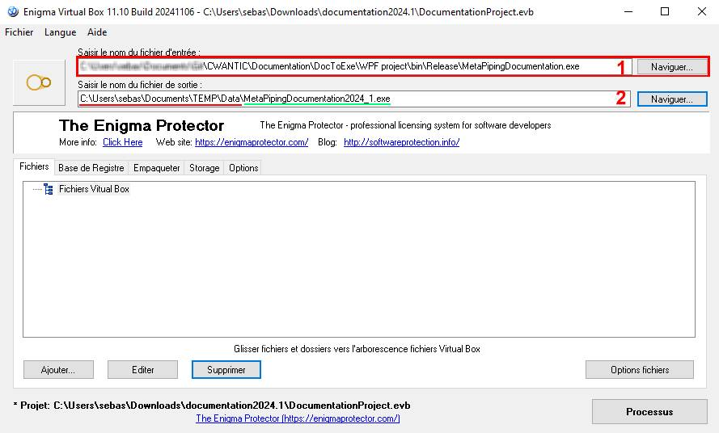
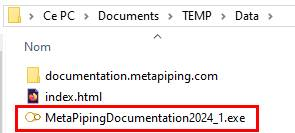

# Transform documentation to application

## 1. Tools to install

### 1.1 HTTRACK

 HTTrack is a free (GPL, libre/free software) and easy-to-use offline browser utility.

It allows you to download a World Wide Web site from the Internet to a local directory, building recursively all directories, getting HTML, images, and other files from the server to your computer. HTTrack arranges the original site's relative link-structure. Simply open a page of the "mirrored" website in your browser, and you can browse the site from link to link, as if you were viewing it online. HTTrack can also update an existing mirrored site, and resume interrupted downloads. HTTrack is fully configurable, and has an integrated help system. 

>https://www.httrack.com/page/1/en/index.html

### 1.2 ENIGMA VIRTUAL BOX

Enigma Virtual Box is used for file and registry systems virtualization and allows you to consolidate all files and registry used by your application into a single executable file without having to extract virtual files to the disk. With Enigma Virtual Box, you can virtualize any types of files, dynamic libraries (.dll), ActiveX/COM objects (.dll, .ocx), video and music files (.avi, .mp3), text files (.txt, .doc, .html), etc. Enigma Virtual Box does not extract temporary files to the HDD; file emulation is performed in the process memory only.

Enigma Virtual Box is perfect for creating portable applications!

>https://enigmaprotector.com/en/aboutvb.html

## 2. WPF project

MetaPipingDocumentation.sln is the project that build an application with a web browser to show the local website of documentation.metapiping.com.

4 files are needed :

| File | Location |
| -------- | ---- |
| MetaPipingDocumentation.exe | WPF project\bin\Release |
| Microsoft.Web.WebView2.Core.dll | WPF project\bin\Release |
| Microsoft.Web.WebView2.Wpf.dll | WPF project\bin\Release |
| WebView2Loader.dll | WPF project\bin\Release\runtimes\win-x64\native |

## 3. Download documentation.metapiping.com

Download the whole website *documentation.metapiping.com* locally.

Use HTTrack for that and download it on a new directory.

### 3.1 Create a temporary directory. For example **TEMP** in Documents :

    C:\Users\sebas\Documents\TEMP

### 3.2 Launch HTTrack and create a new project

1) Project name = Data (that will create a Data sub-directory)
2) Select C:\Users\sebas\Documents\TEMP as base directory
3) Next

### 3.3 Define the URL

1) Action = Download web site(s)
2) Add *http://documentation.metapiping.com* url
3) Next

### 3.4 Adjust connection

1) Select the first choice
2) Terminate

    Wait 5..10 min

1) Terminate

### 3.5 Check the TEMP directory

The **Data** directory has been created :

Remove the selected files :

### 3.6 The Data directory 

## 4. Create the application

### 4.1 Launch Enigma Virtual Box.

1. Search **MetaPipingDocumentation.exe** (§ 2) as input exe file.
2. Search the **Data** directory (§ 3.6) Rename the output as **MetaPipingDocumentation202X_Y.exe**.

### 4.2 Dlls

3. Add **Microsoft.Web.WebView2.Core.dll** and **Microsoft.Web.WebView2.Wpf.dll** (§ 2) in the Virtual files from ...\CWANTIC\Documentation\DocToExe\WPF project\bin\Release :

Let the default choice of **%DEFAULT FOLDER%** :

4. Add **WebView2Loader.dll** (§ 2) in the Virtual files from ...\CWANTIC\Documentation\DocToExe\WPF project\bin\Release\runtimes\win-x64\native :

### 4.3 Data

5. Drag and drop the **Data** directory (§ 3.6) in the Virtual box : 

### 4.4 Properties

6. Modify the properties of all selected files (right click on a *.html file) : **Always write on the disk** :

7. Modify the options with everything checked :

### 4.5 Execute

8. Click on Processus :

You will have one executable with the documentation inside :

Move the file and remove **TEMP** directory.