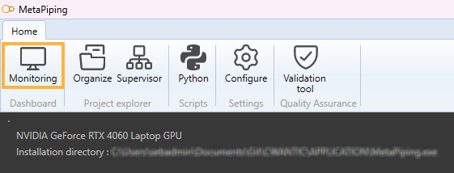
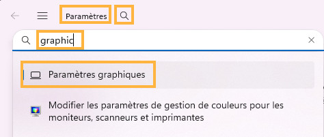

# Monitoring

Click on **Monitoring** button to access the control center.

It actually shows 2 informations:

* The current graphic card associated to the application
* The current location of the executable

>If your computer has 2 graphic cards, one for low energy application and one for high performance graphism, it is recommended to change MetaPiping.exe to the last one. That can be done in the computer settings:

Click on the search button and write "graphic". Select the first item "Graphic settings".

A screen shows all associated application with a graphic card. Click on "Add desktop application" and go to to MetaPiping.exe. You can there associate the software to a high performance graphic card.