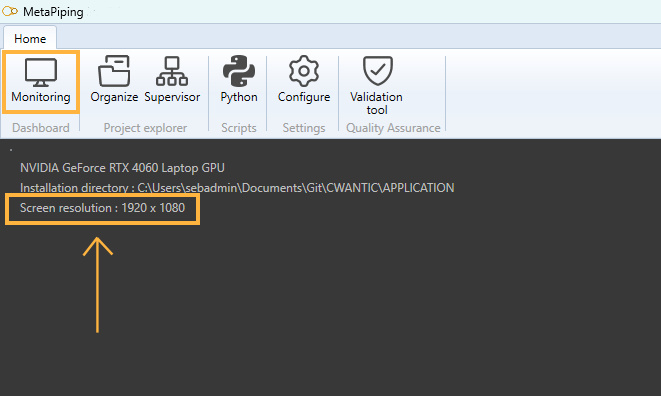
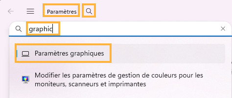

# Monitoring

Click on **Monitoring** button to access the control center.

It actually shows 3 informations:

* The current graphic card associated with the application
* The current location of the executable
* The current screen resolution : must be at least 1920 x 1080

>If your computer has 2 graphic cards, one for low energy application and one for high performance graphics, it is recommended to associate MetaPiping.exe with the last one. This can be done in the computer settings:

Click on the search button and write "graphic". Select the first item "Graphic settings".

A screen shows all applications associated with a graphic card. Click on "Add desktop application" and go to MetaPiping.exe. You can there associate the software with a high performance graphic card.