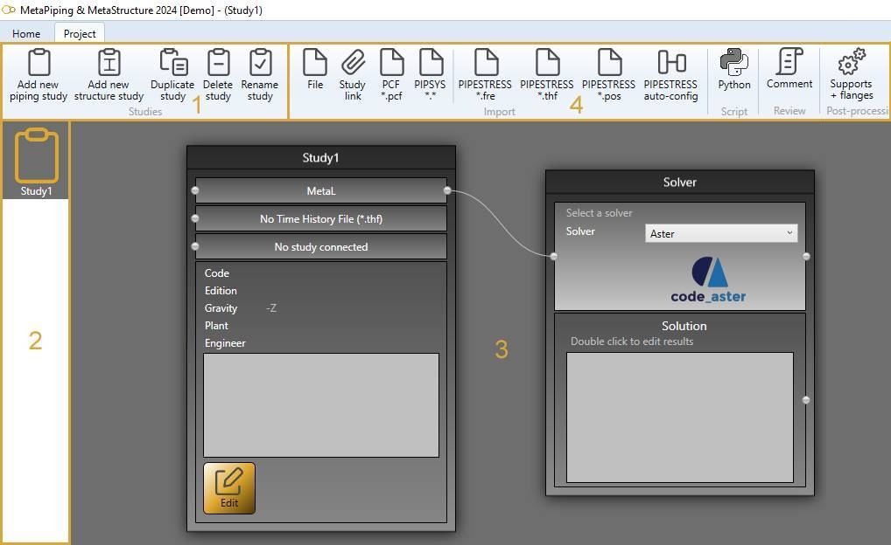
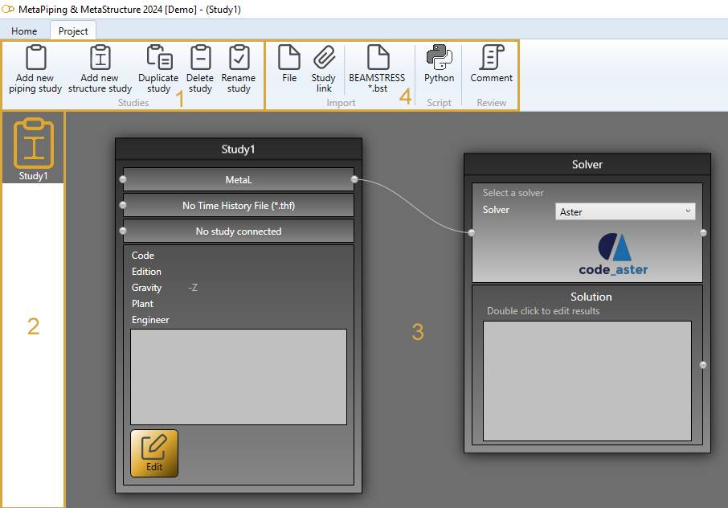

# Project

A project is a container of **studies**.

If you create a new **piping project**, the first study will be a piping study :

If you create a new **structure project**, the first study will be a structure study :

---

The **project** screen consists of 4 zones :

1. The **Tools** to manage the studies of the current project
2. The **Container** of studies
3. The current study **Diagram** - see [study](https://documentation.metapiping.com/Explorer/Study.html) to have more information
4. The **Bricks** to manage the current study - see [study](https://documentation.metapiping.com/Explorer/Study.html) to have more information

## 1. Tools

### 1.1 Selection

Select a study in the **container** (2). 

This study become the **current study** shown in the main panel (3).
### 1.2 Add

Click on **Add new piping study** to create an empty piping study that will be added to the **container** (2).

Click on **Add new structure study** to create an empty structure study that will be added to the **container** (2).

This new study become the **current study** shown in the main panel (3).

### 1.3 Duplicate

Select a study in the **container** (2) and click to **Duplicate study** to have a full copy of the selected study.

This new study become the **current study** shown in the main panel (3).

### 1.4 Delete

Select a study in the **container** (2) and click to **Delete study** to remove the selected study (and all it contains).

{: .warning }
>ATTENTION, this action is irreversible

{: .warning }
>ATTENTION, You cannot remove the current study if it is the only one

After deleting, the first study of the project become the current study shown in the main panel (3).

### 1.5 Rename

Select a study in the **container** (2) and click to **Rename study** to modify the name of the selected study.

---
## 2. Study

Click [here](https://documentation.metapiping.com/Explorer/Study.html) to have more information about studies.