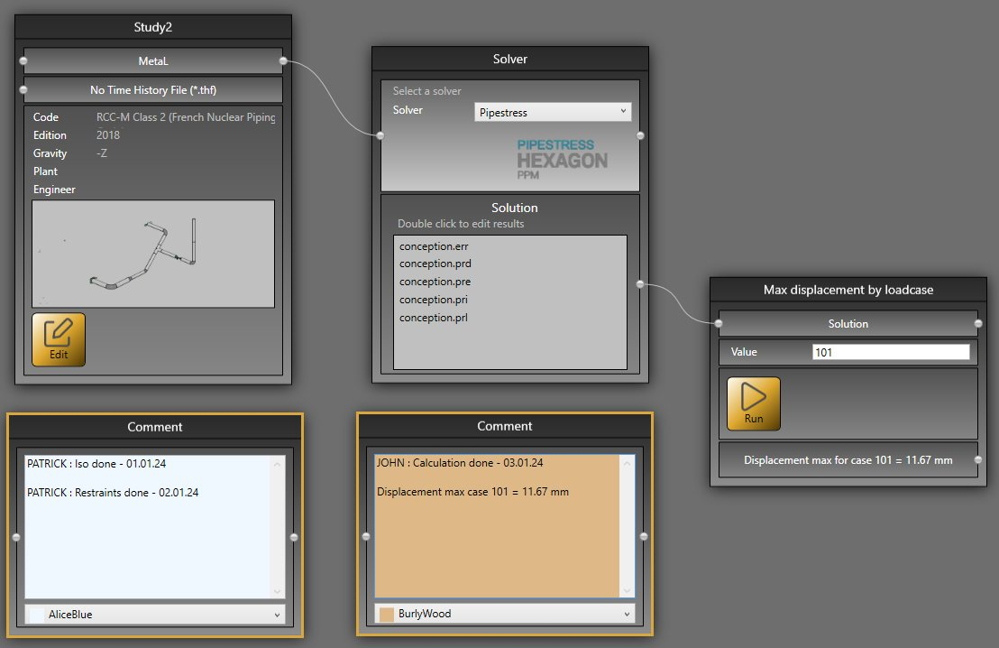

# Study

A study consists of a **Diagram** of bricks and connections.

It is a folder that contains at least a 3D model and the results of calculation.

The **study** screen consists of :

1. The **Bricks**
2. The main panel that show the **Study Diagram**
3. The **Solver brick**
4. A **Connector**
5. A **Connector**
6. The **Edit** button to design the 3D model

An empty study contains at least one **Study brick** and one **Solver brick**.
## 1. Connections

Connect the connectors 4 and 5 to define the current **Solver**. 

    Press left mouse button above connector 4 -> move the mouse to connector 5 -> release the left button

    To remove the connection : select the connection and press the DELETE button of the keyboard.

Select **Aster** for example :

Now, the project will be calculated with **Code_Aster Solver**

Click [here](https://documentation.metapiping.com/Analysis/Solver.html) to have more information about Code_Aster.

## 2. Empty model

Click **Edit** (6) to start an empty design.

Click [here](https://documentation.metapiping.com/Design/index.html) to have more information about the design.

## 3. Bricks

### 3.1 File

This create a brick that let you import a file of any extension.

This is usefull only for Python script that need a file as input (Ex : Excel file or Text file).

Click on the button to open a search file dialog.

Use the connector to send the file to another brick as an input.

### 3.2 PCF

The **plugin** PCF let you import *.pcf files.

Open a file and connect it to the **MetaL** connector of the **Study brick**.

This will convert the PCF to the MetaL file format.

### 3.3 PIPSYS

The **plugin** PIPSYS let you import files with several extensions.

Open a file and connect it to the **MetaL** connector of the **Study brick**.

This will convert the PIPSYS to the MetaL file format.

### 3.4 PIPESTRESS

The **plugin** PIPESTRESS let you import *.fre (and *.thf files).

The Time History File is not mandatory and depend on the correspondinf FRE file.

Open a file and connect it to the **MetaL** connector of the **Study brick**.

This will convert the FRE to the MetaL file format.

The **plugin** PIPESTRESS let you also import POSTR files for postprocessing.

Open a file and connect it to the **Solution** connector of the **Solver brick**.

It will produce a text file (in the result cell) that can be edited by **double click**.

You can specify your favorite text editor in the settings.

The **plugin** PIPESTRESS let you also configure all bricks by just importing a *.fre file. It checks if a *.thf file is needed, set the Solver to PIPESTRESS and make all connections automatically.

### 3.5 Python

You can create your own **brick** thanks to the Python scripts.

Click [here](https://documentation.metapiping.com/Python/index.html) to have more information about the script creation.

### 3.6 Comment

This create a brick with text and color capabilities.

Usefull to show the state of progress of the study to other users. A conventionnal color code can be established.

