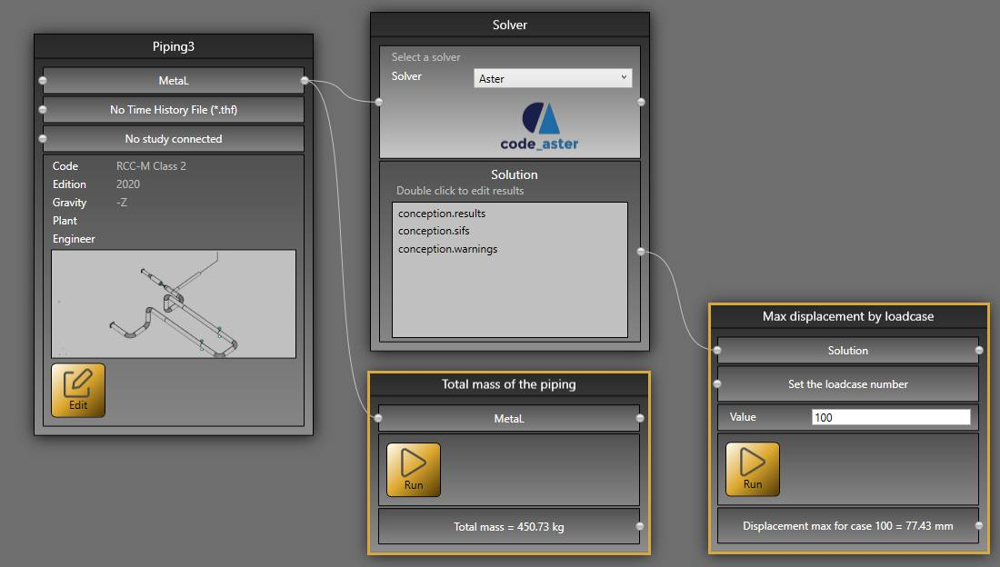
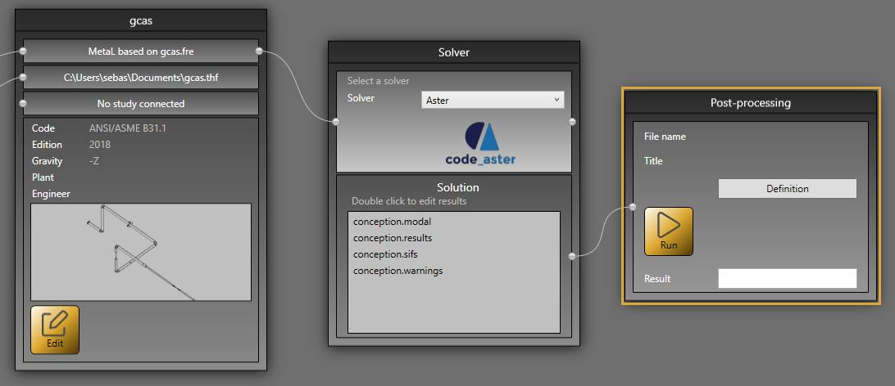

# Study

A study consists of a **Diagram** of bricks and connections.

It is a folder that contains at least a 3D model and the calculation results.

The **study** screen consists of :

1. The **Bricks**
2. The main panel that shows the **Study Diagram**
3. The **Solver brick**
4. A **Connector**
5. A **Connector**
6. The **Edit** button to open the 3D model

An empty study contains at least one **Study brick** and one **Solver brick**.
## 1. Connections

Connect the connectors 4 and 5 to define the current **Solver**. 

    Press left mouse button above connector 4 -> move the mouse to connector 5 -> release the left button

    To remove the connection : select the connection and press DELETE on the keyboard.

Select **Aster** for example :

Now, the project will be calculated with **Code_Aster Solver**

Click [here](https://documentation.metapiping.com/Analysis/Solver.html) to have more information about Code_Aster.

## 2. Empty model

Click **Edit** (6) to start a new design.

Click [here](https://documentation.metapiping.com/Design/index.html) to have more information about the design.

## 3. Piping bricks

### 3.1 File

This create a brick that lets you import a file of any extension.

This is useful only for Python scripts that need a file as input (Ex : Excel file or Text file).

Click on the button to open a search file dialog.

Use the connector to send the file to another brick as an input.

{: .warning }
>You can import another **MetaL** file and connect it to the **MetaL** connector of the **Study brick**.

### 3.2 Study link (for visual purpose)

This create a brick that virtually replicates existing studies inside another one. This is useful to create new nodes based on those of the linked studies.

{: .warning }
>You can connect multiple studies. All must be defined in the same coordinate system XYZ.

{: .warning }
>In design, you can hide the linked studies.

{: .warning }
>In design, you cannot modify elements of linked studies.

Break the connection to change the linked study.

### 3.3 Structures link (for coupled analysis)

This create a brick that virtually replicates existing structure studies inside a piping one. 

This is mandatory to create coupled analysis between piping and supports.

{: .warning }
>All studies must be defined in the same coordinate system XYZ.

Click on the **Select** button and select one or more structures.

Connect it to the piping study on the correct connector.

Break the connection to select other studies.

### 3.4 PCF

The **plugin** PCF lets you import *.pcf files.

Open a file and connect it to the **MetaL** connector of the **Study brick**.

This will convert the PCF to the MetaL file format.

### 3.5 PIPSYS

The **plugin** PIPSYS lets you import files with several extensions.

Open a file and connect it to the **MetaL** connector of the **Study brick**.

This will convert the PIPSYS to the MetaL file format.

### 3.6 PIPESTRESS

The **plugin** PIPESTRESS lets you import *.fre (and *.thf files).

The Time History File is not mandatory and depends on the corresponding FRE file.

Open a file and connect it to the **MetaL** connector of the **Study brick**.

This will convert the FRE to the MetaL file format.

The **plugin** PIPESTRESS also lets you import POSTR files for postprocessing.

Open a file and connect it to the **Solution** connector of the **Solver brick**.

It will produce a text file (in the result cell) that can be edited by **double click**.

You can specify your favorite text editor in the settings.

The **plugin** PIPESTRESS also lets you configure all bricks by just importing a *.fre file. It checks if a *.thf file is needed, sets the Solver to PIPESTRESS and makes all connections automatically.

### 3.7 Python

You can create your own **brick** thanks to the Python scripts.

*Example of a brick connected to the MetaL and another one connected to the solution.*

Click [here](https://documentation.metapiping.com/Python/index.html) to have more information about the script creation.

### 3.8 Comment

This creates a brick with text and color capabilities.

Useful to show the state of progress of the study to other users. A conventional color code can be established.

### 3.9 Post-processing : supports + flanges

This brick lets you create combinations (or groups) of load cases defined in the piping model and output various results for those combinations :
- reactions on restraints
- displacements at nodes
- internal forces and moments in elements

It also allows to check flanges according to various piping codes.

Click on **Definition** to open the definition window. 

Once the data are entered, click on **Run** to launch the analysis. A report with the detailed results will show up after the analysis is completed.

The definition window consists of several tabs.

#### 3.9.1 General

Enter the root of the file name where the input data will be saved. The file will be given the extension **.post**. The results will be saved in a file with the same root and extension **.rpost**.

You may also enter a title and a memo.

Check the box **Process all restraints** to output the reactions for all supports. If checked, the reactions can be output in the local coordinates of the supports (instead of the global coordinates) by checking the box **Output the reactions in local coordinate system**.

If flanges are to be checked, select the piping code, edition, and calculation method.

#### 3.9.2 Groups

A group is a combination of load cases defined in the piping model, and/or previously created groups.

| Field | Description |
| -------- | ----------- |
| No. | Group number |
| Method | Algebraic, Envelope, SRSS, or Absolute |
| No out. | No result is output if checked |
| Add lines | The results for the group are output in a single line (except for flange check). In order to improve readability, additional lines may be inserted after the group. For example, enter the string **#-#** to insert a line filled with **#** characters, followed by another line filled with **-** characters, and finally a line filled with **#** characters. Use character **b** for inserting a blank line |
| Level | A (or blank), B, C, D or T (for flange check only) |
| Ref. | Reference case number for pressure and temperature (for flange check only) |
| C1 to C6 | Numbers of the constituent load cases or groups |
| Title |  |

Multipliers may be specified for the constituent load cases or groups by checking the box **Show case multipliers Fn**.

The load cases defined in the model are listed on the right. Instead of typing the case number in columns Ref. and C1 to C6, you can also double-click on the load case in the list.

#### 3.9.3 Restraints

Enter the nodes which reactions are to be processed.

| Field | Description |
| -------- | ----------- |
| Node | Node name |
| Local | Reactions are output in the local directions of the restraints if checked |
| Title |  |

The retrained nodes are listed on the right. Instead of typing the node name, you can also double-click on the node in the list.

#### 3.9.4 Nodes

Enter the nodes which displacements are to be processed.

| Field | Description |
| -------- | ----------- |
| Node | Node name |
| Title |  |

The nodes are listed on the right. Instead of typing the node name, you can also double-click on the node in the list.

#### 3.9.5 Elements

Enter the elements which internal forces and moments are to be processed.

| Field | Description |
| -------- | ----------- |
| Element | Element name in the form **{start node name} - {end node name}** |
| At end | Forces and moments are output at the end node if checked, at the start node otherwise |
| Title |  |

The elements are listed on the right. Instead of typing the element name, you can also double-click on the element in the list.

#### 3.9.6 Flanges

Three sets of data may be defined, depending on the selected piping code and method :
- Curves of rated pressure as function of temperature
- Flange, neck pipe and bolt material
- Flange data

#### 3.9.6.1 Ratings

Click on button **-** to remove the selected rating curve and button **+** to add a rating curve.

Enter the name of the curve, title and points (T, P) defining the curve.

Click on the database button to import data from the database.

#### 3.9.6.2 Materials

Click on button **-** to remove the selected material and button **+** to add a material.

Enter the name of the material name, description, target (piping for the flange and neck pipe, bolting for the bolts) and points (T, Eh, Sh and Sy) defining the material.

Click on the database button to import data from the database.

#### 3.9.6.2 Flanges

Click on button **-** to remove the selected flange and button **+** to add a flange.

Click on button  to copy the data from another flange.

Fields displayed in gray italic are optional for the selected code and method.

**General**

| Field | Description |
| -------- | ----------- |
| Flange | Select the flange to be processed in the combobox |
| Title |  |

**Flange geometry and material**

| Field    | Description |
| -------- | ----------- |
| Type | Integral, Loose, Lap or Optional |
| Rating | Select the flange rating in the combobox |
| Thickness t | |
| Hub length h |  |
| Hub diameter Dg0 |  |
| Hub diameter Dg1 |  |
| Number of bolts |  |
| Bolt hole diameter dh |  |
| Bolt circle diameter C |  |
| Raised face diameter Dr |  |
| Outside diameter A |  |
| Inside diameter B |  |
| Inside diameter same as pipe | If checked, flange inside diameter B is the same as the connected pipe |
| Flange material | If not defined, the flange material is taken the same as the material assigned to the flange in the model |
| Neck material | If not defined, the neck material is taken the same as the flange |
| Neck material same as pipe | If checked, neck material is the same as the connected pipe |

Click on the database button to import data from the database.

**Bolting**

| Field | Description |
| -------- | ----------- |
| Diameter Db | Bolt diameter |
| Pitch Pc | Thread pitch |
| Resisting area | If 0, calculated with the minimum diameter of standard threads Db - 1.2268 Pc |
| Bolt nut diameter | If 0, taken as 1.5 Db |
| Pitch diameter Dp | If 0, taken as  Db – 0.6495 Pc |
| Thread half angle Be | If 0, taken as 30° |
| Material | Bolt material |
| Bolt force changed after test | For RCC-M only |

Click on the database button to import data from the database.

**Gasket**

| Field | Description |
| -------- | ----------- |
| Load reaction diameter |  |
| Effective width |  |
| Factor m |  |
| Seating stress y |  |
| Friction on steel | For RCC-M only |
| Seating force mult. | If entered, the seating force calculated according to the code is multiplied by this factor |

**Torque calculation**

| Field | Description |
| -------- | ----------- |
| Min. bearing friction | If 0, taken as 0.15 |
| Max. bearing friction | If 0, taken as 0.15 |
| Min. thread friction | If 0, taken as 0.15 |
| Max. thread friction | If 0, taken as 0.15 |

## 4. Structure bricks

### 4.1 File

This create a brick that lets you import a file of any extension.

This is useful only for Python scripts that need a file as input (Ex : Excel file or Text file).

Click on the button to open a search file dialog.

Use the connector to send the file to another brick as an input.

### 4.2 Study link

This creates a brick that virtually replicates existing studies inside another one. This is useful to create new nodes based on those of linked studies.

{: .warning }
>You can connect multiple studies. All must be defined in the same coordinate system XYZ.

{: .warning }
>In design, you can hide the linked studies.

{: .warning }
>In design, you cannot modify elements of linked studies.

### 4.3 BEAMSTRESS

This creates a brick that lets you import *.bst files that are converted to MetaL file.

{: .warning }
>ATTENTION, only version 2.0.0 or higher *.bst files can be imported. If the file version is too old, we recommand to open it with a recent BEAMSTRESS and save the model again.

### 4.4 Python

You can create your own **brick** thanks to the Python scripts.

Click [here](https://documentation.metapiping.com/Python/index.html) to have more information about the script creation.

### 4.5 Comment

This creates a brick with text and color capabilities.

Useful to show the state of progress of the study to other users. A conventional color code can be established.
