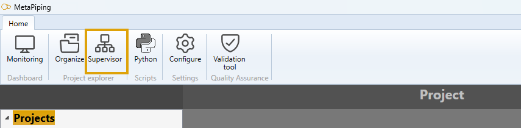
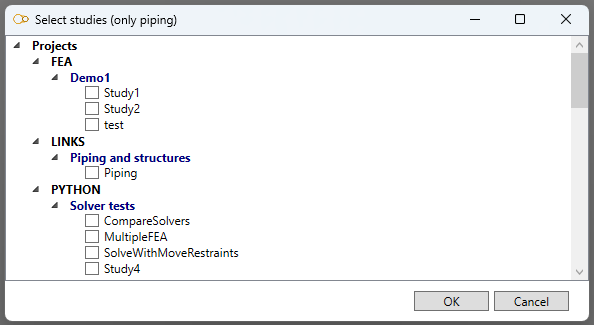
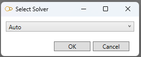
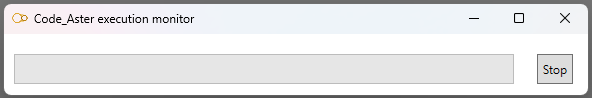

# Supervisor

Click on **Supervisor** button to access the batch tool.

## Batch calculation

MetaPiping let you calculate projects in batch mode.

1. Select piping studies from all projects

>Only projects that contains piping studies will be shown and only piping studies will be shown.

2. Select a solver

* Auto          : use the study's specified solver
* Aster         : use Code_Aster solver (even if PIPESTRESS solver is specified in the study)
* PipeStress    : use PIPESTRESS solver (even if Aster solver is specified in the study)

3. Calculation

Depending on the solver selected, a progress window will appear for each study.

The **supervisor** will calculate the solution of all studies and place the result files in the studies' directories.