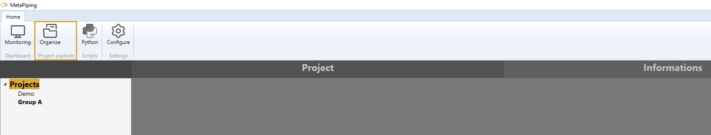
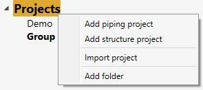
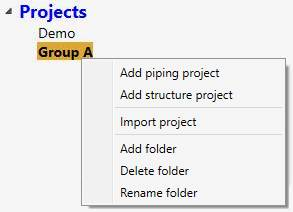
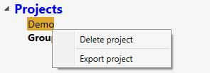
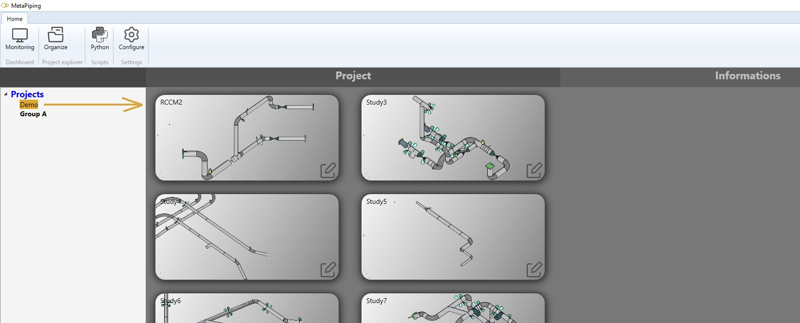
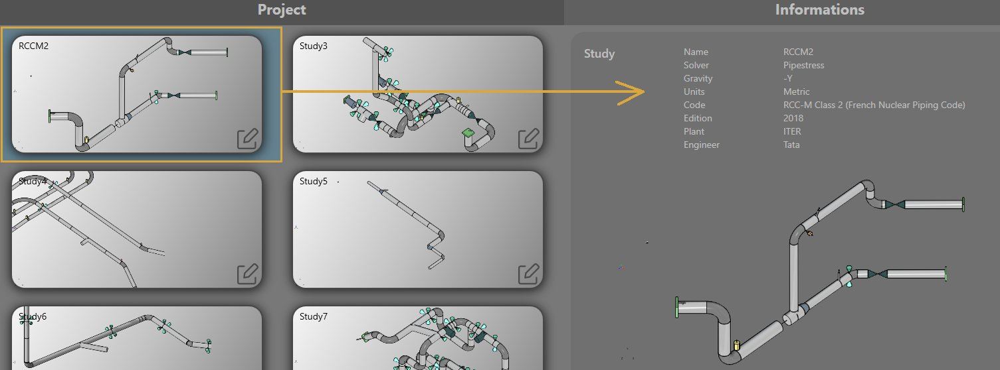
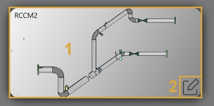

# Explorer

Click on **Organize** button to access the explorer panel.

## 1. Organizer

You can organize your projects in the left panel.

Right click on **Projects** let you :

- Add a new project
- Add a new folder

Select a **folder** (Ex : Group A). Right click on it let you :

- Add a new project
- Add a new sub-folder
- Delete the current folder

Select a **project** (Ex : Demo). Right click on it let you :

- Delete the current project

## 2. Project preview

A **project** is a container of **studies**.

When selecting a project, a preview of all studies is shown :

You can have general information about one study by selecting a thumbnail :

### 2.1 Project/study edition

To edit a project or a study, just **double click** on a thumbnail of any study (1).

To edit a specific study, **click** on button (2).

## 3. Python script

A **Python script** can be created to explore the current **MetaL** and **results** of the study and present your own informations.

Click [here](https://documentation.metapiping.com/Python/info.html) to have more information about python script creation for a project.

Click [here](https://documentation.metapiping.com/Settings/General.html) to see how to define a python script as default "information script" in the settings.
