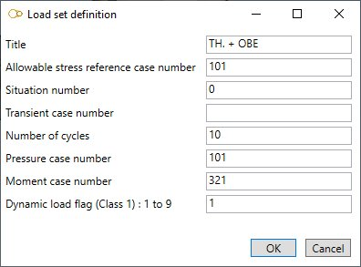

# Load sets (Class 1 only)

    This load is a specific combination of loads assumed to act simultaneously on a piping system
    at a given instant. Pairs of load sets are employed in pipe stress analysis to determine 
    physical changes in the system from one load set instant to another.
    Typical load set parameters, which may occur in various combinations, are : pressure,
    temperature, moment and transient effects.

When selecting **Load sets** load type, all existing load sets are listed in the combobox :

The loads appear with the **Title**. There is no **Case number** for that kind of loading.

## 1. General

When editing, the definition window shows this screen :

Enter a **Title**.

<ins>Allowable stress reference case number</ins> :

Documentation will come soon…

<ins>Situation number</ins> :

Documentation will come soon…

<ins>Transient case number</ins> :

    use positive (+) sign for heat up 
    use negative (-) sign for cool down 

Documentation will come soon…

<ins>Number of cycles</ins> :

Documentation will come soon…

<ins>Pressure case number</ins> :

Documentation will come soon…

<ins>Moment case number</ins> :

Documentation will come soon…

<ins>Dynamic load flag</ins> :

Documentation will come soon…
