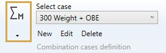
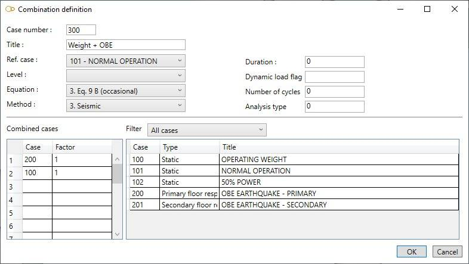

# Combination cases

    This case consists of combining the results of load cases, dynamic cases or previously calculated
    combination cases to form a new case.

When selecting **Combination cases**, all existing combinations are listed in the combobox :

The cases appear with their **Case number** + **Title**.

## 1. General

When editing, the definition window shows up :

Enter a **Case number** and a **Title**.

<ins>Ref. case</ins> :

Operating pressures (and allowable stresses) of the reference case will be used for this case. The calculation of the allowable stresses depends on the current **calculation code**.

Click [here](https://documentation.metapiping.com/Analysis/Codes.html) for more information about all possible codes.

<ins>Level</ins> :

This field is intended for nuclear piping codes only. The possible values are : A (normal conditions), B (upset), C (emergency), D (faulted) and T (test). 

<ins>Equation</ins> :

The equations are code-dependent.

<ins>Method</ins> :

- 0- Algebraic addition
- 1- Absolute addition
- 2- SRSS
- 3- Seismic
- 4- Maximum absolute
- 6- Algebraic maximum
- 7- Algebraic minimum
- 8- Range
- 9- Max resultant moment range
- S- Max thermal stress range

<ins>Dynamic load flag</ins> :

- For ASME Class 1 : the flag is a number from 1 to 9 that identifies the dynamic moments to be used in Equation 13
- For RCC-M Class 1 : the flag with number 1 identifies the operational earthquake

<ins>Number of cycles</ins> :

- For ASME Class 1 : number of sub-cycles predicted for each occurrence of the dynamic event (default = 1)
- For RCC-M Class 1 : number of occurences of the seismic event if the analysis type is 0, or number of seismic sub-cycles if the analysis type is 1

<ins>Analysis type</ins> :

- For RCC-M Class 1 only : enter 0 (or blank) for the total earthquake moments and 1 for the primary (inertial) earthquake moments

## 2. Combined cases

Enter the **number** of the constituent cases and the corresponding **factor** (1) :

On right side, as a reminder, the list of all cases (2). You can filter them by selecting the type :

- All
- Static
- Dynamic
- Combination
