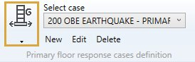
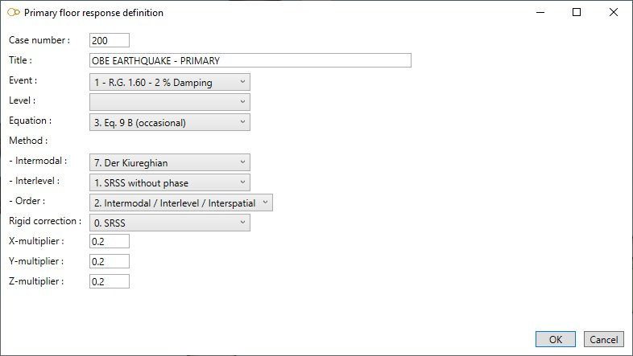
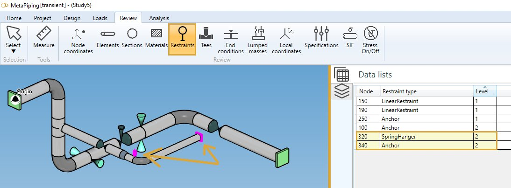

# Primary floor response cases

    This load describes the floor response spectra for each support level. This analysis is used to
    obtain bound solutions for simple multilevel cases (including single level cases) for which the
    dynamic loading is entirely due to movements at the support points.
    The "levels" are groups of supports which are moving in parallel and are entered using the level
    number field on supports.

{: .warning }
>Attention, to obtain the complete solution for multilevel problems, it is necessary to calculate the primary and secondary parts of the solution separately and then to combine them.

MetaPiping will calculate the bounds for the **PRIMARY** part of the solution u(t) for displacements, rotations, forces, moments and stresses due to the dynamic support movement loading.

When selecting **Primary floor response cases**, all existing primary floor response cases are listed in the combobox :

The cases appear with their **Case number** + **Title**.

## 1. General

When editing, the definition window shows up :

Enter a **Case number** and a **Title**.

<ins>Event</ins> :

Select a **Spectra** : *R.G. 1.60 - 2% Damping* in this example.

See §2.

<ins>Level</ins> :

This field is intended for nuclear piping codes only. The possible values are : A (normal conditions), B (upset), C (emergency), D (faulted) and T (test). 

<ins>Equation</ins> :

The equations are code-dependent.

<ins>Method</ins> :

For intermodal :

- 1- Grouping
- 2- Ten percent
- 3- Double sum
- 4- SRSS
- 5- All coupling
- 6- Rosenblueth
- 7- Der Kiureghian

For interlevel :

- 0- Absolute without phase
- 1- SRSS without phase
- 2- Algebraic
- 3- Absolute with phase
- 4- SRSS with phase
- 5- Envelope
- 6- SRSS with counterphase

For order :

- 0- Interlevel / Intermodal / Interspatial
- 1- Interlevel / Interspatial / Intermodal
- 2- Intermodal / Interlevel / Interspatial

<ins>Rigid correction</ins> :

- 0- SRSS
- 1- None
- 2- Absolute
- A- SRSS with modal
- B- Gupta
- C- Lindley-Yow

<ins>X, Y, Z multipliers</ins> :

This factor multiplies the X, Y, Z component of the loading.

 If a factor is zero or blank, then the corresponding loading component will be zero.

## 2. Spectra definition

In this example, we use this **Spectra loading** :

It contains 2 **LEVELS** with corresponding spectra :

Click [here](https://documentation.metapiping.com/Loads/Piping/Spectra.html) for more information about the spectra definition.

## 3. Restraint defintion

In this example, all restraints are assigned a **LEVEL** :

Level 1 for the main line.

Level 2 for the secondary line.

## 4. Secondary floor response cases

Click [here](https://documentation.metapiping.com/Loads/Piping/SecondaryCases.html) for more information about the secondary floor response cases.