# Static cases

    Static cases consist of internal and/or external static loadings on the piping system. MetaPiping will calculate corresponding displacements, rotations, forces, moments and stresses.

All existing static cases are listed in the combobox with their **Case number** + **Title** :

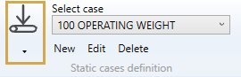

When editing or creating a static case, the definition window shows up. There are three tabs : General, Options and Applied loads.

## 1. General

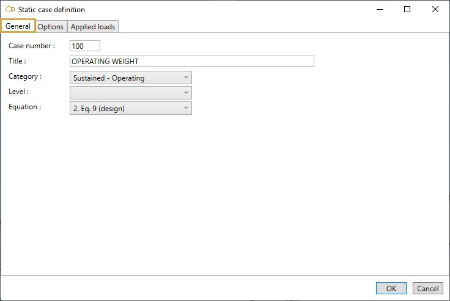

Enter a **Case number** and a **Title**.

<ins>Category</ins> :

- Sustained - Operating
- Sustained - Test
- Sustained - Empty
- Sustained - Design
- Occasional - Wind
- Occasional - Snow
- Occasional - Distributed
- Occasional - Acceleration
- Occasional - SAM
- Thermal expansion
- Settlement
- Cold spring
- Dummy (for oper. cond.)
- User defined

Depending on the chosen category, some options are pre-selected in tab **Options** and the loads that may be applied are listed in tab **Applied loads**.

<ins>Level</ins> :

This field is intended for nuclear piping codes only. The possible values are : A (normal conditions), B (upset), C (emergency), D (faulted) and T (test). 

<ins>Equation</ins> :

The equations to be verified are code-dependent. For example, here are the equations for code RCC-M Class 2:

- 1- None (no stress calculation)
- 2- Equation 6 (sustained)
- 3- Equation 10 B (occasional)
- 4- Equation 10 C (occasional)
- 5- Equation 10 D (occasional)
- 6- Equation 10 T (test)
- 7- Equation 7 (thermal expansion)
- 8- Equation 8 (thermal expansion + sustained)
- S- Equation 9 (settlement)

## 2. Options

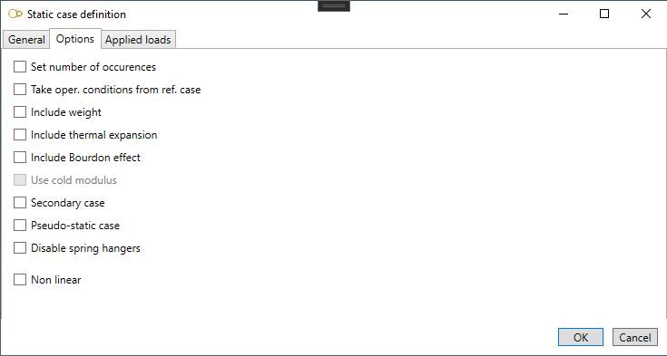

- **Set number of occurences** : enter the number of cycles (thermal expansion cases only)
- **Take oper. conditions from ref. case** : select the load case which pressure and temperature will be used for thermal expansion, Young modulus, Bourdon effect and bend stiffening. If no reference case is selected and no operating conditions are defined for the load case, room temperature is used and no pressure is considered
- **Include weight** : if checked, the weight is considered in the calculation. Four options are available: operating weight, test weight, empty weight and design weight. Design weight is equivalent to operating weight, except that spring hangers are pinned. Design weight can be useful for determining the installation force to be exerted on the spring hangers
- **Include thermal expansion** : if checked, thermal expansion is considered in the calculation
- **Include Bourdon effect** : if checked, expansion due to internal pressure is considered in the calculation
- **Use cold modulus** : if checked, Young modulus at room temperature is used for this case (only if **Hot modulus** is set in **Model options**)
- **Secondary case** : to be checked for displacement-type cases like thermal expansion. Depending on the piping code (e.g. RCC-M Class 2), the moments may be multiplied by Ec/Eh when the **Hot modulus** is used
- **Pseudo-static cases** : to be checked for dynamic cases that are calculated as static cases (e.g. earthquake calculated with a pseudo-static acceleration)
- **Disable spring hangers** : for some cases like settlement and cold springing, it is common practice to readjust the spring hangers to their design parameters. This is equivalent to disabling the spring hangers

## 3. Applied loads

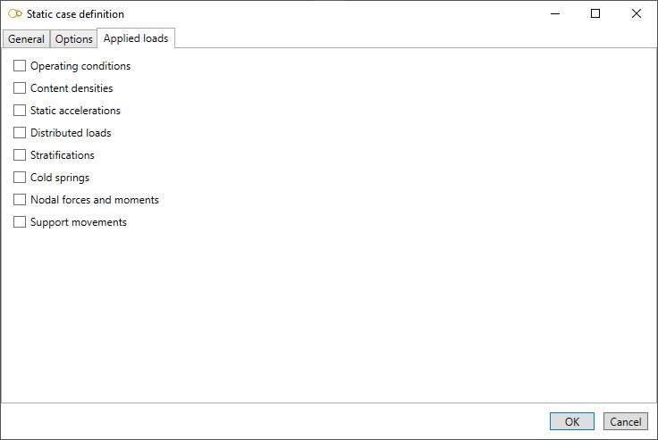

Select the loads that will be applied to the load case. For some loads like temperature and pressure, it is possible to set default values that will apply to all elements. The user can of course supersede the default values for some elements by selecting them and specifying different values.

---

### 3.1 Operating conditions

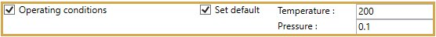

You can define operating conditions on elements of the model.

The temperature is used for multiple purposes :
- the Young modulus Eh is evaluated at this temperature if the **Hot modulus** option is used. The Young modulus at room temperature Ec is used otherwise if no reference case is specified
- thermal expansion is applied if **Include thermal expansion** is checked
- the allowable stress Sh for non-Class 1 piping is evaluated at this temperature if the **Hot allowable** option is used. The design temperature is used otherwise

The pressure is used for multiple purposes :
- the longitudinal stress due to pressure thrust
- the stiffening effect on elbows and miter bends
- the SIF reducing effect on elbows and miter bends 

You can define **DEFAULT** operating conditions that will be applied on all elements of the model.

Define the default **temperature** and **pressure** of the load :

| Property | Unit Metric | Unit USA |
| -------- | ---- | ---- |
| Temperature | °C | °F |
| Pressure | N/m² | lb/ft² |

If you check this option, you will see this **button** in the ribbon:

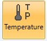

1. Select the **Temperature** button
2. Open the right **Data panel**
3. Select one or more elements
4. Define the new **temperature** and **pressure** for these elements
5. Apply

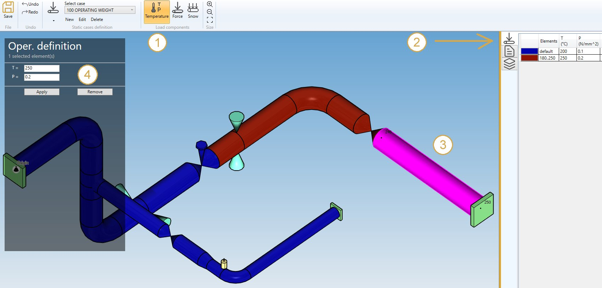

You can **undo** this command.

Click on the **Remove** button to delete the operating condition load on selected elements.

---

### 3.2 Content densities

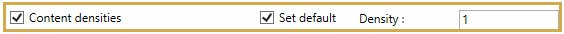

By checking **Content densities** in **Applied loads** you can define fluid densities on elements of the model.

You can also define the **DEFAULT** fluid density so that you only have to define the elements that doesn't *follow* the default density. If no default density is set, and no density is specified on some elements, the default density provided in **Model options** or directly in **Data** will be used.

If you check this option, you will see this **button** in the ribbon :

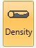

1. Select the **Density** button
2. Open the right **Data panel**
3. Select one or more elements
4. Define the new **density** for these elements
5. Apply

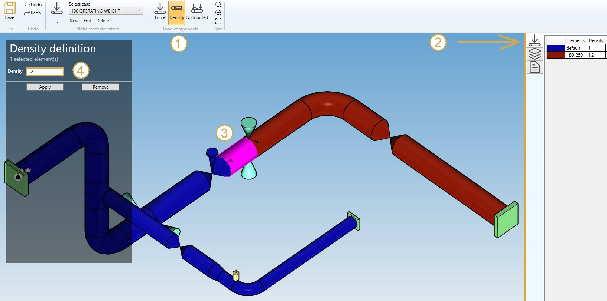

You can **undo** this command.

Click on the **Remove** button to delete the density on selected elements.

---

### 3.3 Static accelerations

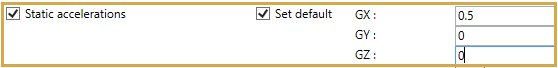

By checking **Static acceleration** in **Applied loads** you can define acceleration loads on elements of the model.

You can also define **DEFAULT** accelerations that will be applied to all elements of the model :

| Property | Unit Metric | Unit USA |
| -------- | ---- | ---- |
| GX | fraction of G | fraction of G |
| GY | fraction of G | fraction of G |
| GZ | fraction of G | fraction of G |

If you check this option, you will see this **button** in the ribbon :

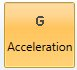

1. Select the **Acceleration** button
2. Open the **Data panel** on the right
3. Select one or more elements
4. Define the new **vector acceleration** for these elements
5. Apply

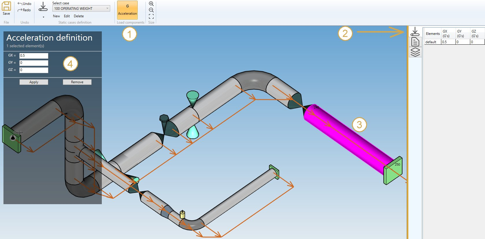

You can **undo** this command.

Click on the **Remove** button to delete the load on selected elements.

You can also change the size of the drawn accelerations by clicking on these buttons :

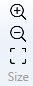

---

### 3.4 Distributed loads

By checking **Distributed loads** in **Applied loads** you can define distributed loads on elements of the model. There are three types of distributed loads: simple distributed load (force per unit length), wind and snow.

Simple distributed loads may be applied for weight and occasional cases other than wind and snow cases. Wind loads may only be applied for wind cases and snow loads for snow cases.

#### 3.4.1 Simple distributed load (distributed)

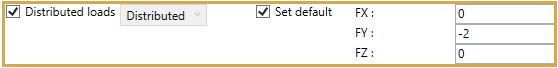

You can define **DEFAULT** distributed loads that will be applied to all elements of the model :

| Property | Unit Metric | Unit USA |
| -------- | ---- | ---- |
| FX | N/m | lb/ft |
| FY | N/m | lb/ft |
| FZ | N/m | lb/ft |

If you check this option, you will see this **button** in the ribbon :

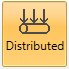

1. Select the **Distributed** button
2. Open the right **Data panel**
3. Select one or more elements
4. Define the new **vector force** for these elements
5. Apply

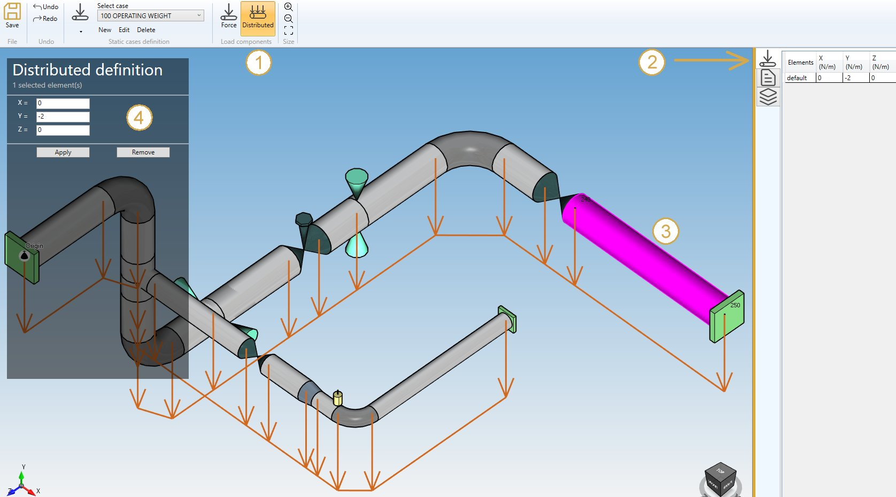

You can **undo** this command.

Click on the **Remove** button to delete the load on selected elements.

You can **undo** this command.

You can also change the size of the drawed forces by clicking on these buttons :

#### 3.4.2 Wind load

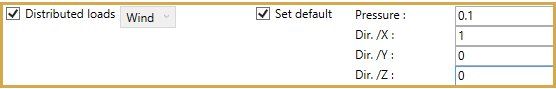

You can define **DEFAULT** wind loads that will be applied to all elements of the model.

Define the wind **pressure** and **direction** :

| Property | Unit Metric | Unit USA |
| -------- | ---- | ---- |
| Pressure | N/m² | lb/ft² |
| Dir. /X | - | - |
| Dir. /Y | - | - |
| Dir. /Z | - | - |

If you check this option, you will see this **button** in the ribbon :

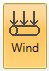

1. Select the **Wind** button
2. Open the right **Data panel**
3. Select one or more elements
4. Define the new **pressure** and **direction** for these elements
5. Apply

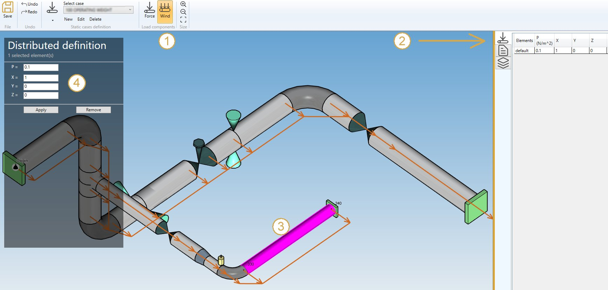

You can **undo** this command.

Click on the **Remove** button to delete the wind load on selected elements.

You can **undo** this command.

You can also change the size of the drawed forces by clicking on these buttons :

#### 3.4.3 Snow load

You can define **DEFAULT** snow loads that will be applied to all elements of the model.

Define the snow **pressure** (direction is vertical downwards) :

| Property | Unit Metric | Unit USA |
| -------- | ---- | ---- |
| Pressure | N/m² | lb/ft² |

If you check this option, you will see this **button** in the ribbon :

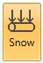

1. Select the **Snow** button
2. Open the right **Data panel**
3. Select one or more elements
4. Define the new **pressure** for these elements
5. Apply

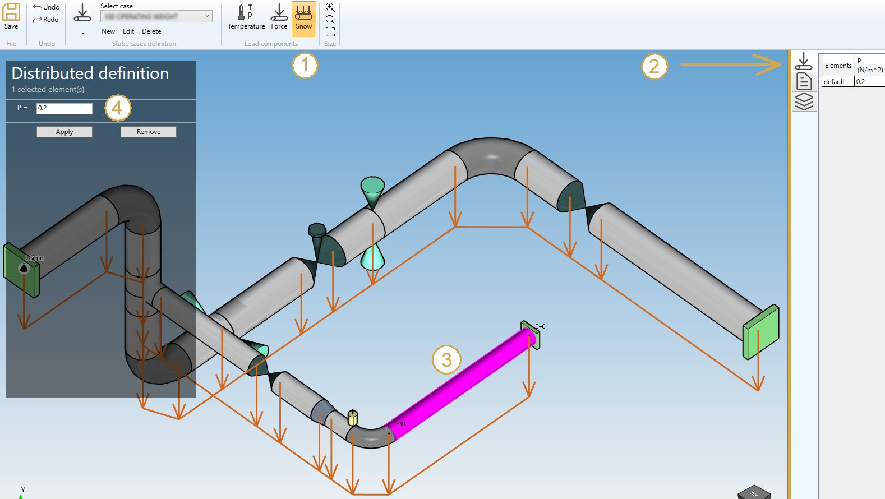

You can **undo** this command.

Click on the **Remove** button to delete the snow load on selected elements.

You can **undo** this command.

You can also change the size of the drawed forces by clicking on these buttons :

---

### 3.5 Stratifications

You can define stratifications on several elements of the model.

    Thermal stratification occurs when there is a non-constant, time independent temperature distribution in the pipe wall. Typically, this situation occurs where there is stagnation or circulation of fluids in layers in the pipe.

If you check this option, you will see this **button** in the ribbon :

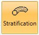

1. Select the **Stratification** button
2. Open the right **Data panel**
3. Select one or more elements
4. Define the new **stratification** for these elements
5. Apply

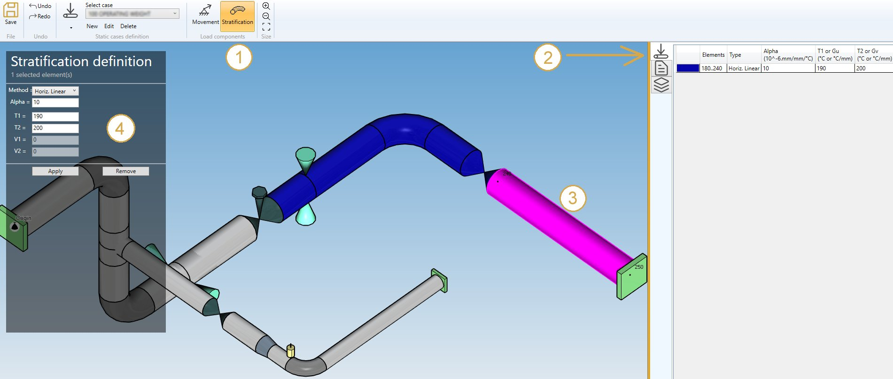

<ins>Method</ins> :

- Horiz. Linear
- Horiz. Step
- Horiz. Laminar
- Horiz. Gu
- Skewed

<ins>Properties</ins> :

Depending on the selected method, the properties are :

**Horiz. Linear** :

| Property | Definition | Unit Metric | Unit USA |
| -------- | -- | ---- | ---- |
| Alpha | Mean coef. of thermal expansion of pipe | 10^-6mm/mm/°C | 10^-6in/in/°F |
| T1 | Temperature at bottom of the pipe | °C | °F |
| T2 | Temperature at top of the pipe | °C | °F |

**Horiz. Step** :

| Property | Definition | Unit Metric | Unit USA |
| -------- | -- | ---- | ---- |
| Alpha | Mean coef. of thermal expansion of pipe | 10^-6mm/mm/°C | 10^-6in/in/°F |
| T1 | Temperature at bottom of the pipe | °C | °F |
| T2 | Temperature at top of the pipe | °C | °F |
| V1 | Vertical coordinate of the discontinuity | mm | in |

**Horiz. Laminar** :

| Property | Definition | Unit Metric | Unit USA |
| -------- | -- | ---- | ---- |
| Alpha | Mean coef. of thermal expansion of pipe | 10^-6mm/mm/°C | 10^-6in/in/°F |
| T1 | Temperature at bottom of the pipe | °C | °F |
| T2 | Temperature at top of the pipe | °C | °F |
| V1 | Vertical coordinate of the laminar flow (down) | mm | in |
| V2 | Vertical coordinate of the laminar flow (up) | mm | in |

**Horiz. Gu** :

| Property | Definition | Unit Metric | Unit USA |
| -------- | -- | ---- | ---- |
| Alpha | Mean coef. of thermal expansion of pipe | 10^-6mm/mm/°C | 10^-6in/in/°F |
| Gu | stratification value inside the pipe | °C/mm | °F/in |

**Skewed** :

Stratification definition in **LOCAL COORDINATES** (U, V, W) :

| Property | Definition | Unit Metric | Unit USA |
| -------- | -- | ---- | ---- |
| Alpha | Mean coef. of thermal expansion of pipe | 10^-6mm/mm/°C | 10^-6in/in/°F |
| Gu | stratification value inside the pipe in U direction| °C/mm | °F/in |
| Gv | stratification value inside the pipe in V direction| °C/mm | °F/in |
| VX | X component of the local V vector | - | - |
| VY | Y component of the local V vector | - | - |
| VZ | Z component of the local V vector | - | - |

You can **undo** this command.

Click on the **Remove** button to delete the load on selected restraints.

---

### 3.6 Cold springs

By checking **Cold springs** in **Applied loads** you can define cold spring (pre-stress) on several elements of the model.

    The length of elements that will be altered by an explicit amount will causes forces, moments and stresses in the piping system.

If you check this option, you will see this **button** in the ribbon :

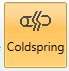

1. Select the **Coldspring** button
2. Open the right **Data panel**
3. Select one or more elements
4. Define the new **extension** for these elements
5. Apply

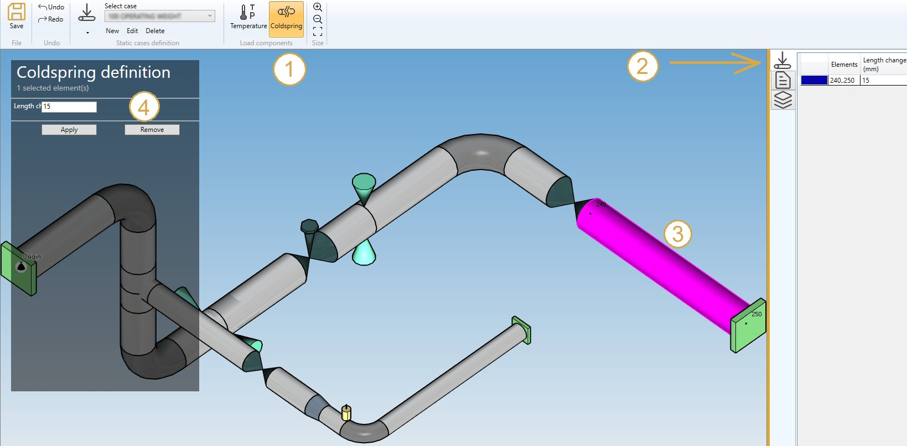

| Property | Unit Metric | Unit USA | Remark |
| -------- | ---- | ---- | -- |
| Length change | mm | in | Positive value for extension |

You can **undo** this command.

Click on the **Remove** button to delete the load on selected restraints.

---

### 3.7 Nodal forces and moments

You can define nodal forces and moments on nodes of the model.

If you check this option, you will see this **button** in the ribbon :

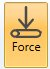

1. Select the **Force** button
2. Open the right **Data panel**
3. Select one or more nodes
4. Define the new **force and moment** on these nodes
5. Apply

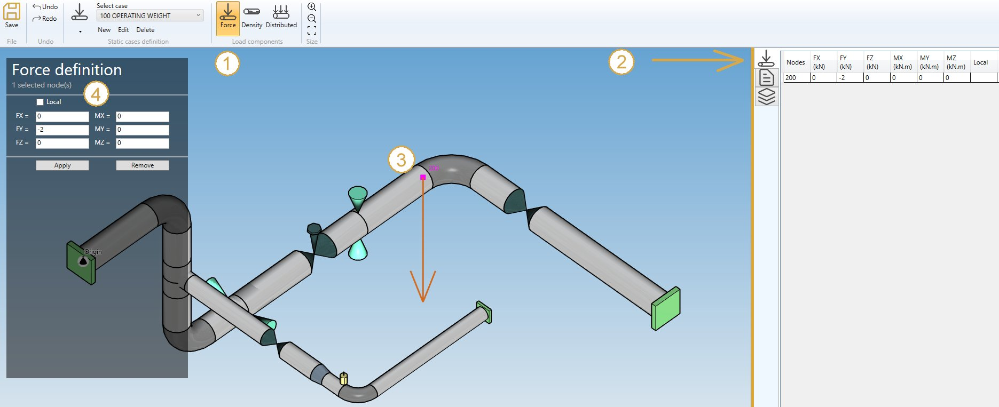

| Property | Unit Metric | Unit USA |
| -------- | ---- | ---- |
| FX | kN | kips |
| FY | kN | kips |
| FZ | kN | kips |
| MX | kN.m | kips.ft |
| MY | kN.m | kips.ft |
| MZ | kN.m | kips.ft |

You can **undo** this command.

Click on the **Remove** button to delete the force/moment on selected nodes.

You can **undo** this command.

You can also change the size of the drawed forces by clicking on these buttons :

---

### 3.8 Support movements

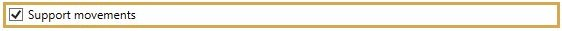

You can define movements on supports of the model.

If you check this option, you will see this **button** in the ribbon :

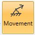

1. Select the **Movement** button
2. Open the right **Data panel**
3. Select one or more restraints
4. Define the new **vector displacement** and **vector rotation** for these restraints
5. Apply

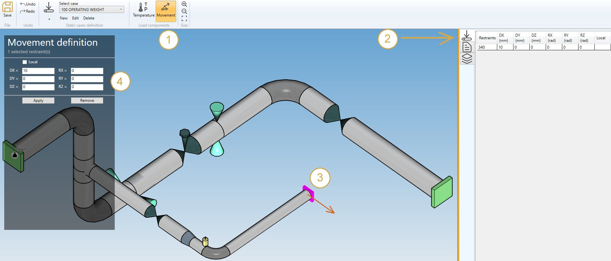

| Property | Unit Metric | Unit USA |
| -------- | ---- | ---- |
| DX | mm | in |
| DY | mm | in |
| DZ | mm | in |
| RX | rad | rad |
| RY | rad | rad |
| RZ | rad | rad |

The values can be set in **local** axis.

You can **undo** this command.

Click on the **Remove** button to delete the load on selected restraints.

You can **undo** this command.

You can also change the size of the drawn movements by clicking on these buttons :

