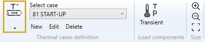
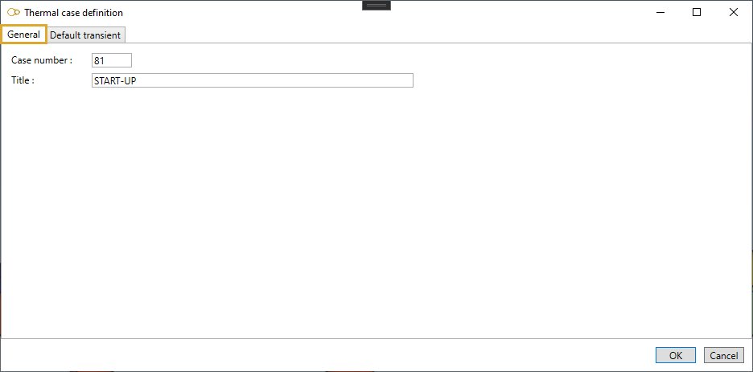
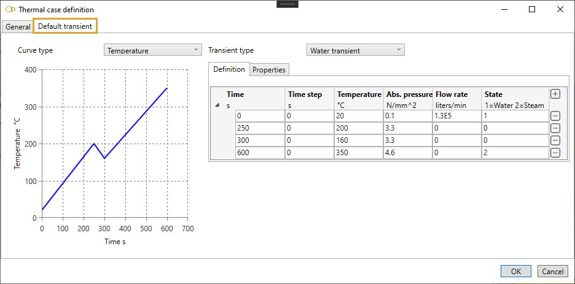
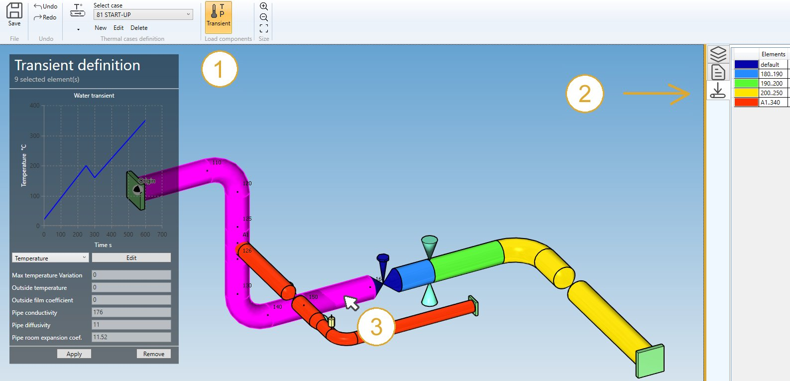
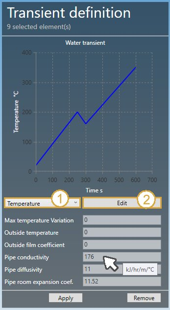
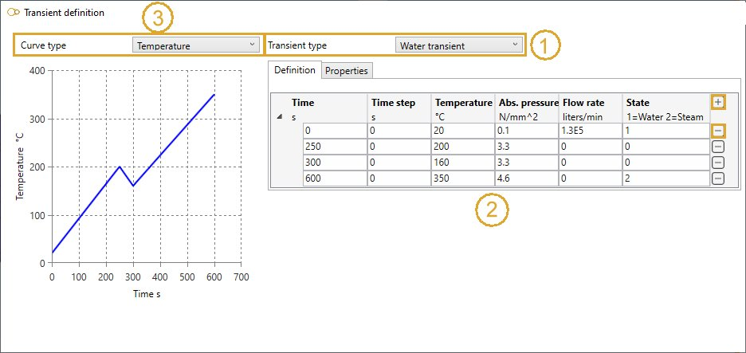
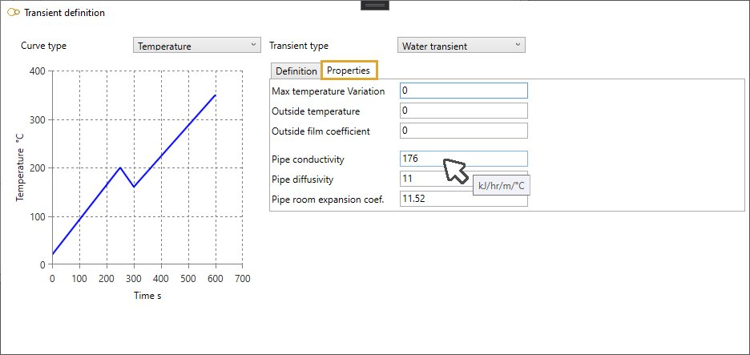
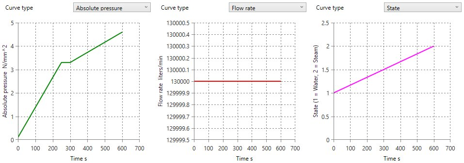

# Thermal cases (Class 1 only)

    This case consists of the definition of TRANSIENTS that describes the evolution of the fluid
    temperature (*) during time inside the pipes. Additional stresses will result from the 
    temperature gradients.
    (*) also absolute pressure, flow rate, state or film coefficient.

When selecting **Thermal cases**, all existing thermal cases are listed in the combobox :

The cases appear with their **Case number** + **Title**.

When editing, the definition window shows up :

## 1. General

Enter a **Case number** and a **Title**.

## 2. Default transient

If defined, all elements of the model will use the same **default transient** :

See §5. for more information about edition of a **transient**.

## 3. Data panel

Click on the **Transient** button (1) to define transient to elements :

A right panel can be opened by clicking on the top button (2). It presents the elements with the same transient (1 color for each transient).

>Click on the same button to hide the panel.

Select one or more element (3) to define a **Transient** (instead of the default one).

Click [here](https://documentation.metapiping.com/Design/Selection.html) for more information about the selection tool.

## 4. Left panel

The main properties of the selected transient (or the default one of the thermal case) are shown on the left panel :

Select the graph type (1) :

- Evolution of the **temperature of the fluid** during time
- Evolution of the **absolute pressure of the fluid** during time
- Evolution of the **flow rate of the fluid** during time
- Evolution of the **state of the fluid** during time

Click on the **Edit** button (2) to modify the current transient.

See §5. for more information about edition of a **transient**.

Other properties (not editable) :

| Property | Unit Metric | Unit USA | Remark |
| -------- | ---- | ---- | -- |
| Max temperature variation | °C | °F | If blank, MetaPiping use the default value |
| Outside temperature | °C | °F | Temperature outside pipe |
| Outside film coefficient | kJ/hr/m²/°C | btu/hr/ft²/°F | External heat exchange coefficient |
| Pipe conductivity | kJ/hr/m/°C | btu/hr/ft/°F | If blank, MetaPiping uses the value entered in the material definition |
| Pipe diffusivity | mm²/s | ft²/hr | If blank, MetaPiping uses the value entered in the material definition |
| Pipe room expansion coefficient | 10^-6.mm/mm/°C | 10^-6.in/in/°F | Pipe thermal expansion coefficient at 21°C. If blank, MetaPiping uses the value entered in the material definition |

    To know the UNIT of a property, just move the mouse over the cells. 

Click on the **Apply** button to define the **current transient** to selected elements.

Click on the **Remove** button to remove the **current transient** and reaffect the **Default transient** to selected elements.

## 5. Transient definition

To define a **Transient**, first select the type (1) :

- Water transient
- Fluid film coefficient

### 5.1 Definition

Enter the values of the graphes (2). The first time step must be 0.

Click on the **+** button to add a row. Click on the **-** button to remove a row.

For each row, define the properties :

<ins>Water transient</ins> :

| Property | Unit Metric | Unit USA | Remark |
| -------- | ---- | ---- | -- |
| Time | s | s | |
| Time step | s | s | Informative |
| Temperature | °C | °F | |
| Absolute pressure | N/mm² | psi | |
| Flow rate | liters/min | gallons/min | |
| State | - | - | 1 for Water, 2 for Steam |

<ins>Fluid film coefficient</ins> :

| Property | Unit Metric | Unit USA | Remark |
| -------- | ---- | ---- | -- |
| Time | s | s | |
| Temperature | °C | °F | |
| Film coefficient | kJ/hr/m²/°C | btu/hr/ft²/°F | |

>Tip : for blank values, MetaPiping will make linear interpolations.

>The time step must be ascendant!

### 5.2 Properties

Enter other properties :

| Property | Unit Metric | Unit USA | Remark |
| -------- | ---- | ---- | -- |
| Max temperature variation | °C | °F | If blank, MetaPiping use the default value |
| Outside temperature | °C | °F | Temperature outside pipe |
| Outside film coefficient | kJ/hr/m²/°C | btu/hr/ft²/°F | External heat exchange coefficient |
| Pipe conductivity | kJ/hr/m/°C | btu/hr/ft/°F | If blank, MetaPiping uses the material property |
| Pipe diffusivity | mm²/s | ft²/hr | If blank, MetaPiping uses the material property |
| Pipe room expansion coefficient | 10^-6.mm/mm/°C | 10^-6.in/in/°F | Pipe thermal expansion coefficient at 21°C. If blank, MetaPiping use the material property |

    To know the UNIT of a property, just move the mouse over the cells.

### 5.3 Curve type

Select the **curve type** in the list (3) :

