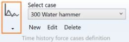

# Time history cases

    This case consists of dynamic forces and moments applied to some nodes of the model. The solution
    is obtained using the modal superposition method.

When selecting **Time history cases**, all existing time history cases are listed in the combobox :

 

The cases appear with their **Case number** + **Title**.

When editing, the definition window shows up :

Enter a **Case number** and a **Title**.

<ins>Event</ins> :

Select the time history event associated with the load case. If no event is selected, the time histories from the external THF file connected to the study are used.

<ins>Level</ins> :

This field is intended for nuclear piping codes only. The possible values are : A (normal conditions), B (upset), C (emergency), D (faulted) and T (test). 

<ins>Equation</ins> :

The equations are code-dependent.

<ins>Damping</ins> :

Enter the damping value (in percentage).

<ins>Rigid correction</ins> :

If checked, include the effect of the higher "rigid" modes (i.e. modes above the cut-off frequency).

<ins>Resultant moment</ins> :

If checked, the envelope values for the moment components are the values for the time step which maximizes the resultant moment. Otherwise, the envelope for each moment component is based on the maximum absolute value at any time step.

<ins>Explicit scheme (Aster solver only)</ins> :

If checked, Runge Kutta explicit integration scheme is used. Newark implicit scheme is used otherwise.

<ins>Time step (Aster solver only)</ins> :

Enter the constant time step for integration. If zero, the time step is determined automatically.

<ins>Archive rate (Aster solver only)</ins> :

If zero or one, the solution for each time step is stored in the .rmed result file. In order to save disk space and speed up the calculation, a value larger than one may be entered.

