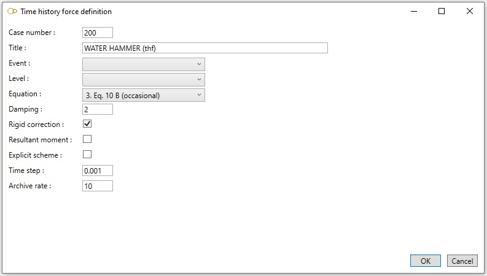

# Time history cases

    This case consists of dynamic forces and moments applied to some nodes of the model. The solution
    is obtained using the modal superposition method. Time histories are entered in an external THF
    file connected to the study beforehand.

When selecting **Time history cases**, all existing time history cases are listed in the combobox :

The cases appear with their **Case number** + **Title**.

When editing, the definition window shows up :

Enter a **Case number** and a **Title**.

<ins>Level</ins> :

This field is intended for nuclear piping codes only. The possible values are : A (normal conditions), B (upset), C (emergency), D (faulted) and T (test). 

<ins>Equation</ins> :

The equations are code-dependent.

<ins>Damping</ins> :

Enter the damping value (in percentage).

<ins>Rigid correction</ins> :

If checked, include the effect of the higher "rigid" modes (i.e. modes above the cut-off frequency).
