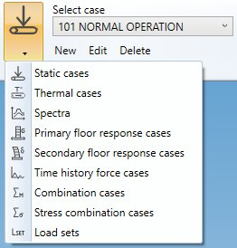
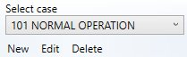

# Piping loads

Click on the **LOAD** button to have access to the **load case types** :

After selection, the choice becomes the **current load case type**.

## 1. Edition

For all case types, you can **create**, **modify** or **remove** a selected case :

- **New** : open an empty window of **current load case type** : press OK to create the load
- **Edit** : open a window of **current load case type** with the selected case :  press OK to modify the load case
- **Delete** : remove the selected case
- **Selection** : list of all cases of the **current load case type**

## 2. Load tree

All loads can be viewed, created, edited, moved and removed in a single treeview :

1. Select the load treeview tab
2. Select a load to edit
3. Add a load of a particular category
4. Remove a load
5. Insert a load between two others

>Tip: you can also move a load by draging a load and drop it on another one of the same category.