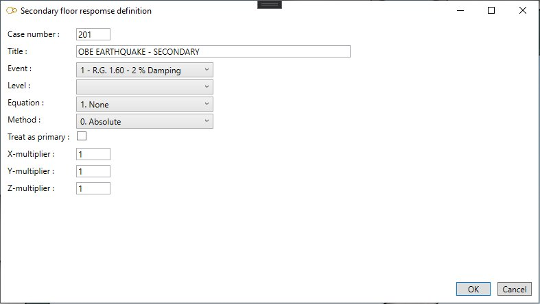

# Secondary floor response cases

    This load describes the floor response spectra for each support level. This analysis is used to
    obtain bound solutions for simple multilevel cases (including single level cases) for which the
    dynamic loading is entirely due to movements at the support points.
    The "levels" are groups of support points which are moving in parallel and are entered using the
    level number field on support.

{: .warning }
>Attention, to obtain the complete solution for multilevel problems, it is necessary to calculate the primary and secondary parts of the solution separately and then to combine them.

MetaPiping will calculate the bounds for the **SECONDARY** part of the solution v(t) for displacements, rotations, forces, moments and stresses due to the dynamic support movement loading.

When selecting **Secondary floor response cases** load type, all existing loads are listed in the combobox :

The loads appear with the **Case number** + **Title**.

## 1. General

When editing, the definition window shows this screen :

Enter a **Case number** and a **Title**.

<ins>Event</ins> :

Select a **Spectra** : *R.G. 1.60 - 2% Damping* in this example.

See §2.

<ins>Level</ins> :

Documentation will come soon…

<ins>Equation</ins> :

- 1- None
- 2- Eq. 9 (design)
- 3- Eq. 9 B (occasional)
- 4- Eq. 9 C (occasional)
- 5- Eq. 9 D (occasional)
- 6- Test
- 7- Eq. 12
- 8- Eq. 10 (partial)

Documentation will come soon…

<ins>Method</ins> :

- 0- Absolute
- 1- SRSS

Documentation will come soon…

<ins>Treat as primary</ins> :

Documentation will come soon…

<ins>X, Y, Z multipliers</ins> :

This factor multiplies the X, Y, Z component of the loading.

 If this field is zero or blank, then all X, Y or Z loading components will be zero for this loading.

## 2. Spectra definition

In this example, we use this **Spectra loading** :

It contains 2 **LEVELS** with corresponding spectra :

Click [here](https://documentation.metapiping.com/Loads/Spectra.html) for more information about the spectra definition.

## 3. Primary floor response cases

Click [here](https://documentation.metapiping.com/Loads/PrimaryCases.html) for more information about the primary floor response cases.