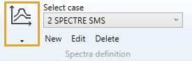
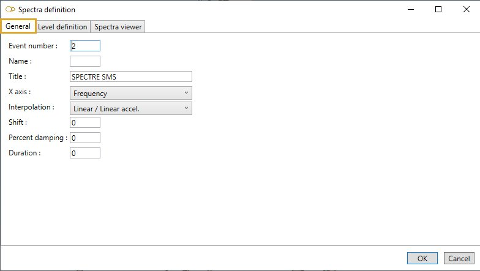
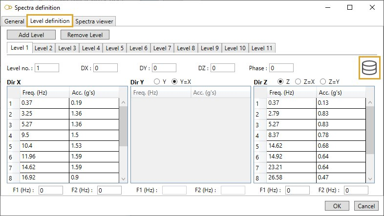
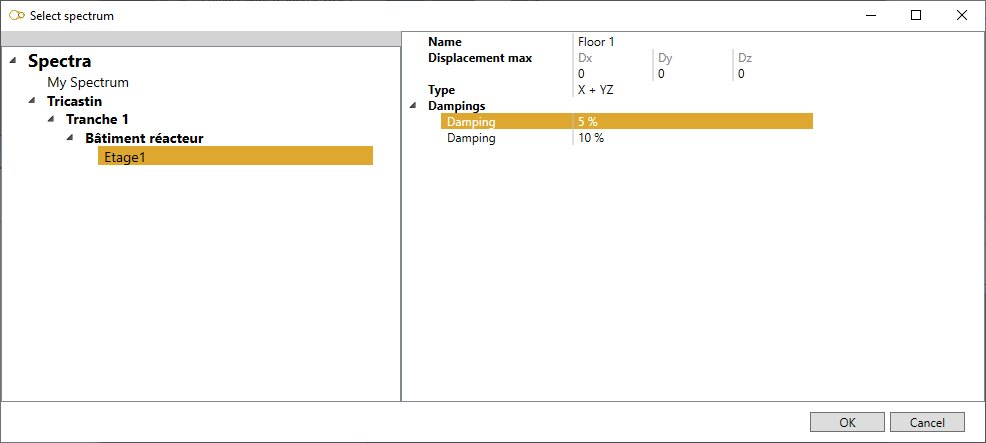
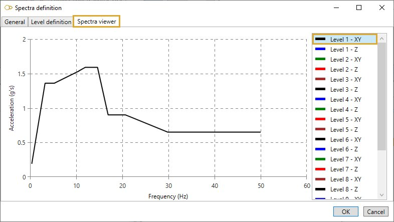
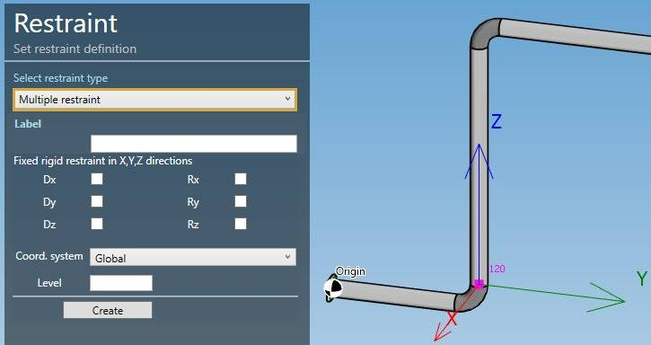
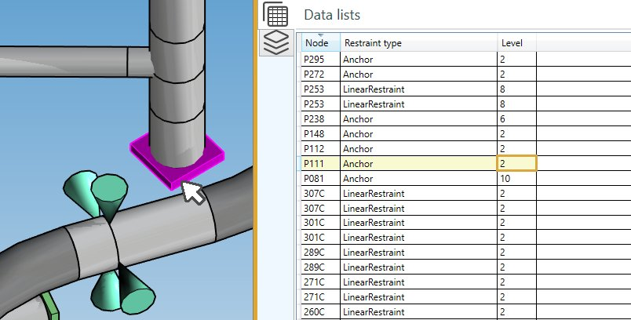

# Spectra

    This load consists of the definition of series of SPECTRUM that describe the support movement loading
    for each EVENT/LEVEL for primary and secondary floor response cases.

When selecting **Spectra** load type, all existing loads are listed in the combobox :

The loads appear with the **Event number** + **Title**.

## 1. General

When editing, the definition window shows the **General** tab :

Enter a **Event number**, a **Name** and a **Title**.

The primary and secondary floor response cases with the same **EVENT/LEVEL** will use this spectrum to describe the dynamic support movement load.

<ins>X axis</ins> :

- Spectrum is **frequency** vs. acceleration
- Spectrum is **period** vs. acceleration

<ins>Interpolation</ins> :

- Linear / Linear acceleration
- Linear frequency / Linear acceleration
- Linear period / Linear acceleration
- Log frequency / Linear acceleration
- Log frequency / Log acceleration

<ins>Shift</ins> :

The shift (in %) determines an interval about each natural frequency. MetaPiping will use the maximum acceleration in each such interval, as determined by interpolating the spectrum data specified.

This method is used for peak broadening. 0 or blank = no shift.

<ins>Percent damping</ins> :

Documentation will come soon…

<ins>Duration</ins> :

Duration of earthquake (in seconds).

0 or blank = infinite (10^6 s).

## 2. Level definition

In this tab, you can create/remove **LEVELS** for the same level **EVENT** :

The **LEVEL** number relates the spectra to the supports.

Click [here](https://documentation.metapiping.com/Design/Restraints.html) to have more information about supports.

<ins>DX, DY, DZ</ins> :

Global X, Y, Z displacements (mm, in). Informative.

<ins>Phase</ins> :

Documentation will come soon…

<ins>Spectrum in direction X, Y, Z</ins> :

Enter **acceleration** for each **frequency/period**.

>Attention, the frequency/period must be entered in ascending order

The possible cases are :

- X + Y + Z = a spectrum for each direction
- X + YZ = a spectrum for X and a common one for Y and Z
- Y + XZ = a spectrum for Y and a common one for X and Z
- Z + XY = a spectrum for Z and a common one for X and Y
- XYZ = the same spectrum for all directions

<ins>F1 and F2</ins> :

Documentation will come soon…

### 2.1 Database

The **Database** button on upper right corner gives an access to the spectra libraries :

Select a library on the left treeview, then select a row that represents a particular damping for a predefined spectrum. Some values are just informative. Click **OK**. The properties are copied to the spectrum screen.

Click [here](https://documentation.metapiping.com/Settings/Databases/Spectra.html) to have more information about spectrum database.

## 3. Spectra viewer

Select a level on the right list to see the spectrum graph :

## 4. Restraints

You can now select **restraints** or create one on a selected node and affect the **Level** property (set the level number) :

You can also check the property on **Review** mode (type Restraints):

